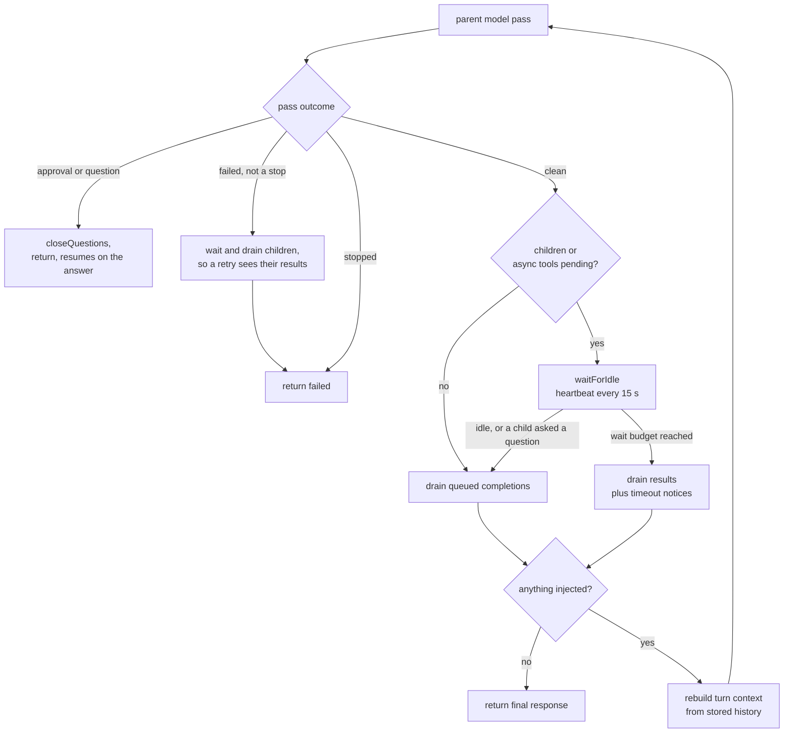
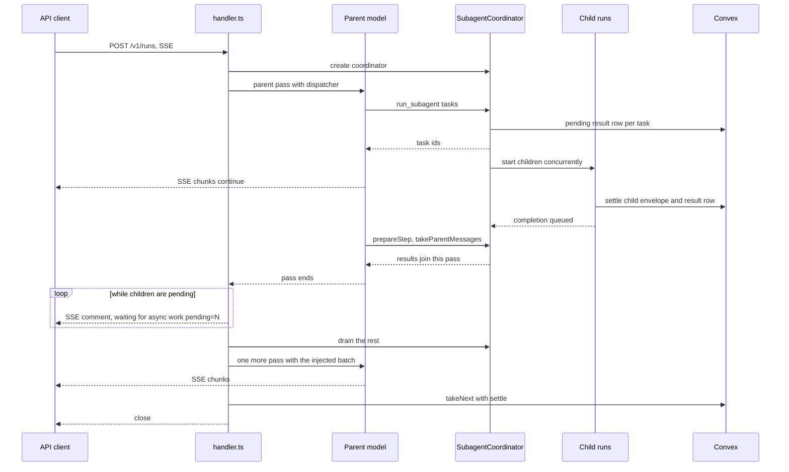
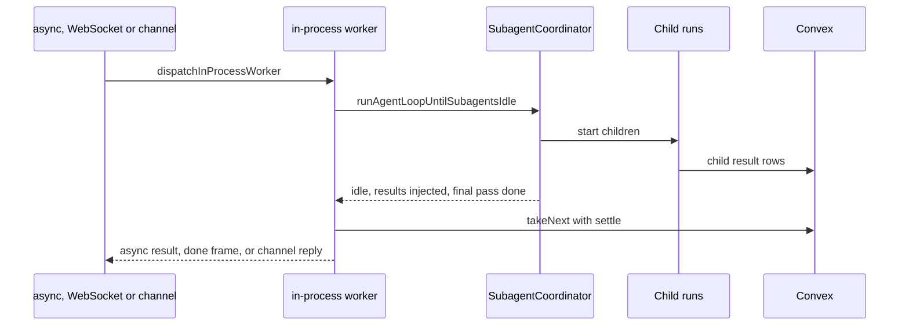
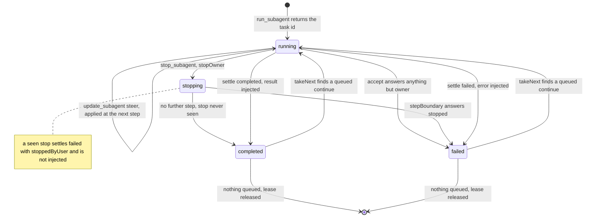
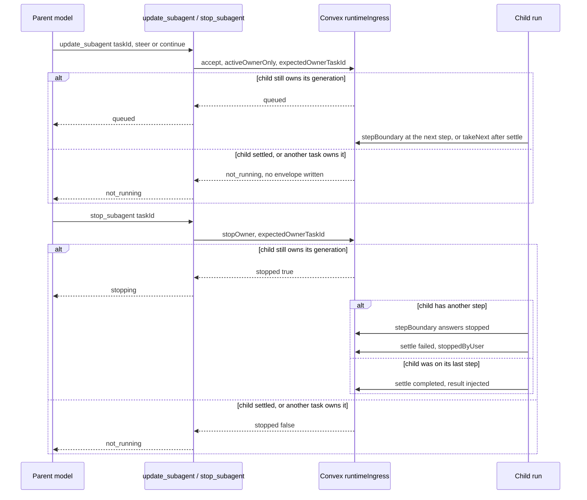
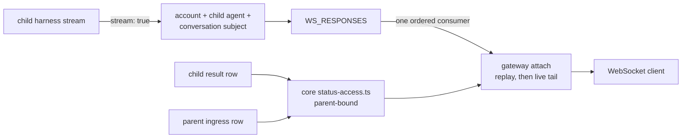
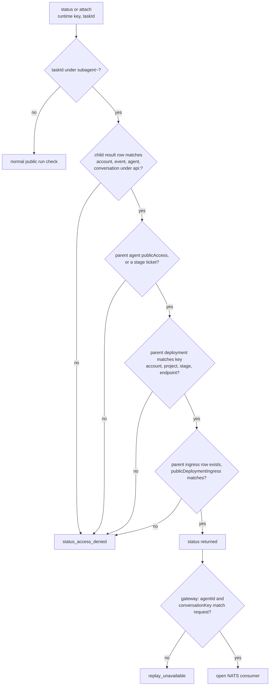

# Subagents

How subagent runs execute inside core: dispatch, the parent continuation loop, control of a running child, and who may watch a child's stream. Configuration and model-facing behavior are in the [subagents guide](../guides/subagents.md). Paths are relative to `apps/core/`.

| File                           | Owns                                                                                             |
| ------------------------------ | ------------------------------------------------------------------------------------------------ |
| `src/harness/subagents.ts`     | `SubagentCoordinator`: dispatch, child runs, the result and question queues                      |
| `src/harness/handler.ts`       | `runParentContinuationLoop`, `waitAndDrainAsyncWork`, SSE heartbeats                             |
| `src/harness/harness.ts`       | `prepareStep`, where queued child messages join the parent mid-pass                              |
| `src/harness/tools/`           | `run-subagent`, `get-subagent-status`, `update-subagent`, `stop-subagent` and `ask-parent` tools |
| `src/harness/status-access.ts` | Who may read a child's status with a runtime key                                                 |

## Execution model

`run_subagent` creates a pending result row per task, returns the task ids at once, and starts the children as promises inside the same request or worker, not as separate processes. The parent's model stream keeps going.

A child result or `ask_parent` question that arrives while the parent streams waits in the coordinator's in-memory queue. At the parent's next step boundary `prepareStep` takes it (`takeParentMessages`) and adds it as `user` messages, the same way a [steer](queue-and-steer.md#the-step-boundary) joins a run. What arrives after the pass goes through the continuation loop:

```mermaid
flowchart TD
  Pass["parent model pass"] --> Out{"pass outcome"}
  Out -->|"approval or question"| Park["closeQuestions,<br/>return, resumes on the answer"]
  Out -->|"failed, not a stop"| Keep["wait and drain children,<br/>so a retry sees their results"]
  Keep --> Failed["return failed"]
  Out -->|"stopped"| Failed
  Out -->|"clean"| Pend{"children or<br/>async tools pending?"}
  Pend -->|"no"| Drain["drain queued completions"]
  Pend -->|"yes"| Wait["waitForIdle<br/>heartbeat every 15 s"]
  Wait -->|"idle, or a child asked a question"| Drain
  Wait -->|"wait budget reached"| Timeout["drain results<br/>plus timeout notices"]
  Drain --> Inj{"anything injected?"}
  Timeout --> Inj
  Inj -->|"no"| Done["return final response"]
  Inj -->|"yes"| Rebuild["rebuild turn context<br/>from stored history"]
  Rebuild --> Pass
```

The wait budget ends 60 s before the request or worker deadline, or 8 minutes out when there is none (`waitUntilMs` in `handler.ts`). A queued question ends the wait early so the parent can answer while other children keep running. A failed write at a step boundary puts the taken results and questions back in the queue.

### Sync SSE

`handler.ts` creates one `SubagentCoordinator` per request and passes its dispatcher into `harness.ts`, which exposes it as `run_subagent`.

```mermaid
sequenceDiagram
  participant C as API client
  participant H as handler.ts
  participant M as Parent model
  participant S as SubagentCoordinator
  participant A as Child runs
  participant CX as Convex

  C->>H: POST /v1/runs, SSE
  H->>S: create coordinator
  H->>M: parent pass with dispatcher
  M->>S: run_subagent tasks
  S->>CX: pending result row per task
  S-->>M: task ids
  S->>A: start children concurrently
  M-->>C: SSE chunks continue
  A->>CX: settle child envelope and result row
  A-->>S: completion queued
  M->>S: prepareStep, takeParentMessages
  S-->>M: results join this pass
  M-->>H: pass ends
  loop while children are pending
    H-->>C: SSE comment, waiting for async work pending=N
  end
  H->>S: drain the rest
  H->>M: one more pass with the injected batch
  M-->>C: SSE chunks
  H->>CX: takeNext with settle
  H-->>C: close
```

The comment lines are ignored by SSE clients but keep idle proxies from closing the stream.

### Async, WebSocket and channels

Background runs, the WebSocket worker and channel turns run the same loop on an in-process worker, without heartbeats. The parent's envelope settles only after the continuation, so the async result, the WebSocket `done` frame or the channel reply already includes the children's work. `runtimeAsyncAgentResults` keeps each child's status for polling.

```mermaid
sequenceDiagram
  participant In as async, WebSocket or channel
  participant W as in-process worker
  participant S as SubagentCoordinator
  participant A as Child runs
  participant CX as Convex

  In->>W: dispatchInProcessWorker
  W->>S: runAgentLoopUntilSubagentsIdle
  S->>A: start children
  A->>CX: child result rows
  S-->>W: idle, results injected, final pass done
  W->>CX: takeNext with settle
  W-->>In: async result, done frame, or channel reply
```

## Context and reasoning

Inherited context (`context: "inherited"`) goes straight into the child model call and is never copied into the child's stored conversation. Reasoning parts are stripped from it first. After a child result is injected, the next parent pass is rebuilt from stored history with completed-turn reasoning stripped. A pending tool-approval resume keeps its tool call, approval request and reasoning, because that step has not finished.

## Persistent children and control

In `persistent` mode, the default, each child is admitted through the same [conversation coordinator](queue-and-steer.md) as a top-level run, with mode `reject`, under a key `subagent-persistent-<uuid>-<tag>`. The tag is an HMAC derived from `STAGE_TICKET_SECRET` over the account, parent agent and UUID, so `run_subagent` only resumes keys core minted for that parent. There is no subagent-specific control API: the control tools use the normal ingress path on the child's conversation.

```mermaid
stateDiagram-v2
  [*] --> running: run_subagent returns the task id
  running --> failed: accept answers anything but owner
  running --> running: update_subagent steer, applied at the next step
  running --> stopping: stop_subagent, stopOwner
  stopping --> failed: stepBoundary answers stopped
  stopping --> completed: no further step, stop never seen
  running --> completed: settle completed, result injected
  running --> failed: settle failed, error injected
  completed --> running: takeNext finds a queued continue
  failed --> running: takeNext finds a queued continue
  completed --> [*]: nothing queued, lease released
  failed --> [*]: nothing queued, lease released
  note right of stopping: a seen stop settles failed with stoppedByUser and is not injected
```

- A busy child conversation makes `accept` answer `rejected`, and the task fails with `Subagent conversation is not available: rejected`, injected like any failure.
- A follow-up drained after the child settles runs as another turn of the same task and is injected like the first answer. Past the parent's wait budget there is no live parent turn, so `transferChildConversation` hands the envelope to its own worker and the result is not injected.
- `get_subagent_status` on a child of this turn waits on `waitForSettled` (60 s, capped by the wait budget), so polling costs one model step per change. Once the parent's step with that result is saved (`confirmDelivered`), the queued completion is dropped so the drain does not start another pass for it.
- `ask_parent` blocks the child on `askParent` for up to 5 minutes, never past the wait budget. `update_subagent` in `steer` mode on a child with an open question answers it (`answered`) instead of queuing a steer. Open questions resolve empty when the budget runs out, the child stops, or the parent pass ends in a failure, approval or question of its own.

Controls decide admission and ownership in one transaction, so a control never lands on a finished child or a later task on the same conversation:

```mermaid
sequenceDiagram
  participant P as Parent model
  participant T as update_subagent / stop_subagent
  participant CX as Convex runtimeIngress
  participant Ch as Child run

  P->>T: update_subagent taskId, steer or continue
  T->>CX: accept, activeOwnerOnly, expectedOwnerTaskId
  alt child still owns its generation
    CX-->>T: queued
    T-->>P: queued
    Ch->>CX: stepBoundary at the next step, or takeNext after settle
  else child settled, or another task owns it
    CX-->>T: not_running, no envelope written
    T-->>P: not_running
  end
  P->>T: stop_subagent taskId
  T->>CX: stopOwner, expectedOwnerTaskId
  alt child still owns its generation
    CX-->>T: stopped true
    T-->>P: stopping
    alt child has another step
      Ch->>CX: stepBoundary answers stopped
      Ch->>CX: settle failed, stoppedByUser
    else child was on its last step
      Ch->>CX: settle completed, result injected
    end
  else child settled, or another task owns it
    CX-->>T: stopped false
    T-->>P: not_running
  end
```

The control tools accept only tasks created by the calling parent event, so a child cannot control a sibling and one parent cannot control another's child. Ephemeral children hold no durable conversation and no owner generation, so nothing fences a stop or steer against them. That is the main reason `persistent` is the default.

## Live child streaming

With `subagent.stream: true`, every child publishes its reasoning, text, tool, error and structured-output parts on the same NATS path a WebSocket run uses, under the authenticated account, the child `agentId` and the child's public conversation key. Publishing is best effort with the usual 3 minute, 2,000-message retention. It never changes persistence, injection, visibility, traces, usage or settlement.

```mermaid
flowchart LR
  Child["child harness stream"] -->|"stream: true"| Subject["account + child agent +<br/>conversation subject"]
  Subject --> Buffer["WS_RESPONSES"]
  Buffer -->|"one ordered consumer"| Gateway["gateway attach<br/>replay, then live tail"]
  ChildStatus["child result row"] --> Auth["core status-access.ts<br/>parent-bound"]
  ParentStatus["parent ingress row"] --> Auth
  Auth --> Gateway
  Gateway --> Client["WebSocket client"]
```

A client attaches with what `run_subagent` returned: `taskId` is the attach `eventId`, next to `runId`, `agentId` and `conversationKey`. The protocol is the one in [attach and replay](queue-and-steer.md#attach-and-replay). The child row exists before dispatch and JetStream keeps the earliest frames, so an attach can come before the first frame. If durable completion arrives without a stream `done`, the gateway waits a short grace period and emits one terminal frame. The durable result at `/v1/runs/{runId}` stays the source of truth after JetStream expiry.

### Attach authorization

The gateway protocol is unchanged. What is specific to children is who may read their status, and so attach, with a runtime key:

```mermaid
flowchart TD
  Req["status or attach<br/>runtime key, taskId"] --> Ns{"taskId under subagent~?"}
  Ns -->|"no"| Pub["normal public run check"]
  Ns -->|"yes"| Child{"child result row matches<br/>account, event, agent,<br/>conversation under api:?"}
  Child -->|"no"| Deny["status_access_denied"]
  Child -->|"yes"| PAgent{"parent agent publicAccess,<br/>or a stage ticket?"}
  PAgent -->|"no"| Deny
  PAgent -->|"yes"| PDep{"parent deployment matches key<br/>account, project, stage, endpoint?"}
  PDep -->|"no"| Deny
  PDep -->|"yes"| PRow{"parent ingress row exists,<br/>publicDeploymentIngress matches?"}
  PRow -->|"no"| Deny
  PRow -->|"yes"| Ok["status returned"]
  Ok --> GW{"gateway: agentId and<br/>conversationKey match request?"}
  GW -->|"no"| Unav["replay_unavailable"]
  GW -->|"yes"| Open["open NATS consumer"]
```

- `taskId` is server-issued: `subagent~` plus the base64url parent event id plus a nonce. That is encoding, not encryption, so it must never carry confidential data. Public requests cannot use the `subagent~` namespace.
- The client never supplies parent scope. Core derives it from the `taskId` and checks it against stored rows.
- `publicDeploymentIngress` is set only when the parent entered through runtime-key HTTP, async or WebSocket ingress. Account-key runs, channels, cron runs and internal continuations get no attach access from endpoint metadata.
- A private child, virtual or predefined, can be watched through its authorized public parent without becoming publicly runnable. The event-bound cursor stops a child cursor from resuming a different task.
