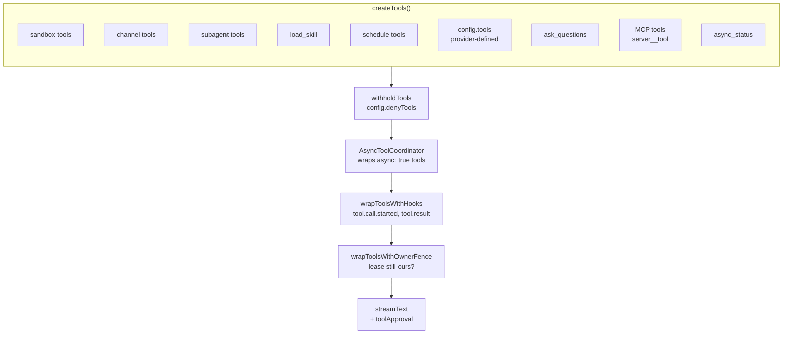
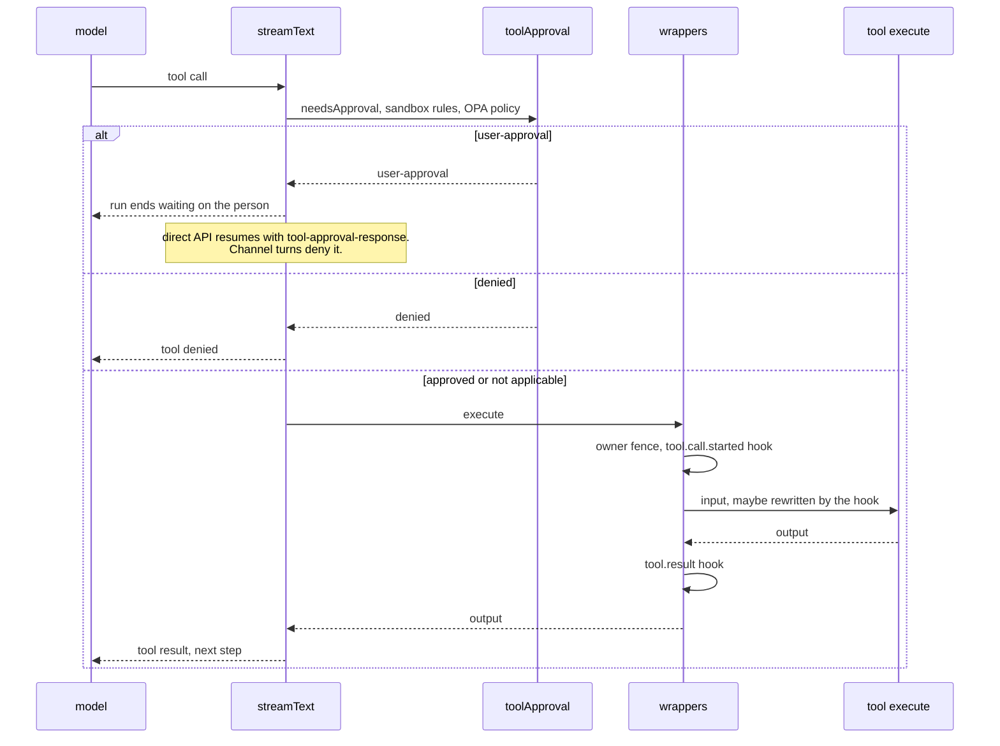
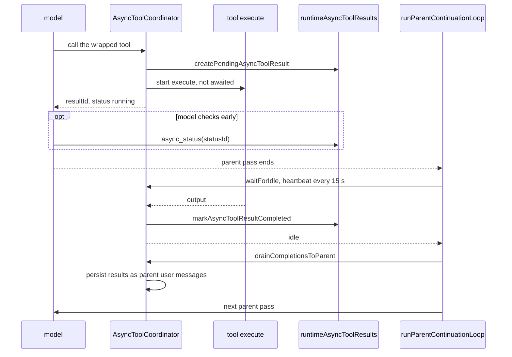
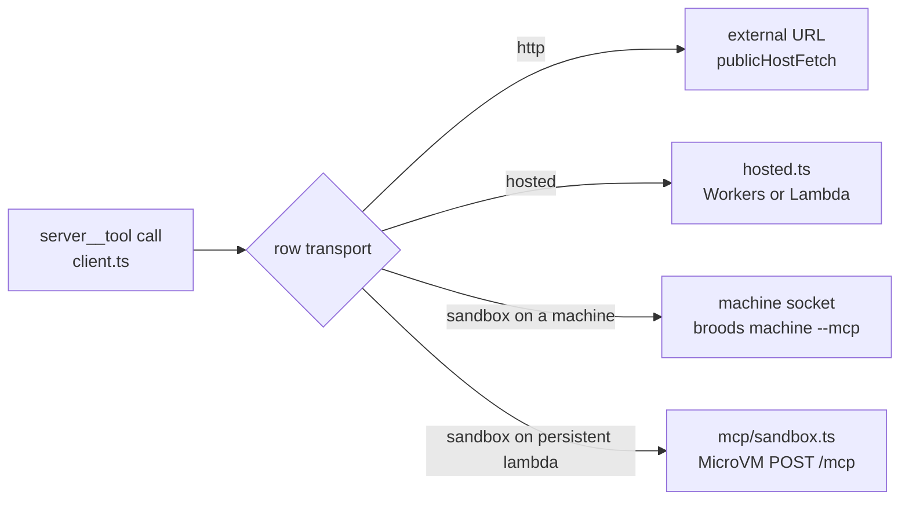
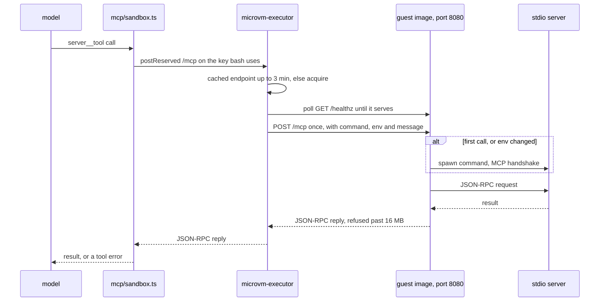
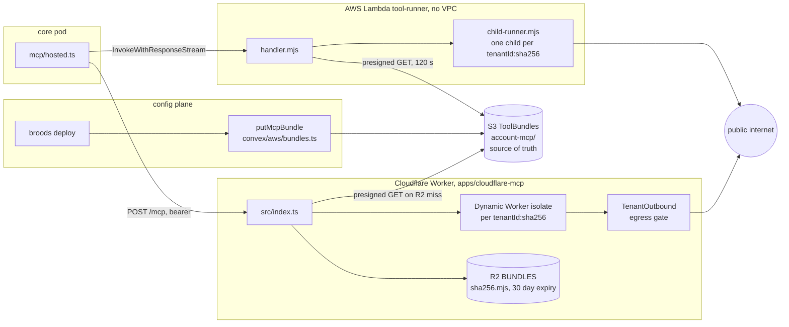
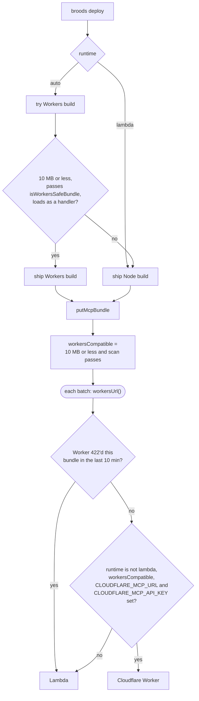
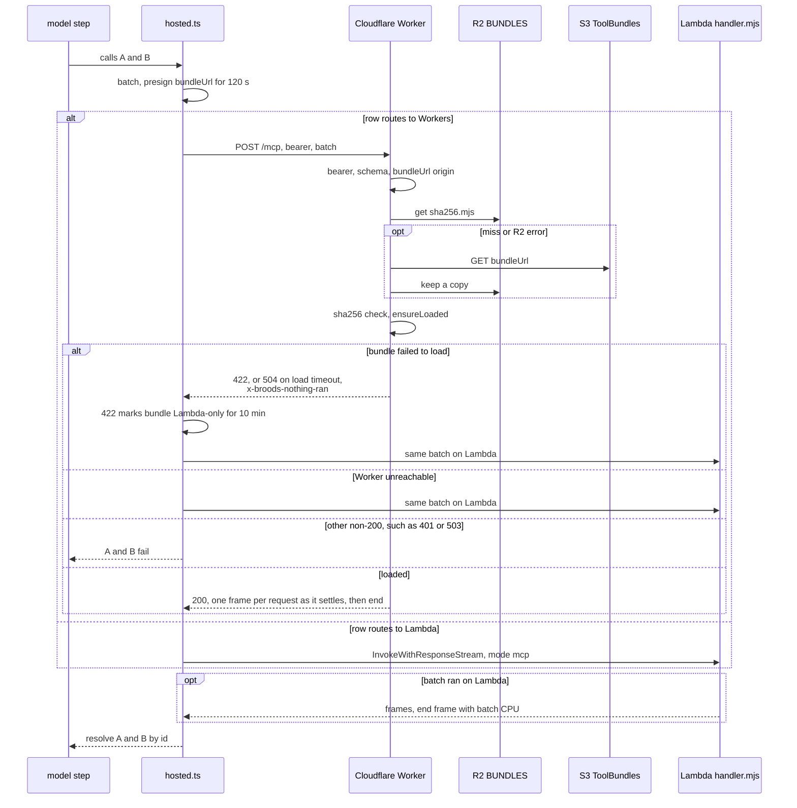
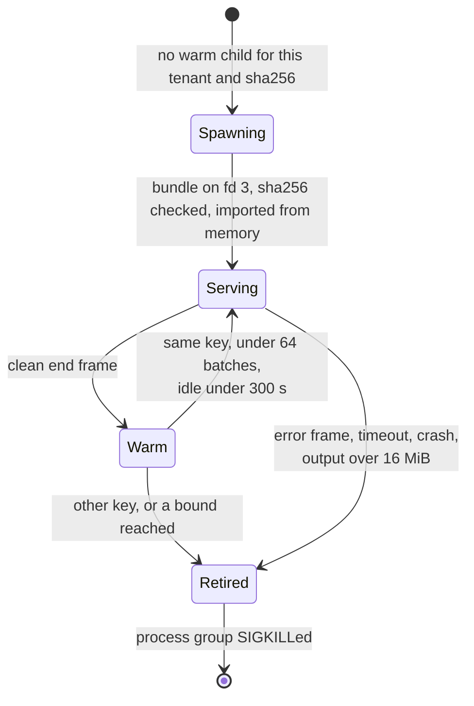

# Tools and MCP

How core builds a run's tool set, how a tool call executes, and where MCP servers run. What users configure is in the [tools guide](../guides/tools.md). Paths are relative to `apps/core/`.

## Registry

`harness.ts` calls `createTools()` in `src/harness/tools/index.ts` once per run, then wraps the result before it reaches `streamText()`:



| Group     | Tools                                                                                          | Registered when                                                                                                                 |
| --------- | ---------------------------------------------------------------------------------------------- | ------------------------------------------------------------------------------------------------------------------------------- |
| Sandbox   | `bash`                                                                                         | any sandbox or sandbox-backed workspace                                                                                         |
|           | `computer`                                                                                     | a machine sandbox                                                                                                               |
|           | `browse`                                                                                       | `browser.enabled`; `assertBrowseSandbox` fails the run unless the first sandbox can run Obscura                                 |
|           | `read`, `glob`                                                                                 | any workspace (mount when it has a sandbox, else S3 or a read-only mount)                                                       |
|           | `write`, `edit`, `grep`                                                                        | a workspace with a sandbox                                                                                                      |
|           | `memory_save`                                                                                  | a sandbox-backed workspace with the memory harness on                                                                           |
| Channel   | `send-files`, `send-images`, `send-reactions`, `send-sticker`, `send-update`                   | a channel turn, each gated on adapter capabilities. See [channels](channels.md)                                                 |
|           | `send-message`                                                                                 | the agent has channels and the request can dispatch to another session                                                          |
| Subagent  | `run_subagent`; persistent mode adds `get_subagent_status`, `update_subagent`, `stop_subagent` | `subagent.enabled` and a dispatcher                                                                                             |
|           | `ask_parent`                                                                                   | a persistent subagent run                                                                                                       |
| Skills    | `load_skill`                                                                                   | `skills.enabled` with `allowed` paths                                                                                           |
| Scheduler | `schedule`, `list_schedules`, `update_schedule`, `cancel_schedule`                             | `scheduler.enabled`, not on a cron-fired run                                                                                    |
| Provider  | every `config.tools` key                                                                       | the key names a tool in the provider's `tools` namespace, else the run fails with `config.tools.<name> is not a supported tool` |
| Questions | `ask_questions`                                                                                | the session has a delivery (channel or WebSocket) and is not cron-fired                                                         |
| MCP       | `<server>__<tool>`                                                                             | each enabled `config.mcp` server                                                                                                |
| Async     | `async_status`                                                                                 | any `async: true` tool or a workspace with background jobs; `logs` and `stop` only with live job controls                       |

`withholdTools` runs after every group is registered, so a channel record's `denyTools` also covers sandbox and MCP tools.

### Provider-defined tools

A provider tool serializes to `{ type: "provider", id: "google.google_search", args }`, which loses its schemas, so `provider-tool.ts` rebuilds it from the live provider factory with those `args`. Core keeps no list of names. Provider tools have no local `execute`, so `async: true` on one only logs a warning.

## A tool call

A sync tool runs inside the model step:



An `async: true` tool returns a status id at once and its result joins the conversation later (`async-tools.ts`, `async-tool-result.ts`):



- A call still pending at the request deadline goes through `drainCompletionsAndTimeoutsToParent`, which marks it `failed` and injects a timeout notice.
- `async_status` marks a settled row `observed`, so it is not injected twice.
- Detached `bash` background jobs settle through `POST /v1/sandbox-jobs/:resultId/complete` instead, which resumes the conversation. See [sandboxes](sandboxes.md#background-jobs).

## MCP servers

Core is a stateless MCP client, spec 2026-07-28, Streamable HTTP only (`src/harness/mcp/client.ts`). Each run lists tools (cached per row for the listing's `ttlMs`) and registers them as `<server>__<tool>`. Every `tools/call` is one POST with no session. The row's transport decides where that POST goes:



- External URLs: the host is resolved first and private, loopback, link-local and metadata addresses are refused, as are redirects. The OAuth `tokenUrl` gets the same check (`oauth.ts` mints and caches refresh-grant tokens).
- Headers: a credential-bearing header must be a `${NAME}` env ref. Inline secrets and URL userinfo are refused at registration.
- Every remote request carries `X-Broods-Agent-Id` and, when the chain is known, `X-Broods-Principal`. See [security](security.md#agent-principal-and-run-tokens).
- Results: `structuredContent`, or the text blocks. Images reach the model only within `withImageLimits` in `tools/utils.ts` (PNG, JPEG, GIF or WebP, at most 8000 px a side, 8 images and 6 MB per result). Stored history keeps the text only.
- Not supported: `subscriptions/listen`. MRTR `input_required` surfaces as a tool error.

### Server on a lambda sandbox

When a `sandbox` row names a persistent `lambda` sandbox, the VM's image runs the stdio server and keeps it for the VM's lifetime:



The POST is resent only when the connection never opened, because a later 502 may hide a tool that already ran. The body carries the sandbox env without the `BROODS_*` run identity. A call gets the sandbox `timeout`, default 120 s. `sandboxMcpTarget` resolves the row for runs and for the dashboard explorer; `explorerSandboxTarget` in `src/accounts/mcp-service.ts` picks the explorer's VM.

### Hosted servers

A `hosted` row runs an account-uploaded bundle on one of two runtimes. Both take the same `McpHostPayload` and answer with the same NDJSON frames (`src/harness/frames.ts`), so `hosted.ts` reads either one the same way.



| Limit        | Lambda (`apps/lambda`)                       | Cloudflare (`apps/cloudflare-mcp`)        |
| ------------ | -------------------------------------------- | ----------------------------------------- |
| Bundle       | 50 MB (`MAX_MCP_BUNDLE_BYTES`)               | 10 MB                                     |
| Batch in     | 6 MiB invoke payload                         | 6 MiB                                     |
| Batch out    | 16 MiB of frames                             | 16 MiB of frames                          |
| Deadline     | 30 s for the batch, child aborts 2 s earlier | 30 s per request, 5 s CPU, 50 subrequests |
| Core timeout | 45 s request timeout                         | 45 s                                      |
| CPU reported | yes, split evenly across the batch's calls   | no                                        |
| Warm unit    | one child process per `tenantId:sha256`      | one isolate per `tenantId:sha256`         |

`tenantId` is `accountId:agentId` (the account alone for a probe), so two agents never share a child or isolate. Both runtimes are metered on wall time at the Lambda memory size (`HOSTED_MCP_MEMORY_GB`), one request per batch.

#### Which runtime a row uses



The scan in `packages/convex/model/isolateSafety.ts` refuses `require`, `node:` imports, `process` and `Buffer` members, `setImmediate`, `__dirname`, bare package imports, `eval` and `new Function`. Every upload path goes through `putMcpBundle`, so a row's flag never depends on which client uploaded it. Bundles over 10 MB upload through `POST /v1/mcp/uploads` instead of the request body. A self-hosted stack without the Worker runs everything on Lambda, see [self-hosting](self-hosting.md#cloudflare-mcp-runtime-optional).

#### One batch

The parallel calls of one model step reach `hosted.ts` together. `enqueueCall` parks them under `tenantId:runtime:sha256` for `MCP_BATCH_WINDOW_MS` (10 ms) or until `MCP_BATCH_MAX` (8) calls, then `flushBatch` sends one invoke. `MCP_BATCH_MAX=1` turns batching off.



- Only the Worker's own `x-broods-nothing-ran` tag, or a connection that never opened, proves no tool ran. Fallback logs `hosted MCP batch fell back to Lambda`.
- A timeout, an abort, or a broken stream after a 200 fails the batch and is never retried, because a tool may already have acted.
- A batch that ends on a batch-level `error` frame, or without a terminal frame, fails every call it has no answer for.
- The handler factory must build a fresh server per request. One process or isolate serves a batch's calls concurrently, and a shared instance would be aborted when one request's transport closes.

#### Lambda warm child



Before every spawn the handler also kills every other process of its user (`reapStrays`), so a bundle that escaped its group never sits next to the next child. `MCP_CHILD_MAX_CALLS` and `MCP_CHILD_IDLE_SECONDS` set the bounds, and `MCP_CHILD_REUSE=0` makes every child one-shot. The isolation model is in [security](security.md#hosted-mcp-servers).

`defineTool` and `POST /v1/tools` are retired; hosted MCP servers replace them.

## Add a built-in tool

Most integrations belong in an MCP server, external or hosted. Add a built-in tool only for behavior that needs core internals: the session, a sandbox or a channel.

1. Create `src/harness/tools/<name>.tool.ts` with a header comment, the model-facing schema and the execution logic.
2. Export a factory that takes only the context it needs and returns a `ToolSet`.
3. Register it in `createTools()` behind the config or session condition that enables it. `config.tools` is only for provider-defined tools.
4. If users configure it: add the field to `AgentConfig` in `src/shared/domain/agent-config.ts`, validate it in `packages/convex/model/agentRules.ts`, expose it in `packages/broods/src/resources.ts`, run Convex codegen.
5. Update the [API reference](/api-reference), the [tools guide](../guides/tools.md) and focused tests.

```ts
/**
 * Example lookup tool. Keeps the model-facing schema and the service call together.
 */

import { tool, type ToolSet } from "ai";
import { z } from "zod";

interface ExampleLookupContext {
  apiKey: string;
}

export default function exampleLookupTool(
  context: ExampleLookupContext,
): ToolSet {
  return {
    example_lookup: tool({
      description: "Look up Example records.",
      inputSchema: z.object({ query: z.string().min(1) }),
      execute: async ({ query }) => {
        const response = await fetch("https://api.example.com/search", {
          method: "POST",
          headers: {
            Authorization: `Bearer ${context.apiKey}`,
            "Content-Type": "application/json",
          },
          body: JSON.stringify({ query: query }),
        });
        if (!response.ok) {
          throw new Error(`Example lookup failed: ${response.status}`);
        }

        return response.json();
      },
    }),
  };
}
```

Rules:

- One tool per `<name>.tool.ts`. Orchestration stays in `harness.ts`.
- No new Lambda, queue or worker for an ordinary external-service tool. Use an MCP server.
- `async: true` only for tools with a local `execute`. The platform picks wait behavior; agent config does not.
- Reuse provider or service SDK types. Return structured data, not prose.
- Per-account credentials live in encrypted agent config or account env vars. SST secrets are only service-wide fallbacks.
- Approval goes through `needsApproval` ([AI SDK tool approval](https://ai-sdk.dev/docs/ai-sdk-core/tools-and-tool-calling#tool-execution-approval)), never a question inside the tool.
