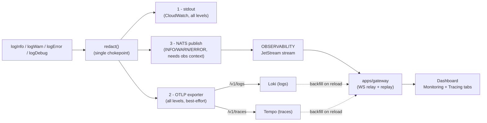
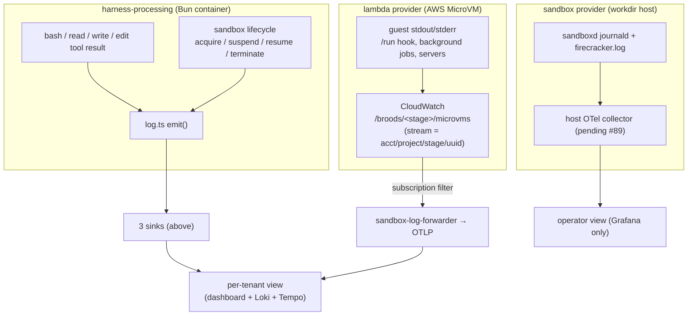

# Observability

Every log line and trace span the platform emits flows through **one redaction
chokepoint** and fans out to three sinks. This page describes that pipeline and how
**sandbox** activity (agent exec output, MicroVM runtime, and the workdir host) joins
it so the dashboard, Loki, and Tempo all see a single correlated stream per tenant.

## The three sinks

`src/shared/log.ts` `emit()` is the single place every line is redacted, then
written to:



- **stdout** — always, unmodified; the CloudWatch fallback and the source for metric
  filters (see [Runtime Telemetry](operations.md#runtime-telemetry)).
- **OTLP** — best-effort to `OTEL_EXPORTER_OTLP_ENDPOINT` (`/v1/logs`, `/v1/traces`),
  landing in **Loki** and **Tempo** as the long-term store. SDK-native gen-ai spans
  come from the AI SDK v7 `@ai-sdk/otel` integration, registered against the same
  tracer at init (`registerTelemetry(new OpenTelemetry({ tracer }))`); inputs/outputs
  are not recorded on those spans because the harness's own span rows already carry
  the redacted payloads.
- **NATS** — INFO/WARN/ERROR only, and only when an _observability context_ is set
  (project + stage + endpoint id). This is the live path the dashboard tails.

A failure in any one sink never blocks the others, and never throws into the agent path.

## User code

`console.*` inside an uploaded hook runs in a V8 isolate that has no
host logger of its own. The isolate sends each line back as a `log` frame on the
same NDJSON protocol that carries results, and the host re-emits it through
`emit()` while iterating that run's frames, so it inherits the run's observability
context and reaches all three sinks tagged `source: "user-code"`. Writing those
lines to the worker's stderr instead would lose them: the pooled worker, which is
the default, discards its children's stderr.

## Tenant scoping

Logs and spans carry the same tenant attributes so a span, its logs, and the live
dashboard stream all correlate:

`account_id` · `project` · `stage` · `endpoint_id` · `agent_id` · `conversation_key` · `trace_id`

NATS subjects encode the routable subset (`src/shared/nats.ts`):

```text
v1.<accountId>.<project>.<base64url(stage)>.{logs|traces}.<endpointId>
```

The durable **`OBSERVABILITY`** JetStream stream binds `v1.*.*.*.logs.>` and
`v1.*.*.*.traces.>`. Unlike the `WS_RESPONSES` resume buffer, it is **not** purged on
persist — it is the recent-history buffer (file-backed, ~2 h window) the gateway
replays on connect before tailing live. Loki/Tempo own everything older. See
[WebSocket Gateway](architecture.md#websocket-gateway-durable-nats-jetstream) for the
stream mechanics.

## Sandbox observability

A sandbox run produces logs in three places. The goal of this phase is that **all
three reach the same per-tenant view** with no change to the executor code.



**1 — In-band (already live, no executor work).** When the agent runs a tool inside a
sandbox, the result is logged through `log.ts` from within the harness process, where
the observability context is already set. Sandbox **lifecycle** events
(`microvm-executor.ts` / `workdir-executor.ts` / `daytona-executor.ts` calling
`logWarn`/`logInfo`) flow the same way. So exec output and lifecycle already appear on
the dashboard and in Loki/Tempo under the originating `endpointId` — correlated with
the model step that triggered them by `trace_id`. **No change to the executors is
required for this path.**

**2 — MicroVM guest output (CloudWatch → Loki, built).** What the guest itself writes
to stdout/stderr — the `/run` hook, detached background jobs, servers the agent started —
goes to CloudWatch at `/broods/<stage>/microvms`. Core names the stream at launch as
`<accountId>/<project>/<stage>/<uuid>`; a `-` segment marks a run with no deployment
scope (channel, cron), so that output still ships for operators but never indexes as a
tenant. A CloudWatch subscription filter invokes `apps/lambda/sandbox-log-forwarder.mjs`,
which splits the stream name into the `account_id` / `project` / `stage` resource
attributes, redacts, and posts one OTLP/HTTP request to the cluster collector — the only
external write path into Loki. The collector's per-tenant grouping and Loki's index
labels then apply unchanged; the per-VM id rides as `sandbox_id` structured metadata
under service `broods-sandbox`, so an ephemeral VM never becomes a new Loki stream.

The dashboard Instances sheet has a **Logs** tab that subscribes with that id
(`subscribe { sandboxId }`), and `broods logs --sandbox <id>` does the same. Sandbox
lines never pass through NATS, so the gateway serves such a subscription by polling
Loki every 2 s over a lookback window and dropping what it already relayed. The
backfill looks back one day, not the deployment stream's 30: the sandbox filter is
structured metadata, so Loki scans every chunk of the tenant in the window, and a
month took 8 s against 0.2 s for a day. Measured end to end, a line reaches the
screen 1–2 s after the collector accepts it; CloudWatch delivery adds a few seconds
in front of that. The forwarder and its filter are SST resources that deploy only when
`OTEL_EXPORTER_OTLP_HEADERS` is set for the stage: the same `Authorization=Basic …`
client line core ships with, so one credential serves both and rotates once.

**3 — workdir host (not built).** workdir has no guest log stream: `sandboxd` logs to
journald and each VM keeps a Firecracker log under its jail path, and neither carries a
tenant. When the production host lands (#89), an otel-collector-contrib on the host
(`journald` + `filelog` receivers, OTLP out to the same collector) ships those as
operator-only logs — `host`, `unit`, `sandbox_id`, no `account_id` — so they reach
Grafana and never a customer dashboard. Exec output already reaches the dashboard via
path 1.

## Security

- **One redaction chokepoint.** `log.ts` redacts by key name (deny exact/prefix/suffix
  lists) and scrubs every emitted string against the run's known secret values before
  any sink sees it. The same redaction applies to all three sinks.
- **Scoped credentials never enter a log.** The short-lived STS mount creds delivered
  to a sandbox are not logged by the harness. The MicroVM forwarder (path 2) applies the
  pattern half of that redaction — `Bearer`/`Basic` values, query-string secrets,
  `fp_agent_*`, `fp_sts_*` — but it cannot know a run's own secret values, so a guest
  that echoes an injected secret prints it, to the owning account's view and to
  operators. Sandbox stdout is untrusted; treat it that way.
- The NATS sink skips any task without a deployment-scoped context (channel/cron paths),
  so it never publishes to a malformed subject; stdout + OTLP still capture those lines.
- A sandbox tail is scoped like every other observability socket: the gateway builds the
  Loki selector from the key's server-derived `account_id`/`project`/`stage`, and the
  `sandboxId` a client sends only narrows inside that. It must be the UUID shape core
  mints; anything else is rejected at the wire before it reaches LogQL.

## Follow-ups

- **workdir host collector** (path 3) belongs to the workdir provisioning runbook in the
  `infra` repo and waits for the production host (#89).
- **Retention.** CloudWatch keeps the MicroVM group 30 days and Loki keeps 90. Once the
  bridge is verified on a stage, the group's retention can drop to a few days.
