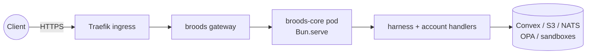
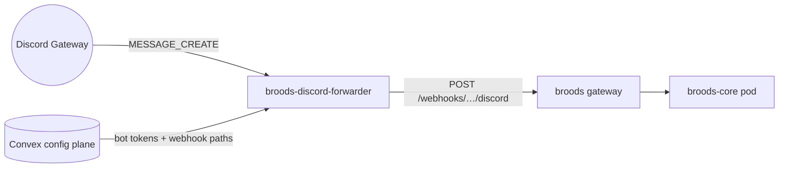
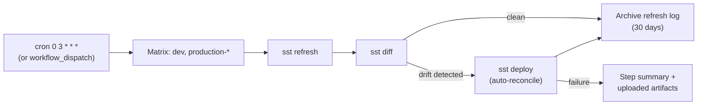
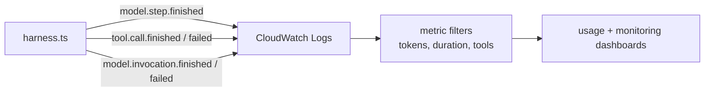

# Operations

This page covers both the **managed service** (`gateway.broods.app`) and **self-hosted** operations. Most day-to-day tasks use the CLI; self-hosted operators also manage SST infrastructure.

## CLI Commands

The `broods` CLI is the primary interface for both paths.

### Development

```bash
broods dev              # watch + sync Development + live-tail logs
broods dev --once       # sync once and exit (no watch, no logs)
broods diff             # show local vs remote diff
```

### Deployment

```bash
broods deploy           # sync Production
broods deploy --prune   # delete undeclared remote resources
broods deploy --rotate-key  # mint a fresh runtime API key
```

### Environment Variables

```bash
broods env set OPENAI_API_KEY    # store encrypted secret
broods env get OPENAI_API_KEY    # reveal value (audited)
broods env list                  # list names (values hidden)
broods env rm OPENAI_API_KEY     # remove variable
broods env sync                  # push every env("NAME") from .env.local
```

`set` also reads a piped value, so a secret can come straight from another tool:

```bash
echo "$VALUE" | broods env set SOME_NAME
```

`rm` refuses while a synced agent or sandbox still reads the variable through `env("NAME")`, and names what holds the reference. Drop the `env()` reference from those resources and sync before removing the variable. Otherwise the stored config keeps the `${NAME}` placeholder that `env("NAME")` compiles to, and the runtime has nothing left to substitute for it. To rotate a secret, run `env set` again rather than removing it first.

### Keeping a stage in step with .env.local

A rotated secret is invisible until something reads it. `env list` prints names, `diff` compares resources, `agent get` reports the channels as connected — and the stage keeps serving the old value until a webhook comes back 401.

`broods env sync` closes that gap. It pushes every `env("NAME")` your project references from `.env.local` to the current stage, skipping the ones the stage already holds the same value for, and prints what moved:

```text
▌ ↑ Synced 1 env var(s) from .env.local: ZALO_WEBHOOK_SECRET
3 other referenced variable(s) already in step with demo-app/production.
1 referenced variable(s) live only on demo-app/production: SLACK_SIGNING_SECRET
```

The last line is the referenced names `.env.local` does not carry — a secret set straight on the stage. `env sync` leaves those alone; naming them is what separates them from the ones it does control.

The stage stores a SHA-256 digest beside each encrypted value, so the CLI can compare the two sides without either revealing a secret. `broods diff` uses the same comparison and warns when they disagree:

```text
⚠ .env.local and demo-app/development disagree on 1 variable(s): ZALO_WEBHOOK_SECRET — run `broods env sync` to push the local values.
```

`sync` only touches names the project references through `env("NAME")` — never `BROODS_*` control vars or unrelated `.env.local` keys — and never deletes. `broods dev` runs the same push on every sync. `broods deploy` does not: Production secrets stay an explicit `env set` or `env sync`, so a stale local value cannot ride a deploy into production.

### Observability

The terminal tails warnings and errors by default. The full INFO and DEBUG history lives in the dashboard monitoring panel, which can page and filter it.

```bash
broods stream            # live-tail warnings and errors
broods logs --limit 100  # backfill + live-tail
broods logs --all        # every level (DEBUG from history only)
broods logs --level info # INFO and above
```

### Agents

```bash
broods agent list       # list agents (name, public/private, model, deploy status)
broods agent get my-agent  # show resolved config
broods run my-agent          # terminal UI chat session
broods run my-agent "Hello"  # same, with the prompt sent as the first turn
```

### Global Options

| Flag                    | Description            |
| ----------------------- | ---------------------- |
| `--dashboard-url <url>` | Override dashboard URL |
| `--project <name>`      | Override project name  |
| `--stage <name>`        | Override target stage  |

## Self-Hosted Configuration

For self-hosted deployments, `sst.config.ts` is the source of truth for infra names, tags, region, the AWS data plane, MicroVM sandbox integration, S3 buckets, and SST secrets. `packages/convex/schema.ts` owns persistent tables.

Use `apps/core/.env` for local SST inputs only:

- `AWS_PROFILE`
- `SST_STAGE`
- `AWS_ACCOUNT_ID`, `PROJECT_NAME`, `PROJECT_OWNER_EMAIL` - Required by `sst.config.ts`; no in-source defaults.
- `ENABLE_DIRECT_API` - Deploys as `false` unless set to `true`; enables direct sync and async POST access to `harness-processing`.
- `ENABLE_WEBSOCKET` - Set to `true` to enable WebSocket gateway worker invocations.
- `NATS_URL` - Required when `ENABLE_WEBSOCKET=true`; ignored by the deployed core container when WebSocket is disabled. The transport is chosen by scheme: `wss://`/`ws://` (WebSocket, e.g. `wss://nats.beeblast.co` from an out-of-cluster caller) or `nats://`/`tls://` (core TCP, for in-cluster callers).
- `NATS_TOKEN` - Token-auth credential for the NATS server; optional (omit for an unauthenticated server).
- `OPA_BASE_URL` - Optional OPA REST endpoint for runtime policy decisions. The core container needs a reachable OPA endpoint; hosted stages use the exposed `https://opa.beeblast.co` endpoint, while `http://127.0.0.1:8181` only works against a locally running OPA.
- `OPA_API_TOKEN` - Bearer token for the OPA REST API. Required when the endpoint enforces token authentication (the hosted `opa.beeblast.co` does); sent as an `Authorization: Bearer` header.

Runtime secrets are SST secrets. Generate your own secret and set

```bash
bunx sst secret set AdminAccountSecret <long-random-value>
bunx sst secret set AccountConfigEncryptionSecret <long-random-value>
bunx sst secret set DaytonaApiKey <daytona-api-key>
```

- `AdminAccountSecret` - Authenticates admin account-management requests.
- `AccountConfigEncryptionSecret` - Encrypts agent config payloads in Convex.
- `DaytonaApiKey` - Daytona sandbox provider key; required by the deploy (no fallback).

Treat `AdminAccountSecret` and `AccountConfigEncryptionSecret` as stable production secrets; rotating the encryption secret requires a re-encryption migration for existing agent configs.

Provider API keys are account-specific, not global SST secrets. Each account-owned agent configures its provider API key in `config.provider.<provider>.apiKey`. Similarly, per-tool credentials are configured per agent under `config.tools.<tool>`, and MCP server credentials ride the registered server's headers as account env-var references. This allows different users to use their own API keys.

Manual account creation through `POST /accounts` requires `AdminAccountSecret` and creates a standalone Convex account with an admin-owned synthetic org id. Normal hosted onboarding continues to use the dashboard-authenticated Convex config plane and a real WorkOS organization.

WebSocket gateway support is application infrastructure, not agent configuration. `sst.config.ts` fails early when `ENABLE_WEBSOCKET=true` is set without `NATS_URL`. At runtime, `harness-processing` also rejects `nats-worker` invocations unless WebSocket is enabled and the NATS connection can be established.

OPA-backed agent policy is optional. When an agent has no assigned policy IDs, runtime behavior is unchanged and no policy decision is requested. When policies are assigned, Broods posts policy inputs to OPA at `/v1/data/broods/authz/decision` using `OPA_BASE_URL` + `OPA_API_TOKEN`. Inputs include action/resource context plus sanitized tool-call details (`toolName`, `mcpId`, `tool.input.*`) so policies can match specific functions and parameters. Each policy document carries a `mode` that picks its own rollout stage: `audit` (default) evaluates and records every decision without blocking; `enforce` lets that policy's deny rules refuse, switches the places it is attached to over to default-deny, and fails closed when OPA is unavailable. Policies attached to the same place can mix, so a new rule can watch while an established one refuses.

## Local Setup

Install dependencies:

```bash
bun install
```

Copy local config:

```bash
cp apps/core/.env.example apps/core/.env
```

Keep `apps/core/.env` for local SST config only. Do not put deployed secrets in that file. Demo scripts read their own env from `packages/demos/<name>/.env`.

## Run, Build, and Deploy

```bash
bun run dev
bun run check
bun run build
bun run deploy
```

`bun run deploy` runs `bun run build` first, then `sst deploy`.

Deploy outputs include:

- `filesystemBucketName`, `skillsBucketName`, `toolBundlesBucketName`
- `cronScheduleGroupName`, `cronSchedulerTargetArn`, and `cronSchedulerRoleArn`

## Container Runtime (Phase 9a)

The core ships as a single container image, `ghcr.io/beeblastco/broods-core`, built from `apps/core/Dockerfile` by the `Build Core Image` workflow (`dev` and `main` tags). One Bun process serves both harness and account routes through the gateway. The container uses Convex plus S3, NATS, OPA, and sandbox providers; an IAM access key for the per-stage `core-runtime` user authorizes the remaining AWS data plane. Core does not talk to EventBridge Scheduler — the Convex config plane owns every schedule, including the account-deletion sweep.



Runtime notes:

- Async self-invocations run in-process (capped by `MAX_INPROCESS_WORKERS`).
- Background-job callbacks use `PUBLIC_BASE_URL`.
- The invocation deadline is synthesized from `REQUEST_TIMEOUT_BUDGET_MS` (default 10 minutes).
- Cron schedules publish onto the cron-runs event bus from SST output `cronSchedulerTargetArn`; the bus rule forwards to the API destination, which POSTs to `${PUBLIC_BASE_URL}/v1/cron-runs` through the gateway. The Convex deployment env vars stay `CRON_SCHEDULER_TARGET_ARN`, `CRON_SCHEDULER_ROLE_ARN`, and `CRON_SCHEDULER_GROUP_NAME`; flip `CRON_SCHEDULER_TARGET_ARN` to the bus ARN at cutover with no code change.

The pods are deployed from the infra repo (`kubernetes/charts/releases/core-dev.yaml` / `core.yaml`) behind the gateway.

## Discord Gateway Forwarder

Discord delivers regular messages only over a Gateway WebSocket, so a process
has to hold one for every Discord bot token. Per token, not per agent: Discord
counts connections against the token and delivers every event to each of them,
so two agents sharing a token share one socket and it fans out to both of their
webhooks. That is
`ghcr.io/beeblastco/broods-discord-forwarder`, built from
`apps/discord-forwarder/Dockerfile` by the `Build Discord Forwarder Image`
workflow and deployed from the infra repo
(`kubernetes/charts/releases/discord-forwarder.yaml`).



There is one release, not one per stage. `BROODS_CONFIG_PLANES` lists the Convex
deployments it reads as a JSON array of `{name, convexUrl, webhookBaseUrl}`, and
each plane's admin credential comes from `CONVEX_DEPLOY_KEY_<NAME>` — plane `dev`
reads `CONVEX_DEPLOY_KEY_DEV`. Adding a deployment is one array entry and one
secret key. It never holds `ACCOUNT_CONFIG_ENCRYPTION_SECRET`; Convex decrypts and
returns only the bot token and webhook path, through
`channel/connections.listConnections`.

A plane is isolated from its neighbours. One that fails a poll keeps serving
whatever it last answered, so a Convex blip cannot read as "every token here was
deleted" and close its sockets; one that has never answered contributes nothing,
so a deployment whose backend is not live yet does not stop the others from
running. Only a poll where no plane answered leaves the pod unready.

Sharing one process across planes is not a tidiness choice. Discord counts
connections against the bot token, and nothing stops the same token being
deployed to both dev and prod, so a forwarder per stage would hold two sockets
for it and answer every message twice. One process keys sockets by token and
fans that token's event out to both planes' webhooks instead.

Only Discord needs this. Telegram, Slack, Zalo, GitHub and Pancake all deliver
regular messages to a registered webhook URL, so nothing has to stay connected
on their behalf. The Convex query takes a channel name rather than assuming
Discord, so a transport that does need a held-open connection (Slack Socket
Mode, Telegram long polling) reuses the same read.

Operational constraints, in order of how much they matter:

- **Single replica, `strategy: Recreate`.** Two pods means two sockets per bot
  token, and Discord sends every event to both. Do not scale it, do not let a
  RollingUpdate surge a second pod, and do not stand up a second release per
  stage — add a plane to the existing one instead.
- **Discord resets a bot token after 1000 IDENTIFYs in 24 hours** and emails its
  owner. The forwarder caps reconnect backoff at 300s and counts IDENTIFYs per
  token, parking a socket rather than dialling past the limit. A restart loop is
  the one failure mode that defeats the counter, which is why liveness
  (`/healthz`) does not depend on the config plane — only readiness (`/readyz`)
  does.
- **Close code 4014 means Message Content Intent is off** in the Discord
  developer portal. The forwarder logs it by name and stops; no config change on
  the Broods side fixes it.

`GET /healthz` reports per-socket state, so `state: "fatal"` on a token is the
signal that a bot needs attention in the portal.

## Post-Deploy Account Setup (Self-Hosted)

When self-hosting, the CLI still handles tenant configuration. After `broods deploy` syncs your resources, the CLI prints the agent-scoped webhook URLs. Register them with your channel providers (see the [Channels overview](channels/index.md)).

If you need to create an account manually (e.g. for automated testing), use the admin `AdminAccountSecret`:

```bash
curl -X POST "$BROODS_BASE_URL/accounts" \
  -H "Authorization: Bearer $ADMIN_ACCOUNT_SECRET" \
  -H "Content-Type: application/json" \
  -d '{"username": "company-a"}'
```

For day-to-day development, prefer the CLI-managed flow described in [Getting Started](getting-started.md).

## Channel Setup

Declare channel agents with the CLI SDK and run `broods dev` or `broods deploy`. The CLI prints the agent-scoped webhook URL after synchronization. Provider registration remains an explicit operation documented by the matching `packages/demos/channel-*` package; infrastructure deployment does not provision demo channel accounts.

## Public Access & Agent Commands

The public runtime endpoint (HTTP/SSE and WebSocket, authenticated with the stage runtime key) is **off by default** for each agent — secured. An agent only answers public-key requests when its config opts in:

```ts
export const myAgent = defineAgent({
  name: "my-agent",
  // …model, provider, sandbox…
  publicAccess: true, // expose the public SSE/WebSocket endpoint,
});
```

When `publicAccess` is not set, a public-key request for that agent is refused with HTTP `403` (`{"error": "...", "code": "public_access_disabled"}`). Internal callers (account/admin secret), channel webhooks, and cron runs are never gated by this flag, so a private agent stays reachable through an internal endpoint or a channel webhook. The dashboard's agent **Public API** panel shows the toggle and hides the endpoint URLs while access is off.

The stage runtime key is encrypted at rest and recoverable by the owning user. The dashboard loads it automatically for Monitoring and Tracing, while `broods login` or `broods deploy` writes it to `BROODS_API_KEY` in `.env.local`. Dashboard and CLI sessions reuse the stored key without rotating it.

Logs and traces are published once to NATS and captured by a durable `OBSERVABILITY` JetStream stream (bound to the `*.logs.>` / `*.traces.>` subjects). See [Observability](observability.md) for the full pipeline, including how sandbox (MicroVM + workdir) logs route into the same per-tenant view. On (re)connect the gateway replays the recent window from that stream and then tails live, so the dashboard shows full-fidelity recent activity even for a run that happened while no tab was open — JetStream replay, not the slower/lossier core subscribe it replaced. Loki (logs) and Tempo (traces) remain the long-term store for history older than the replay window; the refresh control reloads from them. Because Tempo truncates large attributes on ingest, the dashboard prefers the richer/terminal copy of a span when the same span arrives from both sources, so a reload never downgrades a payload.

Tracing shows active and completed tasks with a started-time column, the system prompt, the tools exposed to the model, model input, reasoning, response, tool calls, tool input, and the tool output returned to the model. The system prompt section (`model.system`) is the whole assembled instruction text — the agent's own prompt plus every injected block: the memory index, the workspace/memory/scheduler/skills/subagent harness prompts, skills loaded mid-run, persisted system context, and steering. It is recorded on the task span and again on each model step, because a step's instructions are refreshed at the step boundary; `model.system_part_count` and `model.system_chars` report the real size even when the payload itself is truncated. Every top-level run is its own trace, labelled by what started it: `task` for a person's request, `cron` for a scheduled task firing, `subtask` for a subagent. Each model step is decomposed into **time to first token** (queue/prefill wait), **streaming** (model token generation only), and **tool wait** (tool execution, also shown as the child tool spans) — streaming never folds in tool-execution time, so a slow tool can't be mistaken for slow generation. Channel webhooks and account-management operations resolve the same stage scope as direct agent calls. Configuration mutations now write to Convex `configAuditEvents`, and the dashboard Settings → Audit Logs tab reads that feed reactively; the former core service-audit leaf has been removed.

> Bringing your own custom domain to replace the generated endpoint URL is tracked as a future enhancement.

Inspect and test agents from the CLI:

```bash
broods agent list            # name, public/private, model, deploy status
broods agent get <name>      # model, sandbox, workspaces, tools, channels, webhook
broods run <name>            # terminal UI chat session
broods run <name> "<prompt>" # same session, with the prompt sent as the first turn
broods run <name> "<prompt>" > out.txt  # redirected output streams plain text instead
```

`run` reaches the agent over the public endpoint, so it needs `publicAccess: true`; otherwise it reports the secured-by-default `403` with guidance to enable it.

In a terminal, `run` opens the AI SDK terminal UI: a scrollable chat session with rendered markdown, streamed reasoning, expanded tool cards showing each call's input and output, token statistics, and `y`/`n` approval prompts for tools that request them. Press Enter to send, arrow keys or PgUp/PgDn to scroll, Ctrl+L to repaint, and Esc or Ctrl+C to leave. A prompt on the command line is sent as the first turn and the session stays open for follow-ups.

The agent still runs where it is deployed — each turn is a normal SSE run on one conversation, and approvals travel back over the same direct API — so tools, sandboxes, and policies behave exactly as they do in production.

When stdin or stdout is not a terminal (a pipe, a redirect, CI), `run` streams the answer as plain text instead, so scripted runs stay parseable. A prompt is required in that case, since there is no way to type one.

For quick health checks, redirect the output so the probe stays non-interactive:

```bash
broods run my-agent "ping" | cat
```

Or verify the harness URL directly:

## Live Probes

Example scripts use these environment variables:

```bash
export BROODS_BASE_URL=<gatewayUrl>
export ACCOUNT_GOOGLE_API_KEY=<googleApiKey>
```

Each script creates a temporary account through `BROODS_BASE_URL/accounts` using `ADMIN_ACCOUNT_SECRET`, runs the probe with the returned account secret, then deletes the test account through `DELETE /v1/account` in a cleanup step.

Confirm the harness URL is live:

```bash
curl "$BROODS_BASE_URL"
```

Expected response:

```json
{
  "status": "ok",
  "method": "POST"
}
```

Run:

```bash
# Account management (Create, Update, Delete)
cd packages/demos/account && bun index.ts

# Stream SSE with tools
cd packages/demos/stream && bun index.ts

# Async endpoint with polling
cd packages/demos/async && bun index.ts
```

## CI

- GitHub Actions runs CI on pull requests and pushes; deploys run on pushes to `dev` (stage `dev`) and `main` (stage `production`). Docs-only changes are skipped.
- See [CI/CD](ci-cd.md) for the required repository secrets and variables.

## Drift Cleanup

A daily GitHub Actions workflow (`.github/workflows/drift-cleanup.yaml`) reconciles
drift between `sst.config.ts` and the live stack so resources whose code was
removed cannot accrue charges by sitting in the cloud unreconciled.



| Stage          | Auto-reconcile on drift?                                   | Gate                                                                          |
| -------------- | ---------------------------------------------------------- | ----------------------------------------------------------------------------- |
| `dev`          | yes                                                        | GitHub `development` environment (no approval)                                |
| `production-*` | yes (when the GitHub `production` environment is approved) | GitHub `production` environment (approval-gated — same gate as a prod deploy) |

Each run uploads the full refresh + diff log as the artifact
`drift-plan-{stage}`. The first 200 lines of any non-empty diff are also rendered
in the workflow's step summary, so a Slack-notified CI summary is enough to see
what got deleted when the run auto-reconciles.

This is the safety net for stages that did not get reconciled at the time of a
code change (failed dev deploy, or a Phase-4-style cutover landing after the
last prod deploy). It catches Pulumi-state-tracked orphans only; resources
created entirely outside SST state (no Pulumi URN — e.g. an `aws ec2` command
run by hand) still need manual cleanup.

## Runtime Telemetry

`harness-processing` writes compact JSON log lines for metric-bearing model and tool events so CloudWatch Logs Insights, metric filters, and dashboards can graph model usage without parsing SSE payloads.



Common fields:

- `eventType` - stable metric key, for example `model.step.finished` or `tool.call.finished`
- `accountId`, `agentId`, `conversationKey`, `eventId`
- `modelProvider`, `modelId`, `stepNumber`, `durationMs`
- `model.step.finished` carries per-model-call `durationMs`, the AI SDK `usage`, response ID/model/timestamp, provider metadata, warning counts, and tool call/result counts
- `model.invocation.finished` and `model.invocation.failed` carry final turn status, whole-run `durationMs`, AI SDK total token `usage`, step count, tool call count, `toolsUsed`, per-tool `toolUsage`, and compact `toolCalls` summaries
- `toolName`, `toolCallId`, and `durationMs` for tool events
- A `tool.call` span for a hosted MCP server tool also carries `tool.compute.type` (`"mcp-sandbox"`, the tool-runner Lambda) and `tool.compute.cpu_usec`, so a trace shows which runtime served the call and what it cost. Their absence means the call ran in-process.

Prompts, full tool inputs, tool outputs, request bodies, response bodies, and response headers are not logged by default. This keeps the CloudWatch stream useful for usage visualization while avoiding high-volume or sensitive payloads.
