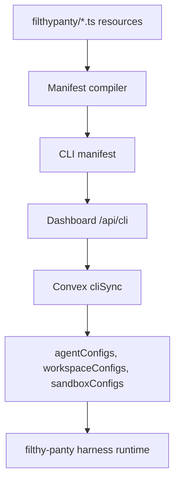

# Filthy Panty CLI and TypeScript SDK

Status: initial implementation.

The `filthy-panty` package provides a Convex-style CLI and strict TypeScript SDK
for defining account resources as code. User projects keep resource definitions
in a `filthypanty/` folder, and the CLI syncs those resources to the SaaS
dashboard/Convex control plane.

## Local Project Shape

```text
filthypanty/
  agents.ts
  _generated/
    api.ts
    ids.ts
    resources.ts
    dataModel.ts
```

Example:

```ts
import {
  defineAgent,
  defineWorkspace,
  env,
} from "filthy-panty";

export const repo = defineWorkspace("repo", {
  storage: { provider: "s3" },
});

export const support = defineAgent("support", {
  provider: {
    openai: { apiKey: env("OPENAI_API_KEY") },
  },
  model: {
    provider: "openai",
    modelId: "gpt-5-mini",
  },
  workspaces: [repo],
});
```

Workspace references are resource objects. The compiler maps `workspaces: [repo]`
to the runtime shape expected by the harness.

Project and environment can be inferred from the folder and command, passed as
CLI flags, read from `.env.local`, or optionally defined with
`defineFilthyPanty(...)` in `filthypanty/filthy-panty.config.ts`.

Runtime code follows the same split as Convex: import the client from the
package and typed generated references from `filthypanty/_generated/api`.

```ts
import { FilthyPantyClient } from "filthy-panty";
import { api } from "./filthypanty/_generated/api";

const client = new FilthyPantyClient({
  host: process.env.FILTHY_PANTY_HOST,
  apiKey: process.env.FILTHY_PANTY_API_KEY,
});

const result = await client.run(api.agents.support, {
  input: "hello",
});
```

`FILTHY_PANTY_API_KEY` is the environment's runtime key (`fp_agent_…`). One key
invokes **any** agent in that project/environment — the agent is selected by the
generated `api.agents.*` reference, not by the key. `filthy-panty deploy` mints
the key on first run and writes it to `.env.local` (the full secret is shown
once; `filthy-panty deploy --rotate-key` mints a fresh one). You can also
generate or rotate it from an agent's **Public API** panel in the dashboard.

## Commands

```bash
filthy-panty init
filthy-panty login
filthy-panty dev
filthy-panty diff
filthy-panty deploy
filthy-panty deploy --prune
filthy-panty deploy --rotate-key
filthy-panty env set OPENAI_API_KEY
filthy-panty logs
filthy-panty run support "hello"
```

`login` uses the dashboard's WorkOS/AuthKit session. The CLI opens a protected
dashboard route, receives a one-time code through a local callback, exchanges it
for an `fp_cli_...` token, and stores that token outside the project directory.
Deploy keys remain available for CI/headless use.

## Sync Path



The SDK contract layer type-imports source-of-truth types from Convex generated
data-model types and core storage/runtime config types. Avoid adding parallel
hand-written resource config object shapes to the package.
