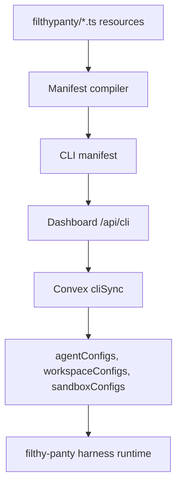

# Filthy Panty CLI and TypeScript SDK

Status: initial implementation.

The `filthy-panty` package provides a Convex-style CLI and strict TypeScript SDK
for defining account resources as code. User projects keep resource definitions
in a `filthypanty/` folder, and the CLI syncs those resources to the SaaS
dashboard/Convex control plane.

## Local Project Shape

```text
filthypanty/
  filthy-panty.config.ts
  agents.ts
  generated/
    ids.ts
    client.ts
    resources.ts
    types.ts
```

Example:

```ts
import {
  defineAgent,
  defineFilthyPanty,
  defineWorkspace,
  env,
} from "filthy-panty";

export default defineFilthyPanty({
  project: "my-app",
  environments: {
    dev: "development",
    deploy: "production",
  },
});

export const repo = defineWorkspace("repo", {
  storage: { provider: "s3" },
});

export const support = defineAgent("support", {
  provider: {
    openai: { apiKey: env("OPENAI_API_KEY") },
  },
  model: {
    provider: "openai",
    modelId: "gpt-5-mini",
  },
  workspaces: [repo],
});
```

Workspace references are resource objects. The compiler maps `workspaces: [repo]`
to the runtime shape expected by the harness.

## Commands

```bash
filthy-panty init
filthy-panty login
filthy-panty dev
filthy-panty diff
filthy-panty deploy
filthy-panty deploy --prune
filthy-panty env set OPENAI_API_KEY
filthy-panty logs
filthy-panty run support "hello"
```

`login` uses the dashboard's WorkOS/AuthKit session. The CLI opens a protected
dashboard route, receives a one-time code through a local callback, exchanges it
for an `fp_cli_...` token, and stores that token outside the project directory.
Deploy keys remain available for CI/headless use.

## Sync Path



The SDK contract layer type-imports source-of-truth types from Convex generated
data-model types and core storage/runtime config types. Avoid adding parallel
hand-written resource config object shapes to the package.
