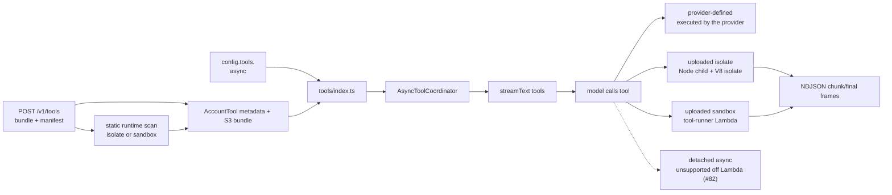
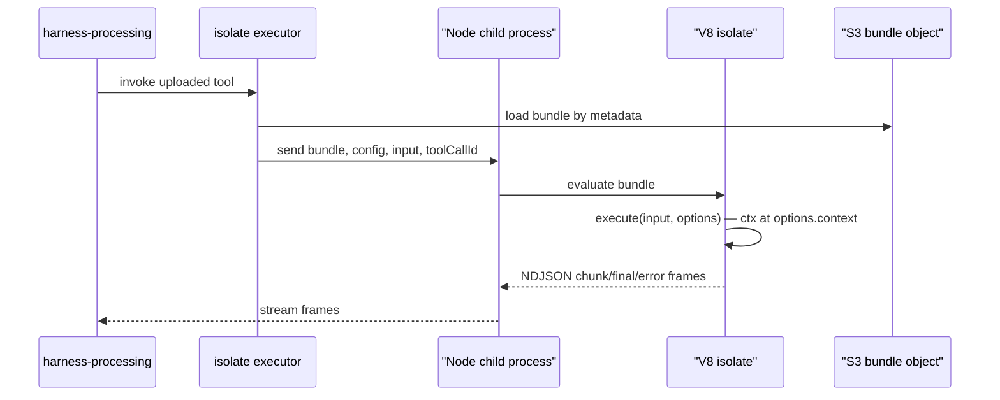
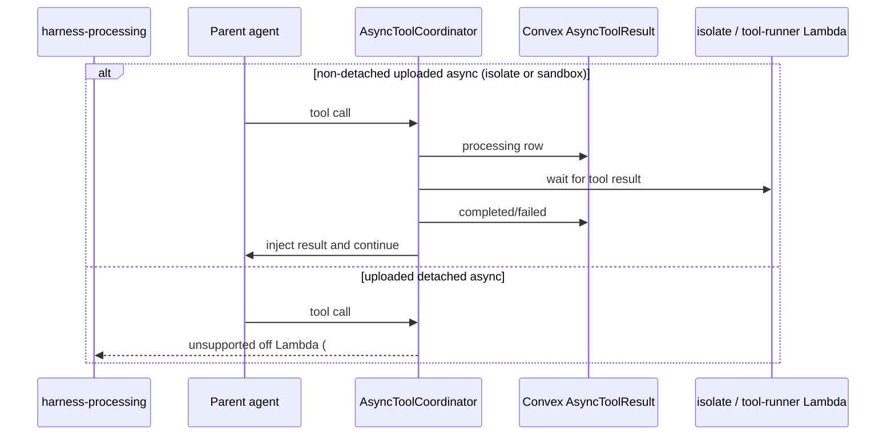

# External Tools

This guide covers agent-configured external tools: provider-defined tools and account-uploaded custom tools. It does not cover the sandbox tools (`bash`, `read`, `write`, `edit`, `glob`, `grep` — see [Workspace & Sandbox](workspace/index.md)), `load_skill`, or `run_subagent`.

Core ships **no built-in external tools**. Every `config.tools` key is one of two things:

- **A provider-defined tool** — a tool the configured AI SDK provider executes itself, named exactly as the provider exposes it on its `tools` namespace. Core resolves the name against the live provider at registry build, so any provider-executed tool the AI SDK ships works with no core change.
- **An uploaded custom tool** — keyed by its account-scoped `toolId`, with the uploaded manifest supplying the model-facing name, description, and input schema. Pure-compute / fetch-only bundles execute in the in-core V8 isolate tier; bundles that need Node, npm, or native modules execute in the platform tool-runner Lambda (the sandbox tier). Only detached-async execution is still deferred (#82).

Anything the provider does not execute itself belongs in an uploaded custom tool that calls the service through the isolate's SSRF-guarded `ctx.fetch` (isolate tier) or native `fetch` (sandbox tier).



## Current Tools

| Tool                  | File                                                                                                                                       | External dependency                                                 | Config key                    |
| --------------------- | ------------------------------------------------------------------------------------------------------------------------------------------ | ------------------------------------------------------------------- | ----------------------------- |
| Provider-defined tool | [`src/harness/tools/provider-tool.ts`](https://github.com/beeblastco/broods/blob/dev/apps/core/src/harness/tools/provider-tool.ts)         | The configured AI SDK provider's own `tools` namespace              | `config.tools.<providerTool>` |
| `async_status`        | [`src/harness/tools/async-status.tool.ts`](https://github.com/beeblastco/broods/blob/dev/apps/core/src/harness/tools/async-status.tool.ts) | — (auto-registered, see below)                                      | —                             |
| Uploaded custom tool  | S3 bundle + account tool metadata                                                                                                          | V8 isolate for `runtime: "isolate"`; tool-runner Lambda for `runtime: "sandbox"` | `config.tools.<toolId>`       |

Provider-defined tool names come from the provider package, not from core. With `config.model.provider: "google"` that includes `googleSearch`, `urlContext`, `googleMaps`, `codeExecution`, `fileSearch`, and `enterpriseWebSearch`; other providers expose their own set. A name the configured provider does not expose is rejected when the agent runs, with the available names listed in the error.

`async_status` is not configured directly: it is registered automatically whenever any `config.tools` entry has `async: true` or a workspace has a persistent sandbox. It is the model-facing polling surface for the async lifecycle described below (`statusId` + actions `status`/`logs`/`stop`).

Sandbox tools come from a referenced `sandbox` (+ `workspaces`) — see [Workspace & Sandbox](workspace/index.md). Skills use `config.skills`; see [Skills](skills.md). Subagents use `config.subagent`.

## Runtime Behavior

`src/harness/harness.ts` resolves the configured model and calls `createTools()` from [`src/harness/tools/index.ts`](https://github.com/beeblastco/broods/blob/dev/apps/core/src/harness/tools/index.ts).

Tool registry path:

1. `createTools()` rejects `config.tools` names reserved by the harness itself.
2. The sandbox tools come from a referenced `sandbox`: `bash` (stateless) when there is no workspace; per workspace, the full `read`/`write`/`edit`/`glob`/`grep`/`bash` set when it has an effective sandbox, or read-only `read`/`glob` when it has none (via a read-only mount by default, or direct S3 with the `sandbox: null` opt-out). Approvals follow that workspace's `permissionMode`.
3. `run_subagent` comes only from `config.subagent`.
4. `load_skill` comes from `config.skills`.
5. Every remaining non-`toolId` key is resolved against the configured provider's `tools` namespace; the config keys other than `enabled`/`needsApproval`/`async` are passed through as that tool's arguments.
6. Convex-id config keys load account-owned uploaded tool metadata and expose the uploaded model-facing tool name.
7. `needsApproval` is applied before tools are passed to `streamText()`.
8. Local `execute` tools with `async: true` are wrapped by `AsyncToolCoordinator`.

Provider-defined tools are executed by the provider during the model call, not by core. Uploaded custom tools are classified at upload time by a static scan:

- `runtime: "isolate"` for pure-compute JavaScript/TypeScript with no `node:` imports, `require`, npm/native dependencies, or use of `process` as a bare global. Reading `process` through a namespace object (`globalThis.process?.versions?.node`) is the standard runtime feature probe: it is guarded, falls through in an isolate, and does not force the sandbox tier. Bundlers inline that pattern from common libraries, so an otherwise pure bundle stays on the isolate tier.
- `runtime: "sandbox"` for code that needs Node, npm, or native modules.

Both tiers execute today. The **isolate** executor runs the bundle in a V8 `isolated-vm` isolate hosted in a Node child process of the core (Bun cannot load `isolated-vm`). The isolate exposes timers, `queueMicrotask`, `console`, `AbortController`/`AbortSignal`, Web-Crypto-ish globals, and an SSRF-guarded global `fetch` plus `ctx.fetch`; private and metadata ranges are blocked, and DNS-rebinding protection pins resolved addresses. There is no npm or native import surface.

The **sandbox** executor invokes the platform tool-runner Lambda — a plain Node.js function that runs the bundle in a per-invocation child process with a scrubbed env (no AWS credentials) and a fresh `TMPDIR`. It has the full Node surface: native `fetch`, timers, `AbortController`, `node:` builtins, and any npm deps the bundler inlined. Egress is open (the function runs outside a VPC), which is what AI-SDK ecosystem tools (Tavily, Exa, Firecrawl) need. Invocation is request/response, so a streaming tool's `yield`s are buffered and replayed once the run completes rather than surfaced live.

**Calling convention.** Both tiers invoke the AI SDK signature `execute(input, options)`: `options.context` carries the broods `ctx` (`{ config, fetch, state, … }`), `options.toolCallId` is the model's tool-call id, and `options.abortSignal` is a real `AbortSignal`. Authoring is unchanged — you write `execute(ctx, input)` and the CLI emits a one-line build-time adapter (`execute(input, options) => impl.execute(options.context, input)`). A fetch-only tool shaped like the AI SDK `tool({ execute })` is compatible too. Bundle-size caps agree across the CLI, core, and the config plane at 1 MB; the sandbox result is bounded by the ~6 MB Lambda response.



### Streaming partial output (sync)

A bundle whose `execute` is an async generator streams partial output from the isolate. Each `yield` becomes an NDJSON `chunk` frame, and a normal return produces one `final` frame; thrown errors produce `error` frames. The executor surfaces those frames as an async iterable. The AI SDK turns each yield into a **preliminary tool result** on the sync SSE stream; the last yield is the final output the model sees. Auto-detected per call: a non-generator `execute` behaves exactly as before.

```ts
// uploaded bundle — yields stream as preliminary results, last yield is final
export default {
  async *execute(ctx, input) {
    yield { type: "text", value: "working…" };
    yield { type: "text", value: "done: " + input.q };
  },
};
```

```text
isolate NDJSON: {"t":"chunk",...}  {"t":"chunk",...}  {"t":"final",...}
SSE fullStream: tool-result(preliminary) … tool-result(preliminary) … tool-result(final)
```

When `config.tools.<name>.async` is `true`, the platform chooses the lifecycle from the tool type and request path:

| Tool type                | Request path                     | Tool code runs in        | Request/worker waits? | Result completion            | Model continuation                    |
| ------------------------ | -------------------------------- | ------------------------ | --------------------- | ---------------------------- | ------------------------------------- |
| Provider-defined         | all paths                        | the model provider       | Yes                   | provider returns tool output | same active agent loop                |
| Uploaded isolate sync    | all paths                        | V8 isolate in Node child | Yes                   | isolate returns final result | same active agent loop                |
| Uploaded isolate async   | SSE and other non-detached paths | V8 isolate in Node child | Yes                   | isolate returns final result | same active agent loop injects result |
| Uploaded sandbox sync    | all paths                        | tool-runner Lambda       | Yes                   | Lambda returns final result  | same active agent loop                |
| Uploaded sandbox async   | SSE and other non-detached paths | tool-runner Lambda       | Yes                   | Lambda returns final result  | same active agent loop injects result |
| Uploaded detached async  | `/async`, channel, NATS          | deferred external tier   | —                     | unsupported off Lambda (#82) | clear dispatcher error                |

The async coordination subsystem still exists. It creates `AsyncToolResult` rows, exposes `async_status`, waits for in-process pending work, and injects completed parent results for non-detached uploaded tools (isolate and sandbox). Uploaded detached async execution has no background execution path today; the dispatcher returns a clear error that detached uploaded tools are not yet supported off Lambda and are tracked in #82.



Notes:

- The continuation loop waits only for in-memory pending work: non-detached uploaded isolate async.
- The original `/async` status row is settled through `asyncResultEventId`; the internal continuation uses a separate event id for dedupe.
- Future: when NATS uses JetStream, missed WebSocket stream chunks can be replayed from persisted stream/consumer state. Until then, NATS continuation reaches the client only while the gateway/client remains subscribed.

> Warning: Provider-defined tools have no local `execute`, so they cannot use this wrapper. If `async: true` is configured for one of those tools, the runtime logs a warning and leaves the tool in its normal provider-defined behavior.

For sync direct API callers, approval requests are streamed as SSE and persisted in the conversation. The caller resumes the turn by sending a direct API `tool-approval-response`. Channel webhooks cannot complete approval; the handler denies channel approval requests with a channel-visible error.

> TODO: Add channel webhook support for completing tool approval requests when channel-safe approval UX is available.

## Code-First Configuration

Import the tool from its AI SDK provider package and pass it straight into
`config.tools`, keyed by the name the provider exposes:

```ts title="broods/index.ts"
import { google } from "@ai-sdk/google";
import { defineAgent, env } from "broods";

export const myAgent = defineAgent({
  name: "my-agent",
  config: {
    provider: { google: { apiKey: env.GOOGLE_API_KEY } },
    model: { provider: "google", modelId: "gemini-3-flash" },
    tools: {
      googleSearch: google.tools.googleSearch({
        searchTypes: { webSearch: {} },
      }),
      // Broods-side flags sit alongside the imported descriptor
      urlContext: { ...google.tools.urlContext({}), needsApproval: true },
    },
  },
});
```

A provider tool built by the AI SDK serializes to a plain descriptor —
`{ type: "provider", id: "google.google_search", args: {...} }`. Its lazy input
and output schemas do not survive JSON, so core rebuilds the tool by calling the
same provider factory with the descriptor's `args`, which keeps those schemas
intact. `enabled`, `needsApproval`, and `async` are Broods flags, not tool
arguments; the dashboard writes the equivalent flat shape
(`googleSearch: { enabled: true, searchTypes: {...} }`), which core accepts too.

Switching `config.model.provider` changes which tool names are available —
`openai` exposes `webSearch`, `codeInterpreter`, and `fileSearch`; `anthropic`
exposes `computerUse`, `bash`, `textEditor`, and `webSearch`. Core does not
maintain that list; it reads the provider's own `tools` namespace.

Tools the provider does not execute itself — an HTTP-backed API such as Tavily,
whose AI SDK package returns a client-executed `Tool` with a JavaScript
`execute` — cannot travel through config at all, because a function does not
serialize. Upload those as custom tools instead.

For uploaded custom tools, use `defineTool` and reference it by name in the agent config:

```ts title="broods/index.ts"
import { defineAgent, defineTool, env } from "broods";

export const analyze = defineTool({
  name: "analyze",
  config: {
    path: "tools/analyze.ts",
    description: "Analyze structured data.",
    inputSchema: {
      type: "object",
      properties: { data: { type: "array" } },
      required: ["data"],
    },
  },
});

export const myAgent = defineAgent({
  name: "my-agent",
  config: {
    tools: {
      [analyze.name]: {
        enabled: true,
        async: true,
        needsApproval: false,
      },
    },
  },
});
```

The CLI bundles the tool source into ESM, hashes it, and uploads it on sync. Agent references are rewritten to the deployed tool ID automatically.

Omitting a tool disables it. Setting `enabled: false` also disables it. Set `needsApproval: true` when the tool should require the AI SDK approval flow before execution.
Set `async: true` when a local `execute` tool may take long enough that the parent agent should keep working while the result is produced.
For uploaded tools, `config` is merged over the upload-time `defaultConfig` and passed to `ctx.config`. Pure-compute / fetch-only bundles run in the V8 isolate tier; node/npm/native bundles run in the tool-runner Lambda (sandbox tier). Only detached-async uploaded tools are deferred to #82.

See [`packages/demos/tool-custom-async-sse`](https://github.com/beeblastco/broods/tree/dev/packages/demos/tool-custom-async-sse) for a runnable direct SSE example that uploads `test_async`, enables `config.tools.<toolId>.async`, and asks the agent to call the uploaded tool. [`packages/demos/tool-custom-stream`](https://github.com/beeblastco/broods/tree/dev/packages/demos/tool-custom-stream) covers the streaming variant.

The full config field reference lives in the [API Reference](/api-reference) under `AgentConfig.tools`.

## Upload a Custom Tool

With the CLI, point `defineTool()` at a TypeScript or JavaScript entrypoint under `broods/`. The CLI bundles it as self-contained ESM (wrapping your `execute(ctx, input)` in the runtime `execute(input, options)` adapter), rejects source or output over 1 MB — the same cap core and the config plane enforce — hashes the compiled bundle, classifies it as `runtime: "isolate"` or `runtime: "sandbox"`, and uploads it through manifest sync. Agent references are rewritten to the deployed tool ID.

```ts title="broods/tools/my-tool.ts"
export default {
  name: "my_tool",
  description: "A custom tool that does something useful.",
  inputSchema: {
    type: "object",
    properties: { query: { type: "string" } },
    required: ["query"],
  },
  async execute(ctx, input) {
    return { type: "text", value: `Result for ${input.query}` };
  },
};
```

```ts title="broods/index.ts"
import { defineAgent, defineTool } from "broods";
import { api } from "./_generated/api";

export const myTool = defineTool({
  name: "my_tool",
  config: {
    path: "tools/my-tool.ts",
    description: "A custom tool.",
    inputSchema: {
      type: "object",
      properties: { query: { type: "string" } },
      required: ["query"],
    },
  },
});

export const myAgent = defineAgent({
  name: "my-agent",
  config: {
    tools: {
      [myTool.name]: { enabled: true, async: true },
    },
  },
});
```

The raw account-management API does not run a build step. When calling it directly, provide an already-bundled JavaScript module. See the [API Reference](/api-reference) `POST /v1/tools` for the raw shape.

Tool management endpoints (raw API):

- `GET /v1/tools`
- `GET /v1/tools/{toolId}`
- `PATCH /v1/tools/{toolId}`
- `DELETE /v1/tools/{toolId}`

## Add a Built-In Tool

1. Create `apps/core/src/harness/tools/<name>.tool.ts`.
2. Add the standard file header docstring.
3. Export a default tool factory, or named factories when one provider module exposes several tools.
4. Keep the model-facing schema and external service call in that tool file.
5. Import the factory in [`src/harness/tools/index.ts`](https://github.com/beeblastco/broods/blob/dev/apps/core/src/harness/tools/index.ts).
6. Add the factory to the static `toolFactories` map with the exact model-facing tool name.
7. Add config validation in [`src/shared/domain/agent-config.ts`](https://github.com/beeblastco/broods/blob/dev/apps/core/src/shared/domain/agent-config.ts) only for options the account can set.
8. Optionally set `config.tools.<name>.async: true` for slow local `execute` tools. Uploaded isolate and sandbox async tools are waited on for SSE and other non-detached paths. Uploaded detached async tools are deferred to #82.
9. Update the [API Reference](/api-reference) `AgentConfig.tools` schema, and focused tests/examples when the public config shape changes.

Keep the factory small. It should read `context.config`, resolve any API key, return a `ToolSet`, and leave unrelated orchestration to `harness.ts`.

```ts
/**
 * Example external service tool for the harness agent.
 * Keep Example API access and model-facing schema here.
 */

import { tool, type ToolSet } from "ai";
import { z } from "zod";
import type { ToolContext } from "./index.ts";

export default function exampleLookupTool(context: ToolContext): ToolSet {
  const { enabled: _enabled, apiKey, ...options } = context.config;

  if (typeof apiKey !== "string") {
    throw new Error("config.tools.exampleLookup.apiKey is required.");
  }

  return {
    exampleLookup: tool({
      description: "Look up external Example records.",
      inputSchema: z.object({
        query: z.string().min(1),
      }),
      execute: async ({ query }) => {
        const response = await fetch("https://api.example.com/search", {
          method: "POST",
          headers: {
            Authorization: `Bearer ${apiKey}`,
            "Content-Type": "application/json",
          },
          body: JSON.stringify({ query, ...options }),
        });

        if (!response.ok) {
          throw new Error(`Example lookup failed: ${response.status}`);
        }

        return response.json();
      },
    }),
  };
}
```

## Design Rules

- Keep external tool logic in `apps/core/src/harness/tools/<name>.tool.ts`.
- Do not add a new Lambda, queue, or worker for ordinary external-service tools; upload them as custom tools instead.
- Use `async: true` only when the tool has a local `execute`; provider-defined tools without `execute` remain provider-managed.
- Do not expose request lifecycle choices in agent config; the platform chooses the supported wait behavior from tool type and request path.
- Do not put external tool config under `workspace`, `skills`, or `subagent`.
- Prefer provider or service SDK types over new custom interfaces when they already model the same options.
- Keep account-specific credentials in encrypted agent config when the account owns them.
- Use SST secrets only for service-wide fallback credentials; per-account tool credentials belong in encrypted agent config.
- Return structured data from `execute` instead of pre-formatting prose for the model, use the `ToolSet` interface from vercel-ai sdk.
- Add approval support through `needsApproval`, not by asking inside the tool implementation. [Implement from vercel=ai sdk](https://ai-sdk.dev/docs/ai-sdk-core/tools-and-tool-calling#tool-execution-approval)
