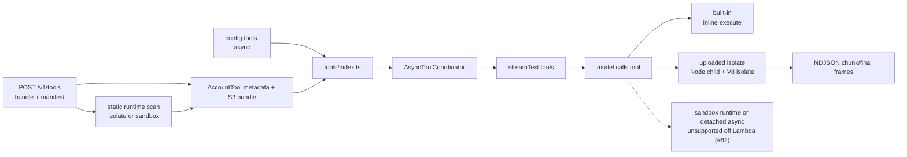
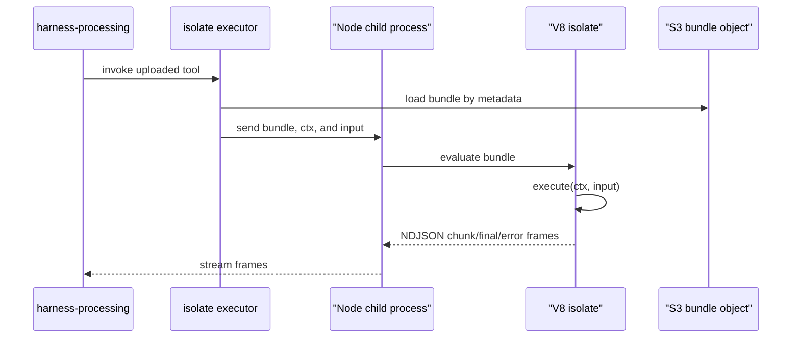
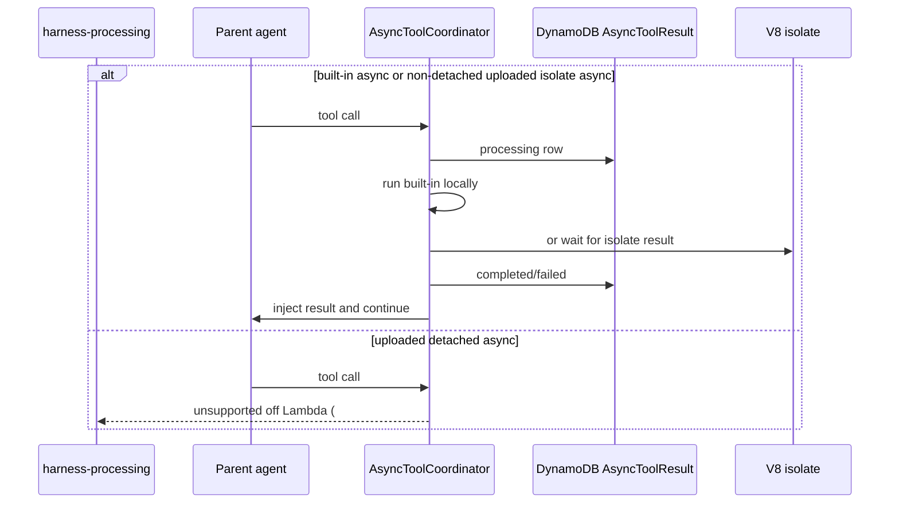

# External Tools

This guide covers agent-configured external tools: built-in tools such as Tavily/Google Search and account-uploaded custom tools. It does not cover the sandbox tools (`bash`, `read`, `write`, `edit`, `glob`, `grep` — see [Workspace & Sandbox](workspace/index.md)), `load_skill`, or `run_subagent`.

External tools are enabled per agent through `config.tools`. Built-in keys use their static name. Uploaded custom tools use their account-scoped `toolId` key, and the uploaded manifest supplies the model-facing name, description, and input schema. Uploaded pure-compute tool code executes in the in-core V8 isolate tier. Uploaded tools that need Node, npm, native modules, or detached async execution are deferred to the external sandbox tier tracked in #82.



## Current Tools

| Tool | File | External dependency | Config key |
| --- | --- | --- | --- |
| `tavilySearch` | [`src/harness/tools/tavily.tool.ts`](https://github.com/beeblastco/broods/blob/dev/apps/core/src/harness/tools/tavily.tool.ts) | Tavily AI SDK search | `config.tools.tavilySearch` |
| `tavilyExtract` | [`src/harness/tools/tavily.tool.ts`](https://github.com/beeblastco/broods/blob/dev/apps/core/src/harness/tools/tavily.tool.ts) | Tavily AI SDK extract | `config.tools.tavilyExtract` |
| `googleSearch` | [`src/harness/tools/google-search.tool.ts`](https://github.com/beeblastco/broods/blob/dev/apps/core/src/harness/tools/google-search.tool.ts) | Google provider-defined tool | `config.tools.googleSearch` |
| `handoffs` | [`src/harness/tools/handoffs.tool.ts`](https://github.com/beeblastco/broods/blob/dev/apps/core/src/harness/tools/handoffs.tool.ts) | Pancake tags + Zalo staff ping | `config.tools.handoffs` (`pancake.scenarioTagIds.{order,pending}`, `zalo.{botToken,notifyUserIds}`) |
| `async_status` | [`src/harness/tools/async-status.tool.ts`](https://github.com/beeblastco/broods/blob/dev/apps/core/src/harness/tools/async-status.tool.ts) | — (auto-registered, see below) | — |
| Uploaded custom tool | S3 bundle + account tool metadata | V8 isolate for `runtime: "isolate"`; sandbox runtime deferred (#82) | `config.tools.<toolId>` |

`async_status` is not configured directly: it is registered automatically whenever any `config.tools` entry has `async: true` or a workspace has a persistent sandbox. It is the model-facing polling surface for the async lifecycle described below (`statusId` + actions `status`/`logs`/`stop`).

Sandbox tools come from a referenced `sandbox` (+ `workspaces`) — see [Workspace & Sandbox](workspace/index.md). Skills use `config.skills`; see [Skills](skills.md). Subagents use `config.subagent`.

## Runtime Behavior

`src/harness/harness.ts` resolves the configured model and calls `createTools()` from [`src/harness/tools/index.ts`](https://github.com/beeblastco/broods/blob/dev/apps/core/src/harness/tools/index.ts).

Tool registry path:

1. `createTools()` rejects unknown `config.tools` names.
2. The sandbox tools come from a referenced `sandbox`: `bash` (stateless) when there is no workspace; per workspace, the full `read`/`write`/`edit`/`glob`/`grep`/`bash` set when it has an effective sandbox, or read-only `read`/`glob` when it has none (via a read-only mount by default, or direct S3 with the `sandbox: null` opt-out). Approvals follow that workspace's `permissionMode`.
3. `run_subagent` comes only from `config.subagent`.
4. `load_skill` comes from `config.skills`.
5. Built-in tools come from the static `toolFactories` map.
6. `tool_*` config keys load account-owned uploaded tool metadata and expose the uploaded model-facing tool name.
7. `needsApproval` is applied before tools are passed to `streamText()`.
8. Local `execute` tools with `async: true` are wrapped by `AsyncToolCoordinator`.

Built-in local tools execute during the current `harness-processing` request. Uploaded custom tools are classified at upload time by a static scan:

- `runtime: "isolate"` for pure-compute JavaScript/TypeScript with no `node:` imports, `require`, npm/native dependencies, or `process`.
- `runtime: "sandbox"` for code that needs Node, npm, native modules, or other off-core execution.

Only `runtime: "isolate"` executes today. The isolate executor runs the uploaded bundle in a V8 `isolated-vm` isolate hosted in a Node child process of the core because Bun cannot load `isolated-vm`. The isolate exposes timers, `queueMicrotask`, `console`, Web-Crypto-ish globals, and an SSRF-guarded global `fetch` plus `ctx.fetch`; private and metadata ranges are blocked, and DNS-rebinding protection pins resolved addresses. There is no npm or native import surface.

Tools classified as `runtime: "sandbox"` return a clear unsupported error off Lambda: sandbox custom tools are deferred to #82.



### Streaming partial output (sync)

A bundle whose `execute` is an async generator streams partial output from the isolate. Each `yield` becomes an NDJSON `chunk` frame, and a normal return produces one `final` frame; thrown errors produce `error` frames. The executor surfaces those frames as an async iterable. The AI SDK turns each yield into a **preliminary tool result** on the sync SSE stream; the last yield is the final output the model sees. Auto-detected per call: a non-generator `execute` behaves exactly as before.

```ts
// uploaded bundle — yields stream as preliminary results, last yield is final
export default {
  async *execute(ctx, input) {
    yield { type: "text", value: "working…" };
    yield { type: "text", value: "done: " + input.q };
  },
};
```

```text
isolate NDJSON: {"t":"chunk",...}  {"t":"chunk",...}  {"t":"final",...}
SSE fullStream: tool-result(preliminary) … tool-result(preliminary) … tool-result(final)
```

When `config.tools.<name>.async` is `true`, the platform chooses the lifecycle from the tool type and request path:

| Tool type | Request path | Tool code runs in | Request/worker waits? | Result completion | Model continuation |
| --- | --- | --- | --- | --- | --- |
| Built-in sync | all paths | `harness-processing` | Yes | tool `execute()` return value | same active agent loop |
| Built-in async | all paths | `harness-processing` | Yes | tool `execute()` return value | same active agent loop injects result |
| Uploaded isolate sync | all paths | V8 isolate in Node child | Yes | isolate returns final result | same active agent loop |
| Uploaded isolate async | SSE and other non-detached paths | V8 isolate in Node child | Yes | isolate returns final result | same active agent loop injects result |
| Uploaded sandbox runtime | all paths | deferred external tier | — | unsupported off Lambda (#82) | clear dispatcher error |
| Uploaded detached async | `/async`, channel, NATS | deferred external tier | — | unsupported off Lambda (#82) | clear dispatcher error |

The async coordination subsystem still exists. It creates `AsyncToolResult` rows, exposes `async_status`, waits for in-process pending work, and injects completed parent results for built-in async tools and non-detached uploaded isolate tools. Uploaded detached async execution has no background execution path today; the dispatcher returns a clear error that detached uploaded tools are not yet supported off Lambda and are tracked in #82.



Notes:

- The continuation loop waits only for in-memory pending work: built-in async and non-detached uploaded isolate async.
- The original `/async` status row is settled through `asyncResultEventId`; the internal continuation uses a separate event id for dedupe.
- Future: when NATS uses JetStream, missed WebSocket stream chunks can be replayed from persisted stream/consumer state. Until then, NATS continuation reaches the client only while the gateway/client remains subscribed.

> Warning: Provider-defined tools without local `execute`, such as Google Search, cannot use this wrapper. If `async: true` is configured for one of those tools, the runtime logs a warning and leaves the tool in its normal provider-defined behavior.

For sync direct API callers, approval requests are streamed as SSE and persisted in the conversation. The caller resumes the turn by sending a direct API `tool-approval-response`. Channel webhooks cannot complete approval; the handler denies channel approval requests with a channel-visible error.

> TODO: Add channel webhook support for completing tool approval requests when channel-safe approval UX is available.

## Code-First Configuration

Use `config.tools` inside `defineAgent` for built-in tools:

```ts title="broods/index.ts"
import { defineAgent, env } from "broods";

export const myAgent = defineAgent({
  name: "my-agent",
  config: {
    provider: { openai: { apiKey: env.OPENAI_API_KEY } },
    model: { provider: "openai", modelId: "gpt-5.5" },
    tools: {
      tavilySearch: {
        enabled: true,
        apiKey: env.TAVILY_API_KEY,
        searchDepth: "advanced",
        maxResults: 5,
      },
      tavilyExtract: { enabled: true, apiKey: env.TAVILY_API_KEY },
      googleSearch: { enabled: true },
    },
  },
});
```

For uploaded custom tools, use `defineTool` and reference it by name in the agent config:

```ts title="broods/index.ts"
import { defineAgent, defineTool, env } from "broods";

export const analyze = defineTool({
  name: "analyze",
  config: {
    path: "tools/analyze.ts",
    description: "Analyze structured data.",
    inputSchema: {
      type: "object",
      properties: { data: { type: "array" } },
      required: ["data"],
    },
  },
});

export const myAgent = defineAgent({
  name: "my-agent",
  config: {
    tools: {
      [analyze.name]: {
        enabled: true,
        async: true,
        needsApproval: false,
      },
    },
  },
});
```

The CLI bundles the tool source into ESM, hashes it, and uploads it on sync. Agent references are rewritten to the deployed tool ID automatically.

Omitting a tool disables it. Setting `enabled: false` also disables it. Set `needsApproval: true` when the tool should require the AI SDK approval flow before execution.
Set `async: true` when a local `execute` tool may take long enough that the parent agent should keep working while the result is produced.
For uploaded tools, `config` is merged over the upload-time `defaultConfig` and passed to `ctx.config`. Uploaded pure-compute tool code runs in the V8 isolate tier; sandbox-runtime and detached-async uploaded tools are deferred to #82.

See [`packages/demos/tool-custom-async-sse`](https://github.com/beeblastco/broods/tree/dev/packages/demos/tool-custom-async-sse) for a runnable direct SSE example that uploads `test_async`, enables `config.tools.<toolId>.async`, and asks the agent to call the uploaded tool. [`packages/demos/tool-custom-stream`](https://github.com/beeblastco/broods/tree/dev/packages/demos/tool-custom-stream) covers the streaming variant.

The full config field reference lives in the [API Reference](/api-reference) under `AgentConfig.tools`.

## Upload a Custom Tool

With the CLI, point `defineTool()` at a TypeScript or JavaScript entrypoint under `broods/`. The CLI bundles it as self-contained ESM, rejects source or output over 1 MB, hashes the compiled bundle, classifies it as `runtime: "isolate"` or `runtime: "sandbox"`, and uploads it through manifest sync. Agent references are rewritten to the deployed tool ID.

```ts title="broods/tools/my-tool.ts"
export default {
  name: "my_tool",
  description: "A custom tool that does something useful.",
  inputSchema: {
    type: "object",
    properties: { query: { type: "string" } },
    required: ["query"],
  },
  async execute(ctx, input) {
    return { type: "text", value: `Result for ${input.query}` };
  },
};
```

```ts title="broods/index.ts"
import { defineAgent, defineTool } from "broods";
import { api } from "./_generated/api";

export const myTool = defineTool({
  name: "my_tool",
  config: {
    path: "tools/my-tool.ts",
    description: "A custom tool.",
    inputSchema: {
      type: "object",
      properties: { query: { type: "string" } },
      required: ["query"],
    },
  },
});

export const myAgent = defineAgent({
  name: "my-agent",
  config: {
    tools: {
      [myTool.name]: { enabled: true, async: true },
    },
  },
});
```

The raw account-management API does not run a build step. When calling it directly, provide an already-bundled JavaScript module. See the [API Reference](/api-reference) `POST /v1/tools` for the raw shape.

Tool management endpoints (raw API):

- `GET /v1/tools`
- `GET /v1/tools/{toolId}`
- `PATCH /v1/tools/{toolId}`
- `DELETE /v1/tools/{toolId}`

## Add a Built-In Tool

1. Create `apps/core/src/harness/tools/<name>.tool.ts`.
2. Add the standard file header docstring.
3. Export a default tool factory, or named factories when one provider module exposes several tools.
4. Keep the model-facing schema and external service call in that tool file.
5. Import the factory in [`src/harness/tools/index.ts`](https://github.com/beeblastco/broods/blob/dev/apps/core/src/harness/tools/index.ts).
6. Add the factory to the static `toolFactories` map with the exact model-facing tool name.
7. Add config validation in [`src/shared/storage/agent-config.ts`](https://github.com/beeblastco/broods/blob/dev/apps/core/src/shared/storage/agent-config.ts) only for options the account can set.
8. Optionally set `config.tools.<name>.async: true` for slow local `execute` tools. Built-in async tools always run in the current request or worker; uploaded isolate async tools are waited on for SSE and other non-detached paths. Uploaded detached async tools are deferred to #82.
9. Update the [API Reference](/api-reference) `AgentConfig.tools` schema, and focused tests/examples when the public config shape changes.

Keep the factory small. It should read `context.config`, resolve any API key, return a `ToolSet`, and leave unrelated orchestration to `harness.ts`.

```ts
/**
 * Example external service tool for the harness agent.
 * Keep Example API access and model-facing schema here.
 */

import { tool, type ToolSet } from "ai";
import { z } from "zod";
import type { ToolContext } from "./index.ts";

export default function exampleLookupTool(context: ToolContext): ToolSet {
  const { enabled: _enabled, apiKey, ...options } = context.config;

  if (typeof apiKey !== "string") {
    throw new Error("config.tools.exampleLookup.apiKey is required.");
  }

  return {
    exampleLookup: tool({
      description: "Look up external Example records.",
      inputSchema: z.object({
        query: z.string().min(1),
      }),
      execute: async ({ query }) => {
        const response = await fetch("https://api.example.com/search", {
          method: "POST",
          headers: {
            "Authorization": `Bearer ${apiKey}`,
            "Content-Type": "application/json",
          },
          body: JSON.stringify({ query, ...options }),
        });

        if (!response.ok) {
          throw new Error(`Example lookup failed: ${response.status}`);
        }

        return response.json();
      },
    }),
  };
}
```

## Design Rules

- Keep external tool logic in `apps/core/src/harness/tools/<name>.tool.ts`.
- Do not add a new Lambda, queue, or worker for ordinary built-in external-service tools.
- Use `async: true` only when the tool has a local `execute`; provider-defined tools without `execute` remain provider-managed.
- Do not expose request lifecycle choices in agent config; the platform chooses the supported wait behavior from tool type and request path.
- Do not put external tool config under `workspace`, `skills`, or `subagent`.
- Prefer provider or service SDK types over new custom interfaces when they already model the same options.
- Keep account-specific credentials in encrypted agent config when the account owns them.
- Use SST secrets only for service-wide fallback credentials, such as `TAVILY_API_KEY`.
- Return structured data from `execute` instead of pre-formatting prose for the model, use the `ToolSet` interface from vercel-ai sdk.
- Add approval support through `needsApproval`, not by asking inside the tool implementation. [Implement from vercel=ai sdk](https://ai-sdk.dev/docs/ai-sdk-core/tools-and-tool-calling#tool-execution-approval)
