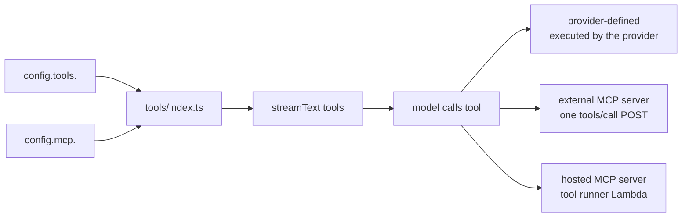

# External Tools

This guide covers agent-configured external tools: provider-defined tools and MCP servers. It does not cover the sandbox tools (`bash`, `read`, `write`, `edit`, `glob`, `grep` — see [Workspace & Sandbox](workspace/index.md)), `load_skill`, or `run_subagent`.

Core ships **no built-in external tools**. Every `config.tools` key is a **provider-defined tool** — a tool the configured AI SDK provider executes itself, named exactly as the provider exposes it on its `tools` namespace. Core resolves the name against the live provider at registry build, so any provider-executed tool the AI SDK ships works with no core change.

Everything else comes from **MCP servers** (`config.mcp`, see [MCP Servers](#connected-mcp-servers) below): core resolves a registered server's tools at registration time and offers each as `<server>__<tool>`. Anything the provider does not execute itself belongs in an MCP server — connect one the service already runs (`defineMcp` with `url`), or write the handler yourself and let the platform host it (`defineMcp` with an inline `handler`).

Account-uploaded custom tools are retired; see [Custom Tools (Retired)](#custom-tools-retired) below.


```mermaid
flowchart LR
  Config["config.tools.<providerTool>"] --> Registry["tools/index.ts"]
  Mcp["config.mcp.<serverId>"] --> Registry
  Registry --> Model["streamText tools"]
  Model --> Call["model calls tool"]
  Call --> Provider["provider-defined<br/>executed by the provider"]
  Call --> External["external MCP server<br/>one tools/call POST"]
  Call --> Hosted["hosted MCP server<br/>tool-runner Lambda"]
```

## Current Tools

| Tool                  | File                                                                                                                                       | External dependency                                                         | Config key                    |
| --------------------- | ------------------------------------------------------------------------------------------------------------------------------------------ | --------------------------------------------------------------------------- | ----------------------------- |
| Provider-defined tool | [`src/harness/tools/provider-tool.ts`](https://github.com/beeblastco/broods/blob/dev/apps/core/src/harness/tools/provider-tool.ts)         | The configured AI SDK provider's own `tools` namespace                      | `config.tools.<providerTool>` |
| `async_status`        | [`src/harness/tools/async-status.tool.ts`](https://github.com/beeblastco/broods/blob/dev/apps/core/src/harness/tools/async-status.tool.ts) | — (auto-registered, see below)                                              | —                             |
| MCP server tool       | [`src/harness/mcp/mcp.tool.ts`](https://github.com/beeblastco/broods/blob/dev/apps/core/src/harness/mcp/mcp.tool.ts)                       | The registered MCP server; the tool-runner Lambda for `transport: "hosted"` | `config.mcp.<serverId>`       |

Provider-defined tool names come from the provider package, not from core. With `config.model.provider: "google"` that includes `googleSearch`, `urlContext`, `googleMaps`, `codeExecution`, `fileSearch`, and `enterpriseWebSearch`; other providers expose their own set. A name the configured provider does not expose is rejected when the agent runs, with the available names listed in the error.

`async_status` is not configured directly: it is registered automatically whenever any `config.tools` entry has `async: true` or a workspace has a persistent sandbox. It is the model-facing polling surface for the async lifecycle described below (`statusId` + actions `status`/`logs`/`stop`).

Sandbox tools come from a referenced `sandbox` (+ `workspaces`) — see [Workspace & Sandbox](workspace/index.md). Skills use `config.skills`; see [Skills](skills.md). Subagents use `config.subagent`. `schedule`, `list_schedules`, `update_schedule`, and `cancel_schedule` use `config.scheduler`; see [Cron Jobs](crons.md#agent-scheduled-tasks).

## Runtime Behavior

`src/harness/harness.ts` resolves the configured model and calls `createTools()` from [`src/harness/tools/index.ts`](https://github.com/beeblastco/broods/blob/dev/apps/core/src/harness/tools/index.ts).

Tool registry path:

1. `createTools()` rejects `config.tools` names reserved by the harness itself.
2. The sandbox tools come from a referenced `sandbox`: `bash` (stateless) when there is no workspace; per workspace, the full `read`/`write`/`edit`/`glob`/`grep`/`bash` set when it has an effective sandbox, or read-only `read`/`glob` when it has none (via a read-only mount by default, or direct S3 with the `sandbox: null` opt-out). Approvals follow that workspace's `permissionMode`.
3. `run_subagent` comes only from `config.subagent`.
4. `load_skill` comes from `config.skills`.
5. Every remaining key is resolved against the configured provider's `tools` namespace; the config keys other than `enabled`/`needsApproval`/`async` are passed through as that tool's arguments.
6. `config.mcp` entries connect the registered server and add its tools as `<server>__<tool>` (see [MCP Servers](#connected-mcp-servers)).
7. `needsApproval` is applied before tools are passed to `streamText()`.
8. Local `execute` tools with `async: true` are wrapped by `AsyncToolCoordinator`.

Provider-defined tools are executed by the provider during the model call, not by core. MCP server tools are request/response: `tools/call` has no streaming analog, so each call is one POST to the external server, or one tool-runner Lambda invoke for a hosted server (see [MCP Servers](#connected-mcp-servers)).

The async coordination subsystem creates `AsyncToolResult` rows, exposes `async_status`, waits for in-process pending work, and injects completed parent results into the same active agent loop. Detached completions settle through `POST /sandbox-jobs/{resultId}/complete` (token-authenticated, `bash` background jobs).

Notes:

- The continuation loop waits only for in-memory pending work.
- The original `/async` status row is settled through `asyncResultEventId`; the internal continuation uses a separate event id for dedupe.
- Future: when NATS uses JetStream, missed WebSocket stream chunks can be replayed from persisted stream/consumer state. Until then, NATS continuation reaches the client only while the gateway/client remains subscribed.

> Warning: Provider-defined tools have no local `execute`, so they cannot use this wrapper. If `async: true` is configured for one of those tools, the runtime logs a warning and leaves the tool in its normal provider-defined behavior.

For sync direct API callers, approval requests are streamed as SSE and persisted in the conversation. The caller resumes the turn by sending a direct API `tool-approval-response`. Channel webhooks cannot complete approval; the handler denies channel approval requests with a channel-visible error.

> TODO: Add channel webhook support for completing tool approval requests when channel-safe approval UX is available.

## Code-First Configuration

Import the tool from its AI SDK provider package and pass it straight into
`config.tools`, keyed by the name the provider exposes:

```ts title="broods/index.ts"
import { google } from "@ai-sdk/google";
import { defineAgent, env } from "broods";

export const myAgent = defineAgent({
  name: "my-agent",
  provider: { google: { apiKey: env("GOOGLE_API_KEY") } },
  model: { provider: "google", modelId: "gemini-3-flash" },
  tools: {
    googleSearch: google.tools.googleSearch({
      searchTypes: { webSearch: {} },
    }),
    // Broods-side flags sit alongside the imported descriptor
    urlContext: { ...google.tools.urlContext({}), needsApproval: true },
  },
});
```

A provider tool built by the AI SDK serializes to a plain descriptor —
`{ type: "provider", id: "google.google_search", args: {...} }`. Its lazy input
and output schemas do not survive JSON, so core rebuilds the tool by calling the
same provider factory with the descriptor's `args`, which keeps those schemas
intact. `enabled`, `needsApproval`, and `async` are Broods flags, not tool
arguments; the dashboard writes the equivalent flat shape
(`googleSearch: { enabled: true, searchTypes: {...} }`), which core accepts too.

Switching `config.model.provider` changes which tool names are available —
`openai` exposes `webSearch`, `codeInterpreter`, and `fileSearch`; `anthropic`
exposes `computerUse`, `bash`, `textEditor`, and `webSearch`. Core does not
maintain that list; it reads the provider's own `tools` namespace.

Tools the provider does not execute itself — an HTTP-backed API such as Tavily,
whose AI SDK package returns a client-executed `Tool` with a JavaScript
`execute` — cannot travel through config at all, because a function does not
serialize. Expose those through an MCP server instead: connect one the service
already runs (`defineMcp` with `url`), or write the handler yourself and host it
on the platform (`defineMcp` with an inline `handler`). See [MCP Servers](#connected-mcp-servers).

Omitting a tool disables it. Setting `enabled: false` also disables it. Set `needsApproval: true` when the tool should require the AI SDK approval flow before execution.

The full config field reference lives in the [API Reference](/api-reference) under `AgentConfig.tools`.

## Custom Tools (Retired)

Account-uploaded custom tools (`defineTool`, `POST /v1/tools`) are retired in favor of MCP servers. The replacement for an uploaded bundle is a **hosted MCP server**: write the same handler code as an MCP server, pass it to `defineMcp` as an inline `handler`, and the platform runs the bundle on the same tool-runner Lambda that ran custom tools. When the service already runs its own MCP endpoint, connect it with `defineMcp` and a `url`. See [MCP Servers](#connected-mcp-servers) below, [Resource Configuration](resources.md#mcp-servers) for the resource shape, and [`packages/demos/mcp-connect`](https://github.com/beeblastco/broods/tree/dev/packages/demos/mcp-connect) for a runnable example.

## Add a Built-In Tool

1. Create `apps/core/src/harness/tools/<name>.tool.ts`.
2. Add the standard file header docstring.
3. Export a default tool factory, or named factories when one provider module exposes several tools.
4. Keep the model-facing schema and external service call in that tool file.
5. Import the factory in [`src/harness/tools/index.ts`](https://github.com/beeblastco/broods/blob/dev/apps/core/src/harness/tools/index.ts).
6. Add the factory to the static `toolFactories` map with the exact model-facing tool name.
7. Add config validation in [`src/shared/domain/agent-config.ts`](https://github.com/beeblastco/broods/blob/dev/apps/core/src/shared/domain/agent-config.ts) only for options the account can set.
8. Optionally set `config.tools.<name>.async: true` for slow local `execute` tools.
9. Update the [API Reference](/api-reference) `AgentConfig.tools` schema, and focused tests/examples when the public config shape changes.

Keep the factory small. It should read `context.config`, resolve any API key, return a `ToolSet`, and leave unrelated orchestration to `harness.ts`.

```ts
/**
 * Example external service tool for the harness agent.
 * Keep Example API access and model-facing schema here.
 */

import { tool, type ToolSet } from "ai";
import { z } from "zod";
import type { ToolContext } from "./index.ts";

export default function exampleLookupTool(context: ToolContext): ToolSet {
  const { enabled: _enabled, apiKey, ...options } = context.config;

  if (typeof apiKey !== "string") {
    throw new Error("config.tools.exampleLookup.apiKey is required.");
  }

  return {
    exampleLookup: tool({
      description: "Look up external Example records.",
      inputSchema: z.object({
        query: z.string().min(1),
      }),
      execute: async ({ query }) => {
        const response = await fetch("https://api.example.com/search", {
          method: "POST",
          headers: {
            Authorization: `Bearer ${apiKey}`,
            "Content-Type": "application/json",
          },
          body: JSON.stringify({ query, ...options }),
        });

        if (!response.ok) {
          throw new Error(`Example lookup failed: ${response.status}`);
        }

        return response.json();
      },
    }),
  };
}
```

## Design Rules

- Keep external tool logic in `apps/core/src/harness/tools/<name>.tool.ts`.
- Do not add a new Lambda, queue, or worker for ordinary external-service tools; expose them through an MCP server instead.
- Use `async: true` only when the tool has a local `execute`; provider-defined tools without `execute` remain provider-managed.
- Do not expose request lifecycle choices in agent config; the platform chooses the supported wait behavior from tool type and request path.
- Do not put external tool config under `workspace`, `skills`, or `subagent`.
- Prefer provider or service SDK types over new custom interfaces when they already model the same options.
- Keep account-specific credentials in encrypted agent config when the account owns them.
- Use SST secrets only for service-wide fallback credentials; per-account tool credentials belong in encrypted agent config.
- Return structured data from `execute` instead of pre-formatting prose for the model, use the `ToolSet` interface from vercel-ai sdk.
- Add approval support through `needsApproval`, not by asking inside the tool implementation. [Implement from vercel=ai sdk](https://ai-sdk.dev/docs/ai-sdk-core/tools-and-tool-calling#tool-execution-approval)

## Connected MCP Servers

An external [MCP](https://modelcontextprotocol.io) server (spec **2026-07-28**, stateless Streamable HTTP only) can be registered per project stage and enabled per agent. Core is the MCP client: at agent registration it connects, lists the server's tools (cached per the listing's own `ttlMs`), and offers each as `<server>__<tool>` alongside every other tool kind. `tools/call` is request/response — one POST per call, no session.

Register a server through the config plane (`POST /v1/mcp?project=&stage=`), the SDK (`defineMcp` synced by `broods deploy`, or `account.createMcp`), then enable it on an agent:

```jsonc
{
  "mcp": {
    "<serverId>": { "enabled": true, "needsApproval": false },
  },
}
```

In a `broods/` project the key is the server's name; the sync rewrites it to the row id:

```ts
import { defineAgent, defineMcp, env } from "broods";

export const search = defineMcp({
  name: "search",
  url: "https://mcp.example.com/mcp",
  headers: { Authorization: `Bearer ${env("SEARCH_TOKEN")}` },
});

export const agent = defineAgent({
  name: "assistant",
  // ...model/provider...
  mcp: { [search.name]: { enabled: true } },
});
```

Rules that follow from the transport and the policy layer:

- The server name namespaces its tools (`search__query`), so it is 1-32 lowercase letters, digits, or hyphens; unique per stage.
- Credential-bearing headers (`Authorization`, `X-Api-Key`, ...) must reference an account env var (`Bearer ${NAME}`); inline secrets and URL userinfo are rejected at registration, and a header still carrying an unresolved ref refuses to connect.
- Per-server OPA rules use the `mcpIds` selector on `tool.call`; `needsApproval` on the entry applies to every tool the server exposes; the row's `allowedTools` filters what registers at all.
- `subscriptions/listen` (server-push list changes) is deliberately unsupported: tool lists refresh when their `ttlMs` expires. MRTR `input_required` results surface as tool errors.

### Hosted MCP servers

A server can also be uploaded instead of connected: give `defineMcp` an inline `handler` — `handler: createMcpHandler(() => server)` from `@modelcontextprotocol/server`, right in the defining file (pass a factory: the server is constructed per request, matching the stateless transport) — or `POST /v1/mcp` a `bundle` whose module default-exports that fetch-style handler. The CLI bundles the defining module, so the whole server is one file; `broods deploy` imports the built bundle and fails the deploy if the handler is missing or not fetch-style, so a broken server never uploads. The row becomes `transport: "hosted"`, the bundle (capped at 50 MB — over 10 MB the CLI uploads it through a storage upload URL instead of the request body, and direct API callers do the same via `POST /v1/mcp/uploads`) lands under the `account-mcp/` S3 prefix, and the tool-runner Lambda hosts it: one invoke per request, run in a child process with a scrubbed environment, a sha256 integrity check on the bundle, and CPU metered as tool compute (`tool.compute.type: "mcp-sandbox"`, billed into the account's tool-sandbox CPU usage). Repeat calls of the same account's bundle reuse a warm child, so only the first call pays the bundle fetch, parse, and spawn; the reuse is bounded and any failed call retires the child. Because the 2026-07-28 transport is stateless, per-invoke hosting is a complete implementation, not an approximation — agents use hosted and external servers identically. See [data security](./data-security.md) for the containment model.
