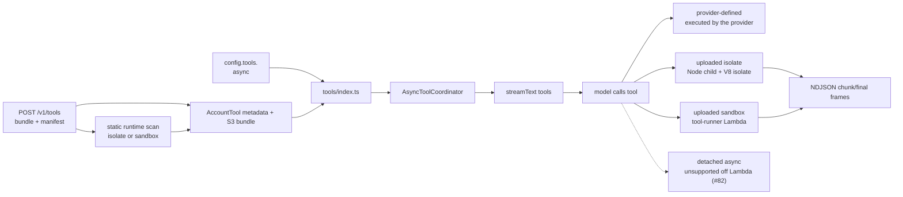
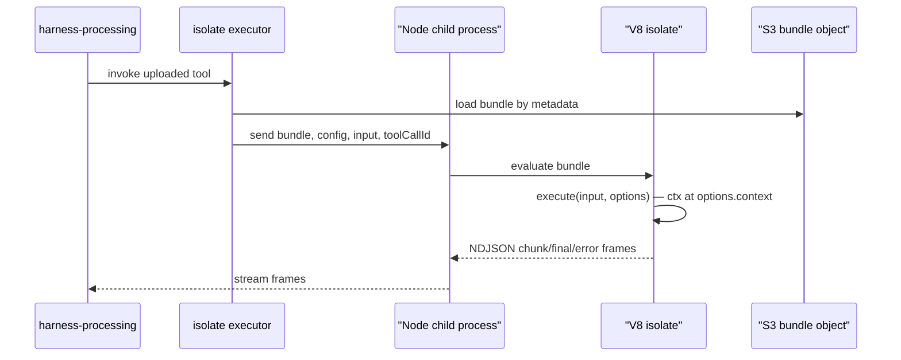
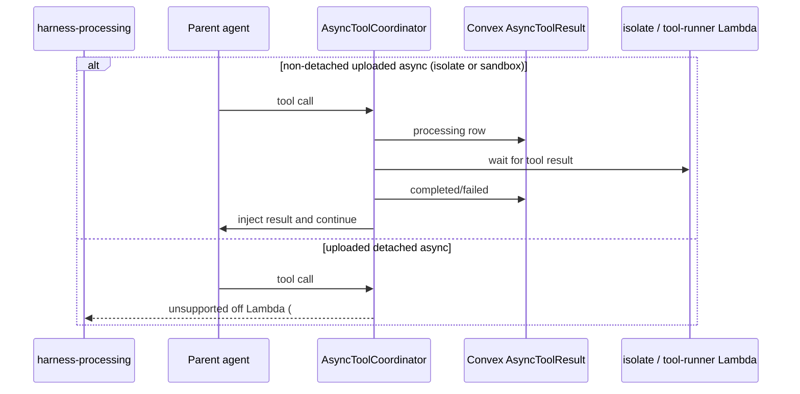

# External Tools

This guide covers agent-configured external tools: provider-defined tools and account-uploaded custom tools. It does not cover the sandbox tools (`bash`, `read`, `write`, `edit`, `glob`, `grep` — see [Workspace & Sandbox](workspace/index.md)), `load_skill`, or `run_subagent`.

Core ships **no built-in external tools**. Every `config.tools` key is one of two things:

- **A provider-defined tool** — a tool the configured AI SDK provider executes itself, named exactly as the provider exposes it on its `tools` namespace. Core resolves the name against the live provider at registry build, so any provider-executed tool the AI SDK ships works with no core change.
- **An uploaded custom tool** — keyed by its account-scoped `toolId`, with the uploaded manifest supplying the model-facing name, description, and input schema. Pure-compute / fetch-only bundles execute in the in-core V8 isolate tier; bundles that need Node, npm, or native modules execute in the platform tool-runner Lambda (the sandbox tier). Only detached-async execution is still deferred (#82).

Anything the provider does not execute itself belongs in an uploaded custom tool that calls the service through the isolate's SSRF-guarded `ctx.fetch` (isolate tier) or native `fetch` (sandbox tier).


```mermaid
flowchart LR
  Upload["POST /v1/tools<br/>bundle + manifest"] --> Store["AccountTool metadata + S3 bundle"]
  Upload --> Scan["static runtime scan<br/>isolate or sandbox"]
  Scan --> Store
  Config["config.tools.<name or toolId><br/>async"] --> Registry["tools/index.ts"]
  Store --> Registry
  Registry --> Wrap["AsyncToolCoordinator"]
  Wrap --> Model["streamText tools"]
  Model --> Call["model calls tool"]
  Call --> Provider["provider-defined<br/>executed by the provider"]
  Call --> Uploaded["uploaded isolate<br/>Node child + V8 isolate"]
  Call --> Sandbox["uploaded sandbox<br/>tool-runner Lambda"]
  Uploaded --> Frames["NDJSON chunk/final frames"]
  Sandbox --> Frames
  Call -.-> Deferred["detached async<br/>unsupported off Lambda (#82)"]
```

## Current Tools

| Tool                  | File                                                                                                                                       | External dependency                                                                                                 | Config key                    |
| --------------------- | ------------------------------------------------------------------------------------------------------------------------------------------ | ------------------------------------------------------------------------------------------------------------------- | ----------------------------- |
| Provider-defined tool | [`src/harness/tools/provider-tool.ts`](https://github.com/beeblastco/broods/blob/dev/apps/core/src/harness/tools/provider-tool.ts)         | The configured AI SDK provider's own `tools` namespace                                                              | `config.tools.<providerTool>` |
| `async_status`        | [`src/harness/tools/async-status.tool.ts`](https://github.com/beeblastco/broods/blob/dev/apps/core/src/harness/tools/async-status.tool.ts) | — (auto-registered, see below)                                                                                      | —                             |
| Uploaded custom tool  | S3 bundle + account tool metadata (http tier: metadata only)                                                                               | V8 isolate for `runtime: "isolate"`; tool-runner Lambda for `runtime: "sandbox"`; direct POST for `runtime: "http"` | `config.tools.<toolId>`       |

Provider-defined tool names come from the provider package, not from core. With `config.model.provider: "google"` that includes `googleSearch`, `urlContext`, `googleMaps`, `codeExecution`, `fileSearch`, and `enterpriseWebSearch`; other providers expose their own set. A name the configured provider does not expose is rejected when the agent runs, with the available names listed in the error.

`async_status` is not configured directly: it is registered automatically whenever any `config.tools` entry has `async: true` or a workspace has a persistent sandbox. It is the model-facing polling surface for the async lifecycle described below (`statusId` + actions `status`/`logs`/`stop`).

Sandbox tools come from a referenced `sandbox` (+ `workspaces`) — see [Workspace & Sandbox](workspace/index.md). Skills use `config.skills`; see [Skills](skills.md). Subagents use `config.subagent`. `schedule`, `list_schedules`, `update_schedule`, and `cancel_schedule` use `config.scheduler`; see [Cron Jobs](crons.md#agent-scheduled-tasks).

## Runtime Behavior

`src/harness/harness.ts` resolves the configured model and calls `createTools()` from [`src/harness/tools/index.ts`](https://github.com/beeblastco/broods/blob/dev/apps/core/src/harness/tools/index.ts).

Tool registry path:

1. `createTools()` rejects `config.tools` names reserved by the harness itself.
2. The sandbox tools come from a referenced `sandbox`: `bash` (stateless) when there is no workspace; per workspace, the full `read`/`write`/`edit`/`glob`/`grep`/`bash` set when it has an effective sandbox, or read-only `read`/`glob` when it has none (via a read-only mount by default, or direct S3 with the `sandbox: null` opt-out). Approvals follow that workspace's `permissionMode`.
3. `run_subagent` comes only from `config.subagent`.
4. `load_skill` comes from `config.skills`.
5. Every remaining non-`toolId` key is resolved against the configured provider's `tools` namespace; the config keys other than `enabled`/`needsApproval`/`async` are passed through as that tool's arguments.
6. Convex-id config keys load account-owned uploaded tool metadata and expose the uploaded model-facing tool name.
7. `needsApproval` is applied before tools are passed to `streamText()`.
8. Local `execute` tools with `async: true` are wrapped by `AsyncToolCoordinator`.

Provider-defined tools are executed by the provider during the model call, not by core. Uploaded custom tools are classified at upload time by a static scan:

- `runtime: "isolate"` for pure-compute JavaScript/TypeScript with no `node:` imports, `require`, npm/native dependencies, Web Streams, or reads off the `process` / `Buffer` globals. Reading `process` through a namespace object (`globalThis.process?.versions?.node`) is the standard runtime feature probe: it is guarded, falls through in an isolate, and does not force the sandbox tier. So is naming your own function or property `process` — only reading it as a namespace counts.
- `runtime: "sandbox"` for code that needs Node, npm, native modules, or Web Streams. Anything importing the `ai` package lands here.
- `runtime: "http"` when you upload no bundle at all but declare an https `endpointUrl` instead: every call POSTs the tool input as JSON to your service and the JSON (or plain-text) response becomes the tool result. There is nothing to scan, hash, or store in S3 — the tiers are mutually exclusive, so an http tool carries no bundle fields and a bundled tool carries no endpoint fields.

Both tiers give you timers, `console`, `AbortController`, `fetch`, `TextEncoder` / `TextDecoder`, `URL` / `URLSearchParams`, `atob` / `btoa`, and `crypto.randomUUID` / `crypto.getRandomValues`. The isolate tier stops there: no filesystem, no module imports, no Web Streams, no Node globals. The sandbox tier is a full Node runtime. Outbound requests from the isolate tier are guarded against SSRF — private and metadata addresses are blocked.

**The http tier.** A call sends `POST endpointUrl` with `Content-Type: application/json`, the tool input as the JSON body, and your static `endpointHeaders`. Header values may reference variables as `${NAME}`; each reference resolves against the same merged config env a bundle would see (`defaultConfig` overlaid by the enabling agent's `tools.<tool>.config.env`), so secrets stay in encrypted agent config. An unresolved reference fails the call rather than sending the literal text. Responses are SSRF-guarded like isolate-tier `fetch`: private and metadata addresses are blocked. A non-2xx status fails the tool with an excerpt of the response body; the response body (JSON parsed when possible) becomes the result. There is a 30-second timeout per call; streaming (`yield`) is not available on this tier.

Async-generator tools stream on both tiers: each `yield` is delivered as a
preliminary tool result while the tool is still running, and the last one is the
tool's result. See [data security](./data-security.md) for what isolation each
tier does and does not give you.

**Writing `execute`.** It takes the tool input first and call options second, matching the AI SDK's `tool({ execute })`. You get the same options a tool running in-process would:

| option                         | what it carries                                                                                                                                                                                  |
| ------------------------------ | ------------------------------------------------------------------------------------------------------------------------------------------------------------------------------------------------ |
| `options.context`              | The broods `ctx`: `config` (see below), `fetch`, and a per-run `state` scratchpad.                                                                                                               |
| `options.toolCallId`           | The model's id for this call.                                                                                                                                                                    |
| `options.abortSignal`          | Trips when the request is cancelled.                                                                                                                                                             |
| `options.messages`             | The conversation so far. Long conversations arrive truncated from the front — the most recent messages that fit 512 KB are forwarded, because the whole history would otherwise ride every call. |
| `options.experimental_context` | Forwarded verbatim from the AI SDK.                                                                                                                                                              |

**Secrets reach a tool through `options.context.config`, not `process.env`.** Put `env("NAME")` under the enabling agent's `tools.<tool>.config`; the value is resolved per stage and stored with the encrypted agent config, then merged over the tool's own `defaultConfig`. Neither tier gives a bundle the runner's environment: the sandbox child's `process.env` is scrubbed to `PATH`, `HOME`, `TMPDIR` and `NODE_ENV`, and the isolate has no `process` at all.


```mermaid
sequenceDiagram
  participant H as harness-processing
  participant E as isolate executor
  participant N as "Node child process"
  participant V as "V8 isolate"
  participant S as "S3 bundle object"

  H->>E: invoke uploaded tool
  E->>S: load bundle by metadata
  E->>N: send bundle, config, input, toolCallId
  N->>V: evaluate bundle
  V->>V: execute(input, options) — ctx at options.context
  V-->>N: NDJSON chunk/final/error frames
  N-->>H: stream frames
```

### Async-generator output (streamed)

A bundle whose `execute` is an async generator streams: every `yield` reaches the
client as a `tool-result` part marked `preliminary: true` as it happens, and the
last one is repeated as the final, non-preliminary result the model sees. Thrown
errors still fail the tool call. A normal non-generator `execute` emits a single
final result and no preliminary parts.

Clients that render tool results should ignore parts with `preliminary: true`
unless they want live progress — the final part always follows.

```ts
// Each yield is a live progress update; the last value is the tool's result.
export const search = defineTool({
  name: "search",
  description: "Search and return the final result.",
  inputSchema: { type: "object", properties: { q: { type: "string" } } },
  async *execute(input) {
    yield { type: "text", value: "working…" };
    yield { type: "text", value: "done: " + input.q };
  },
});
```

```text
runner NDJSON: {"t":"chunk",...}  {"t":"chunk",...}  {"t":"final",...}
SSE fullStream: tool-result(preliminary)  tool-result(preliminary)  tool-result(final)
```

When `config.tools.<name>.async` is `true`, the platform chooses the lifecycle from the tool type and request path:

| Tool type               | Request path                     | Tool code runs in        | Request/worker waits? | Result completion            | Model continuation                    |
| ----------------------- | -------------------------------- | ------------------------ | --------------------- | ---------------------------- | ------------------------------------- |
| Provider-defined        | all paths                        | the model provider       | Yes                   | provider returns tool output | same active agent loop                |
| Uploaded isolate sync   | all paths                        | V8 isolate in Node child | Yes                   | isolate returns final result | same active agent loop                |
| Uploaded isolate async  | SSE and other non-detached paths | V8 isolate in Node child | Yes                   | isolate returns final result | same active agent loop injects result |
| Uploaded sandbox sync   | all paths                        | tool-runner Lambda       | Yes                   | Lambda returns final result  | same active agent loop                |
| Uploaded sandbox async  | SSE and other non-detached paths | tool-runner Lambda       | Yes                   | Lambda returns final result  | same active agent loop injects result |
| Uploaded detached async | `/async`, channel, NATS          | deferred external tier   | —                     | unsupported off Lambda (#82) | clear dispatcher error                |

The async coordination subsystem still exists. It creates `AsyncToolResult` rows, exposes `async_status`, waits for in-process pending work, and injects completed parent results for non-detached uploaded tools (isolate and sandbox). Uploaded detached async execution has no background execution path today; the dispatcher returns a clear error that detached uploaded tools are not yet supported off Lambda and are tracked in #82.


```mermaid
sequenceDiagram
  participant H as harness-processing
  participant P as Parent agent
  participant C as AsyncToolCoordinator
  participant D as Convex AsyncToolResult
  participant I as isolate / tool-runner Lambda

  alt non-detached uploaded async (isolate or sandbox)
    P->>C: tool call
    C->>D: processing row
    C->>I: wait for tool result
    C->>D: completed/failed
    C->>P: inject result and continue
  else uploaded detached async
    P->>C: tool call
    C-->>H: unsupported off Lambda (#82)
  end
```

Notes:

- The continuation loop waits only for in-memory pending work: non-detached uploaded isolate async.
- The original `/async` status row is settled through `asyncResultEventId`; the internal continuation uses a separate event id for dedupe.
- Future: when NATS uses JetStream, missed WebSocket stream chunks can be replayed from persisted stream/consumer state. Until then, NATS continuation reaches the client only while the gateway/client remains subscribed.

> Warning: Provider-defined tools have no local `execute`, so they cannot use this wrapper. If `async: true` is configured for one of those tools, the runtime logs a warning and leaves the tool in its normal provider-defined behavior.

For sync direct API callers, approval requests are streamed as SSE and persisted in the conversation. The caller resumes the turn by sending a direct API `tool-approval-response`. Channel webhooks cannot complete approval; the handler denies channel approval requests with a channel-visible error.

> TODO: Add channel webhook support for completing tool approval requests when channel-safe approval UX is available.

## Code-First Configuration

Import the tool from its AI SDK provider package and pass it straight into
`config.tools`, keyed by the name the provider exposes:

```ts title="broods/index.ts"
import { google } from "@ai-sdk/google";
import { defineAgent, env } from "broods";

export const myAgent = defineAgent({
  name: "my-agent",
  provider: { google: { apiKey: env("GOOGLE_API_KEY") } },
  model: { provider: "google", modelId: "gemini-3-flash" },
  tools: {
    googleSearch: google.tools.googleSearch({
      searchTypes: { webSearch: {} },
    }),
    // Broods-side flags sit alongside the imported descriptor
    urlContext: { ...google.tools.urlContext({}), needsApproval: true },
  },
});
```

A provider tool built by the AI SDK serializes to a plain descriptor —
`{ type: "provider", id: "google.google_search", args: {...} }`. Its lazy input
and output schemas do not survive JSON, so core rebuilds the tool by calling the
same provider factory with the descriptor's `args`, which keeps those schemas
intact. `enabled`, `needsApproval`, and `async` are Broods flags, not tool
arguments; the dashboard writes the equivalent flat shape
(`googleSearch: { enabled: true, searchTypes: {...} }`), which core accepts too.

Switching `config.model.provider` changes which tool names are available —
`openai` exposes `webSearch`, `codeInterpreter`, and `fileSearch`; `anthropic`
exposes `computerUse`, `bash`, `textEditor`, and `webSearch`. Core does not
maintain that list; it reads the provider's own `tools` namespace.

Tools the provider does not execute itself — an HTTP-backed API such as Tavily,
whose AI SDK package returns a client-executed `Tool` with a JavaScript
`execute` — cannot travel through config at all, because a function does not
serialize. Upload those as custom tools instead.

For uploaded custom tools, use `defineTool` and reference it by name in the agent config:

```ts title="broods/index.ts"
import { defineAgent, defineTool, env } from "broods";

export const analyze = defineTool({
  name: "analyze",
  description: "Analyze structured data.",
  inputSchema: {
    type: "object",
    properties: { data: { type: "array" } },
    required: ["data"],
  },
  async execute(input) {
    return { type: "text", value: `Analyzed ${input.data.length} rows.` };
  },
});

export const myAgent = defineAgent({
  name: "my-agent",
  tools: {
    [analyze.name]: {
      enabled: true,
      async: true,
      needsApproval: false,
    },
  },
});
```

The CLI bundles the tool source into ESM, hashes it, and uploads it on sync. Agent references are rewritten to the deployed tool ID automatically.

Omitting a tool disables it. Setting `enabled: false` also disables it. Set `needsApproval: true` when the tool should require the AI SDK approval flow before execution.
Set `async: true` when a local `execute` tool may take long enough that the parent agent should keep working while the result is produced.
For uploaded tools, `config` is merged over the upload-time `defaultConfig` and passed to `ctx.config`. Keep `defaultConfig` non-secret because it is account-wide tool metadata. Put `env("NAME")` values under the enabling agent's `tools.<tool>.config`; that agent config is resolved per stage and encrypted at rest. The compiler rejects environment references in `defaultConfig` instead of leaving a marker object for the tool to receive. Pure-compute / fetch-only bundles run in the V8 isolate tier; node/npm/native bundles run in the tool-runner Lambda (sandbox tier). Only detached-async uploaded tools are deferred to #82.

See [`packages/demos/tool-custom-async-sse`](https://github.com/beeblastco/broods/tree/dev/packages/demos/tool-custom-async-sse) for a runnable direct SSE example that uploads `test_async`, enables `config.tools.<toolId>.async`, and asks the agent to call the uploaded tool. [`packages/demos/tool-custom-stream`](https://github.com/beeblastco/broods/tree/dev/packages/demos/tool-custom-stream) demonstrates async-generator streaming.

The full config field reference lives in the [API Reference](/api-reference) under `AgentConfig.tools`.

## Upload a Custom Tool

Write `execute` inline. The CLI bundles it on sync, so it runs on the platform rather than on your machine. Keep it self-contained and keep secrets out of the source and `defaultConfig`: reference them with `env("NAME")` under the enabling agent's `tools.<tool>.config`. Use `defaultConfig` only for non-secret account-wide metadata.

```ts title="broods/index.ts"
import { defineTool } from "broods";

export const myTool = defineTool({
  name: "my_tool",
  description: "A custom tool that does something useful.",
  inputSchema: {
    type: "object",
    properties: { query: { type: "string" } },
    required: ["query"],
  },
  async execute(input) {
    return { type: "text", value: `Result for ${input.query}` };
  },
});
```

Prefer the implementation in its own file? Pass `path` instead of `execute` and export the tool as the module's default.

Bundle size is capped per tier: **1 MB** on the isolate tier, **10 MB** on the sandbox tier. The tier is classified from the bundle, so a dependency that pulls in Node builtins moves a tool to the sandbox tier and the larger cap at the same time. Http tools carry no bundle and have no size cap — your endpoint owns the code.

The raw account-management API does not run a build step. When calling it directly, provide an already-bundled JavaScript module. See the [API Reference](/api-reference) `POST /v1/tools` for the raw shape.

A tool belongs to one project stage. Two stages may each define a tool
of the same name without colliding, and a stage only ever sees its own — so
the collection endpoints require `?project=<slug>&stage=<name>`. Omitting
either is a `400`; naming one that does not exist is a `404`.

Tool management endpoints (raw API):

- `GET /v1/tools?project=<slug>&stage=<name>`
- `POST /v1/tools?project=<slug>&stage=<name>`
- `GET /v1/tools/{toolId}`
- `PATCH /v1/tools/{toolId}`
- `DELETE /v1/tools/{toolId}`

```ts
const tools = await account.listTools({
  project: "acme",
  stage: "Production",
});
```

## Add a Built-In Tool

1. Create `apps/core/src/harness/tools/<name>.tool.ts`.
2. Add the standard file header docstring.
3. Export a default tool factory, or named factories when one provider module exposes several tools.
4. Keep the model-facing schema and external service call in that tool file.
5. Import the factory in [`src/harness/tools/index.ts`](https://github.com/beeblastco/broods/blob/dev/apps/core/src/harness/tools/index.ts).
6. Add the factory to the static `toolFactories` map with the exact model-facing tool name.
7. Add config validation in [`src/shared/domain/agent-config.ts`](https://github.com/beeblastco/broods/blob/dev/apps/core/src/shared/domain/agent-config.ts) only for options the account can set.
8. Optionally set `config.tools.<name>.async: true` for slow local `execute` tools. Uploaded isolate and sandbox async tools are waited on for SSE and other non-detached paths. Uploaded detached async tools are deferred to #82.
9. Update the [API Reference](/api-reference) `AgentConfig.tools` schema, and focused tests/examples when the public config shape changes.

Keep the factory small. It should read `context.config`, resolve any API key, return a `ToolSet`, and leave unrelated orchestration to `harness.ts`.

```ts
/**
 * Example external service tool for the harness agent.
 * Keep Example API access and model-facing schema here.
 */

import { tool, type ToolSet } from "ai";
import { z } from "zod";
import type { ToolContext } from "./index.ts";

export default function exampleLookupTool(context: ToolContext): ToolSet {
  const { enabled: _enabled, apiKey, ...options } = context.config;

  if (typeof apiKey !== "string") {
    throw new Error("config.tools.exampleLookup.apiKey is required.");
  }

  return {
    exampleLookup: tool({
      description: "Look up external Example records.",
      inputSchema: z.object({
        query: z.string().min(1),
      }),
      execute: async ({ query }) => {
        const response = await fetch("https://api.example.com/search", {
          method: "POST",
          headers: {
            Authorization: `Bearer ${apiKey}`,
            "Content-Type": "application/json",
          },
          body: JSON.stringify({ query, ...options }),
        });

        if (!response.ok) {
          throw new Error(`Example lookup failed: ${response.status}`);
        }

        return response.json();
      },
    }),
  };
}
```

## Design Rules

- Keep external tool logic in `apps/core/src/harness/tools/<name>.tool.ts`.
- Do not add a new Lambda, queue, or worker for ordinary external-service tools; upload them as custom tools instead.
- Use `async: true` only when the tool has a local `execute`; provider-defined tools without `execute` remain provider-managed.
- Do not expose request lifecycle choices in agent config; the platform chooses the supported wait behavior from tool type and request path.
- Do not put external tool config under `workspace`, `skills`, or `subagent`.
- Prefer provider or service SDK types over new custom interfaces when they already model the same options.
- Keep account-specific credentials in encrypted agent config when the account owns them.
- Use SST secrets only for service-wide fallback credentials; per-account tool credentials belong in encrypted agent config.
- Return structured data from `execute` instead of pre-formatting prose for the model, use the `ToolSet` interface from vercel-ai sdk.
- Add approval support through `needsApproval`, not by asking inside the tool implementation. [Implement from vercel=ai sdk](https://ai-sdk.dev/docs/ai-sdk-core/tools-and-tool-calling#tool-execution-approval)
