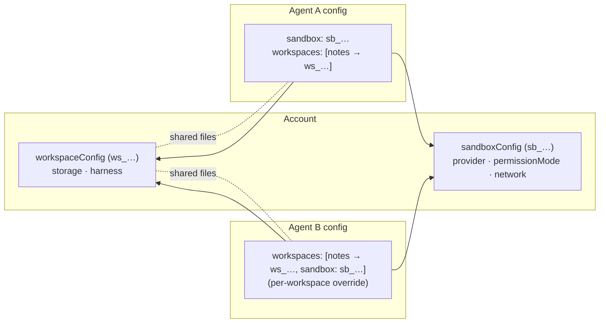
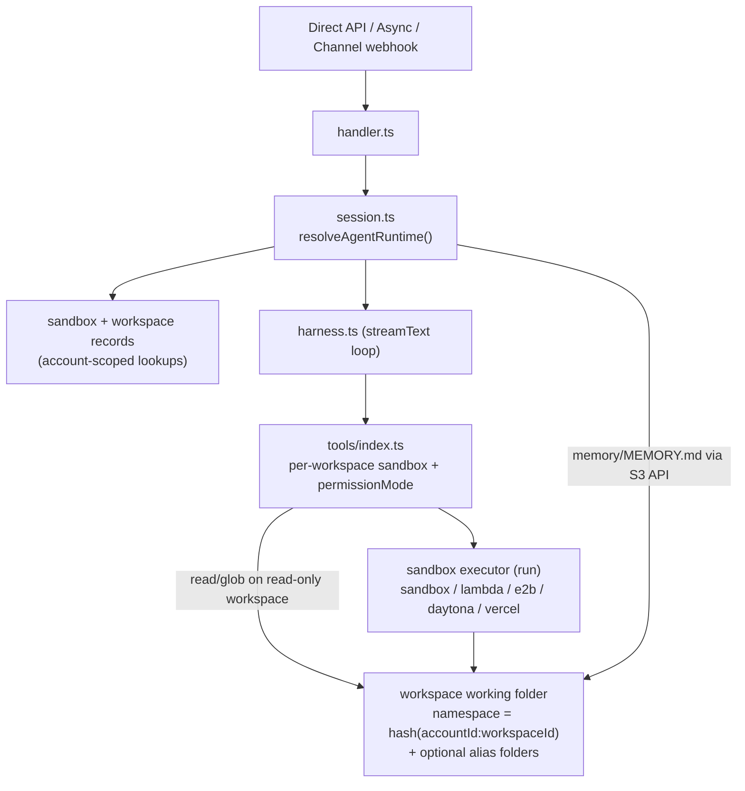
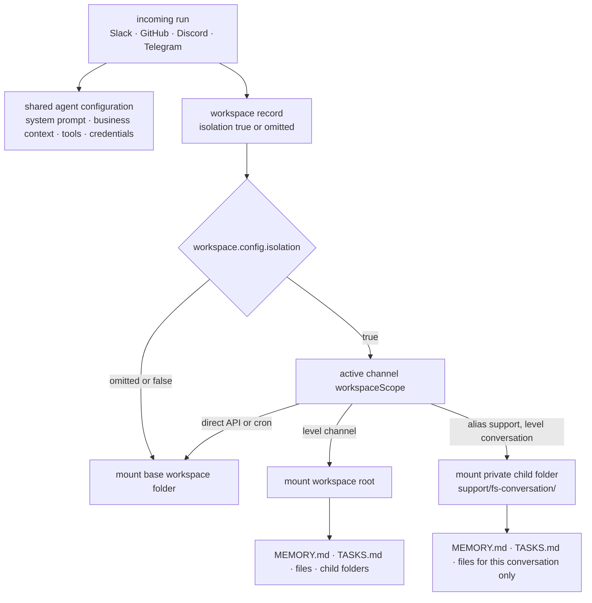

# Workspace & Sandbox

**Sandbox** (compute) and **workspace** (persistent files) are account-scoped resources. You define each once in code with `defineSandbox` and `defineWorkspace`, then reference them from any agent.

- A **sandbox** is the compute backend plus a collection of bash and filesystem tools
  (`bash`, `read`, `write`, `edit`, `glob`, `grep`) and a `permissionMode`.
- A **workspace** is the persistent S3-backed filesystem that gets mounted into a sandbox.
  Agents that reference the **same** `workspaceId` read and write the **same files** unless
  the workspace opts into hierarchical alias isolation.

A sandbox can be attached **agent-wide** (`config.sandbox`) or **per workspace**
(`workspaces[].sandbox`). A workspace's **effective sandbox** follows a simple cascade:

```text
workspaces[].sandbox === null   → read-only, S3-direct reads (opt out of compute entirely)
workspaces[].sandbox === "sb_…" → that sandbox (override)
workspaces[].sandbox omitted    → inherit config.sandbox (read-only via mount if there is none)
```

This is what lets one agent give different workspaces different sandboxes and
`permissionMode`s, lets two agents that share a workspace access it through their own
sandboxes, and lets a single workspace be **read-only**. A read-only workspace reads through
a service-managed read-only mount by default (so it sees committed writes immediately);
`sandbox: null` opts out of that mount and reads straight from S3 (no Lambda, cheapest, but
reads lag mount writes — see [Lambda](sandbox/lambda.md)). `config.sandbox` also powers
stateless `bash` when there is no workspace at all.



## Code-First Configuration

Define sandbox and workspace resources in `broods/`, then pass them to an agent:

```ts title="broods/index.ts"
import {
  defineAgent,
  defineGitHubChannel,
  defineSandbox,
  defineSlackChannel,
  defineWorkspace,
  env,
} from "broods";

export const lambdaSandbox = defineSandbox({
  name: "default",
  config: {
    provider: "lambda",
    network: { mode: "allow-all" },
    permissionMode: "ask",
  },
});

export const notes = defineWorkspace({
  name: "notes",
  config: {
    storage: { provider: "s3" },
    isolation: true,
    harness: { workspace: { enabled: true } },
  },
});

export const slack = defineSlackChannel({
  workspaceScope: { level: "channel" },
  botToken: env.SLACK_BOT_TOKEN,
  signingSecret: env.SLACK_SIGNING_SECRET,
});

export const github = defineGitHubChannel({
  workspaceScope: { alias: "support", level: "conversation" },
  webhookSecret: env.GITHUB_WEBHOOK_SECRET,
  appId: env.GITHUB_APP_ID,
  privateKey: env.GITHUB_PRIVATE_KEY,
});

export const myAgent = defineAgent({
  name: "my-agent",
  config: {
    provider: { openai: { apiKey: env.OPENAI_API_KEY } },
    model: { provider: "openai", modelId: "gpt-5.5" },
    agent: { system: "You are a helpful assistant." },
    channels: [slack, github],
    sandbox: lambdaSandbox,
    workspaces: [
      notes,                                    // inherit agent sandbox
      { workspace: notes, sandbox: null },      // read-only, S3-direct
    ],
  },
});
```

The CLI compiles these into a manifest, resolves references, and syncs them. You can also create records via the raw account API — see the [API Reference](/api-reference) for `POST /v1/sandboxes` and `POST /v1/workspaces`.

## Tool surface

Tool availability is decided **per workspace**, from that workspace's *effective* sandbox
(`workspaces[].sandbox` → else `config.sandbox` → else none). The agent's tool set is the
union across its workspaces:

| Workspace's effective sandbox | Tools for that workspace |
| --- | --- |
| present (mounted) | `read`, `write`, `edit`, `glob`, `grep`, `bash`, `memory_save` (+ workspace/memory harness) |
| **none** (read-only, default) | `read`, `glob` — via a read-only mount (fresh reads) |
| **none**, `sandbox: null` | `read`, `glob` — straight from S3 (no mount/cold start, lagged) |

Plus the agent-level cases:

| Agent references | Tools exposed |
| --- | --- |
| sandbox, **no** workspace | `bash` only — **stateless** (each call is a fresh container; nothing persists) |
| neither sandbox nor workspace | none |

For mounted workspaces, every provider should expose the same model-facing filesystem:
`bash` starts in the selected workspace directory and the file tools take paths relative to
that directory. Ordinary prompts should use relative paths; provider mount paths are
implementation details for logs and debugging.

> When workspaces have different sandboxes, the model picks one with the `workspace`
> argument; each call routes to that workspace's sandbox and inherits its `permissionMode`.
> Every file tool lists **all** workspaces (so an omitted `workspace` always resolves to
> the configured default, never a silent substitute). Selecting a read-only workspace for
> `write`/`edit`/`grep` returns a clean "workspace is read-only" error, and `bash` reports
> "no sandbox available for this command" — in both cases with **no approval prompt**,
> because a workspace with no sandbox has no `permissionMode` to ask against.

## permissionMode

`permissionMode` lives on the sandbox and replaces the old `needsApproval` boolean:

| Mode | `read`/`glob`/`grep` | `write`/`edit` | `bash` |
| --- | --- | --- | --- |
| `ask` | auto | **ask** | **ask** |
| `edit` | auto | auto | **ask** |
| `bypass` | auto | auto | auto |

## Runtime model



The workspace **base namespace** is derived from `accountId:workspaceId`. Isolation does
not change the agent, system prompt, model config, channel config, credentials, or tool
definitions. It only changes which working folder is mounted for that run. Each isolated
folder starts as its own workspace folder, so `MEMORY.md`, `TASKS.md`, generated files,
downloaded files, and sandbox edits are separated from other scopes.



| Workspace setting | Channel setting | What happens |
| --- | --- | --- |
| `isolation` omitted or `false` | `workspaceScope` is not allowed | every run mounts the same workspace root |
| `isolation: true` | every attached channel must set `workspaceScope` | channel runs mount the workspace root; conversation runs mount a private child folder |

If any channel defines `workspaceScope`, at least one attached workspace must use
`isolation: true`. If a workspace uses `isolation: true`, every attached channel must
define `workspaceScope`. The CLI rejects mixed or old-mode configs so the runtime does not
silently pick the wrong folder.

## Isolation scenarios

Use isolation for the **working folder security boundary** of a team, project, ticket, or
chat. Do not use it for business-wide instructions: put shared business context in the
agent system prompt, configured skills, tools, or a separate non-isolated workspace.

What stays shared:

- agent system prompt and model configuration
- channel configuration and credentials
- tool definitions, tool credentials, and tool availability
- account-level resources such as skills and configured business data

What isolation separates:

- the mounted workspace folder
- `MEMORY.md` and `TASKS.md` inside that folder
- files created, edited, downloaded, or staged by the sandbox
- any workspace-relative artifacts the agent writes while handling that scope

Existing files in one isolated folder are not copied into another isolated folder. If the
workspace root has `fileA`, `MEMORY.md`, and `TASKS.md`, a GitHub issue child starts with
its own empty working folder unless you seed or copy files into that child. The agent
still sees the same workspace name, but that name points at the scoped folder for the
current run.

Use no isolation for a deliberately global workspace:

```ts
export const companyKnowledge = defineWorkspace({
  name: "company-knowledge",
  config: {
    storage: { provider: "s3" },
  },
});
```

Effect:

- Slack, GitHub, Discord, Telegram, and direct API runs all mount the same folder.
- A file written from GitHub can be read later from Discord if both agents use this
  workspace.
- Channel `workspaceScope` is invalid because there is no isolated folder hierarchy.

Use this for shared reference files, common templates, or non-sensitive business notes. Do
not use it for customer-specific work, incidents, tickets, or team folders that should not
see each other.

Use `isolation: true` with `workspaceScope` when teams and issues need different folder
boundaries:

```ts
export const supportWorkspace = defineWorkspace({
  name: "support",
  config: {
    storage: { provider: "s3" },
    isolation: true,
  },
});

export const slack = defineSlackChannel({
  workspaceScope: { level: "channel" },
  botToken: env.SLACK_BOT_TOKEN,
  signingSecret: env.SLACK_SIGNING_SECRET,
});

export const github = defineGitHubChannel({
  workspaceScope: { alias: "support", level: "conversation" },
  webhookSecret: env.GITHUB_WEBHOOK_SECRET,
  appId: env.GITHUB_APP_ID,
  privateKey: env.GITHUB_PRIVATE_KEY,
});
```

With that setup:

| Incoming source | Folder behavior |
| --- | --- |
| Slack `T123 / C456 / thread A` | shares the channel working folder with Slack `thread B` in the same channel |
| GitHub `owner/repo#123` | gets a separate working folder from `owner/repo#456` |
| Telegram chat `123` | scoped to chat `123`; `channel` and `conversation` are usually the same key |

Use this mixed mode when providers should not all use the same granularity. For example:

- Slack should share one folder for a team channel.
- GitHub should isolate each issue or PR.
- Discord should share one workspace per team channel, or per thread if that server uses
  threads as tickets.

`workspaceScope.alias` is only used for child conversation scopes. It is the model-visible
folder name below the workspace root, such as `support/`. Same alias plus `conversation`
creates private child folders directly under that alias. Different aliases create separate
child folder trees. Alias values must be safe path segments: letters, numbers, dots,
underscores, or hyphens.

`workspaceScope.level` controls visibility:

- `channel` mounts the workspace root. The parent can see root files and child folders
  below it.
- `conversation` mounts only that conversation child folder. The child cannot read the
  parent folder, and sibling children cannot read each other.

The model-facing workspace name stays the same. If the agent has a workspace named
`support`, it still selects `support` from Slack and from GitHub. What changes is the
folder mounted behind that same name:

| Run | Agent sees | Mounted working folder |
| --- | --- | --- |
| Direct API or cron | workspace `support` | `<workspace>/` |
| Slack in channel `C456` | workspace `support` | `<workspace>/` |
| GitHub issue `owner/repo#123` | workspace `support` | `<workspace>/support/fs-<hash(owner/repo#123)>/` |
| GitHub issue `owner/repo#456` | workspace `support` | `<workspace>/support/fs-<hash(owner/repo#456)>/` |

The Slack channel run, direct API runs, and cron runs mount the workspace root, so they
can browse child issue folders under `support/`. A GitHub issue child mounts only its own
child folder, so it cannot see the workspace root or another issue child.

If the workspace root already contains `fileA`, `MEMORY.md`, and `TASKS.md`, GitHub issue
`#123` will not see them. GitHub issue `#123` sees its own child folder under `support/`.
GitHub issue `#456` sees another child folder under `support/`. All three runs use the same
workspace name, but each scope is backed by a different folder.

The harness toggles are per feature: `workspace.harness.workspace.enabled: false`
suppresses the workspace guidance prompt, and `workspace.harness.memory.enabled: false`
disables structured memory (the `memory_save` tool, index loading, and the `<memory>`
prompt). See [Memory and Session](./memory-and-session.md).
