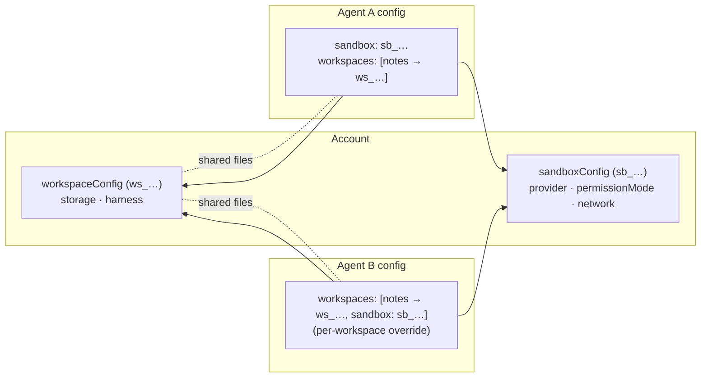
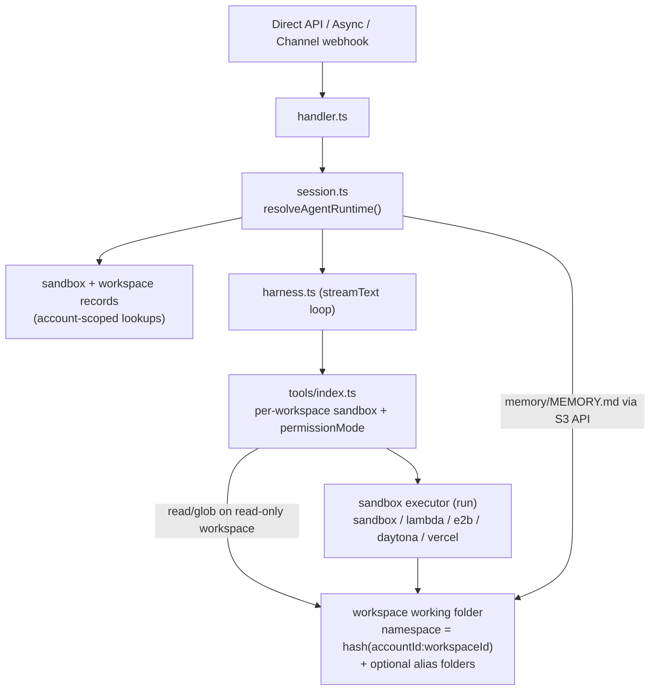
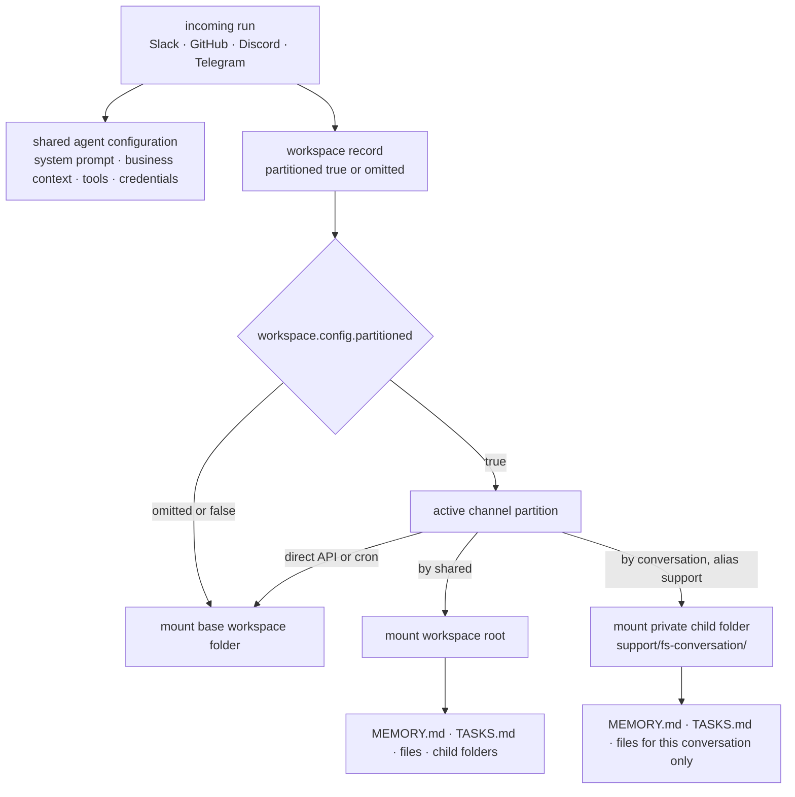

# Workspace & Sandbox

**Sandbox** (compute) and **workspace** (persistent files) are account-scoped resources. You define each once in code with `defineSandbox` and `defineWorkspace`, then reference them from any agent.

- A **sandbox** is the compute backend plus a collection of bash and filesystem tools
  (`bash`, `read`, `write`, `edit`, `glob`, `grep`) and a `permissionMode`.
- A **workspace** is the persistent S3-backed filesystem that gets mounted into a sandbox.
  Agents that reference the **same** `workspaceId` read and write the **same files** unless
  the workspace opts into hierarchical alias partitioning.

A sandbox can be attached **agent-wide** (`config.sandbox`) or **per workspace**
(`workspaces[].sandbox`). A workspace's **effective sandbox** follows a simple cascade:

```text
workspaces[].sandbox === null   → read-only, S3-direct reads (opt out of compute entirely)
workspaces[].sandbox === "sb_…" → that sandbox (override)
workspaces[].sandbox omitted    → inherit config.sandbox (read-only via mount if there is none)
```

This is what lets one agent give different workspaces different sandboxes and
`permissionMode`s, lets two agents that share a workspace access it through their own
sandboxes, and lets a single workspace be **read-only**. A read-only workspace reads through
a service-managed read-only mount by default (so it sees committed writes immediately);
`sandbox: null` opts out of that mount and reads straight from S3 (no Lambda, cheapest, but
reads lag mount writes — see [Lambda](sandbox/lambda.md)). `config.sandbox` also powers
stateless `bash` when there is no workspace at all, and stays directly reachable when
every attached workspace borrows a different sandbox — see
[Whose sandbox is it?](#whose-sandbox-is-it) below.


```mermaid
flowchart LR
  subgraph Account
    SB["sandboxConfig (sb_…)<br/>provider · permissionMode · network"]
    WS["workspaceConfig (ws_…)<br/>storage · harness"]
  end
  subgraph AgentA["Agent A config"]
    A["sandbox: sb_…<br/>workspaces: [notes → ws_…]"]
  end
  subgraph AgentB["Agent B config"]
    B["workspaces: [notes → ws_…, sandbox: sb_…]<br/>(per-workspace override)"]
  end
  A --> SB
  A --> WS
  B --> SB
  B --> WS
  WS -. shared files .- A
  WS -. shared files .- B
```

## Code-First Configuration

Define sandbox and workspace resources in `broods/`, then pass them to an agent:

```ts title="broods/index.ts"
import {
  defineAgent,
  defineGitHubConnection,
  defineSandbox,
  defineSlackConnection,
  defineWorkspace,
  env,
} from "broods";

export const lambdaSandbox = defineSandbox({
  name: "default",
  provider: "lambda",
  network: { mode: "allow-all" },
  permissionMode: "ask",
});

export const notes = defineWorkspace({
  name: "notes",
  storage: { provider: "s3" },
  partitioned: true,
});

export const slack = defineSlackConnection({
  partition: { by: "shared" },
  botToken: env("SLACK_BOT_TOKEN"),
  signingSecret: env("SLACK_SIGNING_SECRET"),
});

export const github = defineGitHubConnection({
  partition: { by: "conversation", alias: "support" },
  webhookSecret: env("GITHUB_WEBHOOK_SECRET"),
  appId: env("GITHUB_APP_ID"),
  privateKey: env("GITHUB_PRIVATE_KEY"),
});

export const myAgent = defineAgent({
  name: "my-agent",
  provider: { openai: { apiKey: env("OPENAI_API_KEY") } },
  model: { provider: "openai", modelId: "gpt-5.5" },
  agent: { system: "You are a helpful assistant." },
  connections: [slack, github],
  sandbox: lambdaSandbox,
  workspaces: [
    notes, // inherit agent sandbox
    { workspace: notes, sandbox: null }, // read-only, S3-direct
  ],
});
```

The CLI compiles these into a manifest, resolves references, and syncs them. You can also create records via the raw account API — see the [API Reference](/api-reference) for `POST /v1/sandboxes` and `POST /v1/workspaces`.

## Tool surface

Tool availability is decided **per workspace**, from that workspace's _effective_ sandbox
(`workspaces[].sandbox` → else `config.sandbox` → else none). The agent's tool set is the
union across its workspaces:

| Workspace's effective sandbox | Tools for that workspace                                                                    |
| ----------------------------- | ------------------------------------------------------------------------------------------- |
| present (mounted)             | `read`, `write`, `edit`, `glob`, `grep`, `bash`, `memory_save` (+ workspace/memory harness) |
| **none** (read-only, default) | `read`, `glob` — via a read-only mount (fresh reads)                                        |
| **none**, `sandbox: null`     | `read`, `glob` — straight from S3 (no mount/cold start, lagged)                             |

Plus the agent-level cases:

| Agent references                                         | Tools exposed                                                                  |
| -------------------------------------------------------- | ------------------------------------------------------------------------------ |
| sandbox, **no** workspace                                | `bash` only — **stateless** (each call is a fresh container; nothing persists) |
| sandbox + workspaces that all borrow a **different** one | the workspace tools, plus a `bash` `sandbox: true` flag (see below)            |
| neither sandbox nor workspace                            | none                                                                           |

For mounted workspaces, every provider should expose the same model-facing filesystem:
`bash` starts in the selected workspace directory and the file tools take paths relative to
that directory. Ordinary prompts should use relative paths; provider mount paths are
implementation details for logs and debugging.

> When workspaces have different sandboxes, the model picks one with the `workspace`
> argument; each call routes to that workspace's sandbox and inherits its `permissionMode`.
> Every file tool lists **all** workspaces (so an omitted `workspace` always resolves to
> the configured default, never a silent substitute). Selecting a read-only workspace for
> `write`/`edit`/`grep` returns a clean "workspace is read-only" error, and `bash` reports
> "no sandbox available for this command" — in both cases with **no approval prompt**,
> because a workspace with no sandbox has no `permissionMode` to ask against.

## Whose sandbox is it?

Two agents can reach the same workspace through very different arrangements, and the
difference decides how much of the machine the agent gets. What matters is whether the
workspace's effective sandbox **is the one the agent itself references**:

| Arrangement                                                 | What the agent gets                                                                                                                                                             |
| ----------------------------------------------------------- | ------------------------------------------------------------------------------------------------------------------------------------------------------------------------------- |
| `config.sandbox: sb_a` + workspace on `sb_a` (or inherited) | The sandbox is the agent's **own machine** with the workspace mounted in it. If that sandbox is `persistent`, `bash` may write anywhere on it, not just the mount.              |
| `workspaces[].sandbox: sb_b`, **no** `config.sandbox`       | The sandbox is only the workspace's **execution layer**. `bash` is scoped to the workspace: writes elsewhere are refused (see [Security](sandbox/security.md)).                 |
| `config.sandbox: sb_a` + workspace on `sb_b`                | Both at once. The workspace is scoped as above, and `sb_a` stays reachable via `bash` with `sandbox: true` — no workspace is mounted there, so nothing reaches durable storage. |

Inheriting the agent sandbox and naming it explicitly are the same case: the cascade
resolves both to the same record, so both land in the first row. An agent that references
the very sandbox its workspace runs on lands there too — identity is the sandbox record, so
`config.sandbox: sb_b` + workspace on `sb_b` is the agent's own machine, not a borrowed one.
Row two is only reached when the agent references **no** sandbox of its own.

`workspace` and `sandbox` are orthogonal: one names a mount, the other says "no mount, my
own machine". `workspace` keeps defaulting to the **default workspace**, so relative paths
keep landing in durable storage unless the model deliberately passes `sandbox: true`.

"Nothing reaches durable storage" is about the **mount**, not about the machine. A
`sandbox: true` run gets a fresh container each call — unless that sandbox is `persistent`
**and** carries an `options.reservationKey`, which is what lets a run with no workspace
namespace reconnect to the same reserved instance. With both set, its filesystem does
survive between calls, until the reservation ends. Without the key, `persistent` alone
changes nothing for these runs and the harness logs a warning saying so. Either way the
workspace mount is the only storage that outlives the sandbox.

## permissionMode

`permissionMode` lives on the sandbox and replaces the old `needsApproval` boolean:

| Mode     | `read`/`glob`/`grep` | `write`/`edit` | `bash`  |
| -------- | -------------------- | -------------- | ------- |
| `ask`    | auto                 | **ask**        | **ask** |
| `edit`   | auto                 | auto           | **ask** |
| `bypass` | auto                 | auto           | auto    |

## Runtime model


```mermaid
flowchart TD
  Request["Direct API / Async / Channel webhook"] --> Handler["handler.ts"]
  Handler --> Session["session.ts<br/>resolveAgentRuntime()"]
  Session --> Resolve["sandbox + workspace records<br/>(account-scoped lookups)"]
  Session --> Harness["harness.ts (streamText loop)"]
  Harness --> Tools["tools/index.ts<br/>per-workspace sandbox + permissionMode"]
  Tools --> Sandbox["sandbox executor (run)<br/>sandbox / lambda / e2b / daytona / vercel"]
  Tools -->|read/glob on read-only workspace| Files
  Sandbox --> Files["workspace working folder<br/>namespace = hash(accountId:workspaceId)<br/>+ optional alias folders"]
  Session -->|memory/MEMORY.md via S3 API| Files
```

The workspace **base namespace** is derived from `accountId:workspaceId`. Isolation does
not change the agent, system prompt, model config, channel config, credentials, or tool
definitions. It only changes which working folder is mounted for that run. Each isolated
folder starts as its own workspace folder, so `MEMORY.md`, `TASKS.md`, generated files,
downloaded files, and sandbox edits are separated from other scopes.


```mermaid
flowchart TD
  Run["incoming run<br/>Slack · GitHub · Discord · Telegram"] --> Shared["shared agent configuration<br/>system prompt · business context · tools · credentials"]
  Run --> Workspace["workspace record<br/>partitioned true or omitted"]
  Workspace --> Mode{"workspace.config.partitioned"}
  Mode -->|"omitted or false"| Root["mount base workspace folder"]
  Mode -->|"true"| Scope["active channel partition"]
  Scope -->|"direct API or cron"| Root
  Scope -->|"by shared"| Parent["mount workspace root"]
  Scope -->|"by conversation, alias support"| Child["mount private child folder<br/>support/fs-conversation/"]
  Parent --> Contents["MEMORY.md · TASKS.md · files · child folders"]
  Child --> Private["MEMORY.md · TASKS.md · files for this conversation only"]
```

| Workspace setting              | Connection setting                               | What happens                                                                          |
| ------------------------------ | ------------------------------------------------ | ------------------------------------------------------------------------------------- |
| `partitioned` omitted or `false` | `partition` is not allowed                  | every run mounts the same workspace root                                              |
| `partitioned: true`              | every attached connection must set `partition` | shared runs mount the workspace root; conversation runs mount a private child folder |

If any connection defines `partition`, at least one attached workspace must use
`partitioned: true`. If a workspace uses `partitioned: true`, every attached connection must
define `partition`. The CLI rejects mixed or old-mode configs so the runtime does not
silently pick the wrong folder.

## Isolation scenarios

Use partitioning for the **working folder security boundary** of a team, project, ticket, or
chat. Do not use it for business-wide instructions: put shared business context in the
agent system prompt, configured skills, tools, or a separate non-isolated workspace.

What stays shared:

- agent system prompt and model configuration
- channel configuration and credentials
- tool definitions, tool credentials, and tool availability
- account-level resources such as skills and configured business data

What partitioning separates:

- the mounted workspace folder
- `MEMORY.md` and `TASKS.md` inside that folder
- files created, edited, downloaded, or staged by the sandbox
- any workspace-relative artifacts the agent writes while handling that scope

Existing files in one isolated folder are not copied into another isolated folder. If the
workspace root has `fileA`, `MEMORY.md`, and `TASKS.md`, a GitHub issue child starts with
its own empty working folder unless you seed or copy files into that child. The agent
still sees the same workspace name, but that name points at the scoped folder for the
current run.

Use no partitioning for a deliberately global workspace:

```ts
export const companyKnowledge = defineWorkspace({
  name: "company-knowledge",
  storage: { provider: "s3" },
});
```

Effect:

- Slack, GitHub, Discord, Telegram, and direct API runs all mount the same folder.
- A file written from GitHub can be read later from Discord if both agents use this
  workspace.
- Channel `partition` is invalid because there is no isolated folder hierarchy.

Use this for shared reference files, common templates, or non-sensitive business notes. Do
not use it for customer-specific work, incidents, tickets, or team folders that should not
see each other.

Use `partitioned: true` with `partition` when teams and issues need different folder
boundaries:

```ts
export const supportWorkspace = defineWorkspace({
  name: "support",
  storage: { provider: "s3" },
  partitioned: true,
});

export const slack = defineSlackConnection({
  partition: { by: "shared" },
  botToken: env("SLACK_BOT_TOKEN"),
  signingSecret: env("SLACK_SIGNING_SECRET"),
});

export const github = defineGitHubConnection({
  partition: { by: "conversation", alias: "support" },
  webhookSecret: env("GITHUB_WEBHOOK_SECRET"),
  appId: env("GITHUB_APP_ID"),
  privateKey: env("GITHUB_PRIVATE_KEY"),
});
```

With that setup:

| Incoming source                | Folder behavior                                                             |
| ------------------------------ | --------------------------------------------------------------------------- |
| Slack `T123 / C456 / thread A` | shares the channel working folder with Slack `thread B` in the same channel |
| GitHub `owner/repo#123`        | gets a separate working folder from `owner/repo#456`                        |
| Telegram chat `123`            | scoped to chat `123`; `shared` and `conversation` are usually the same key |

Use this mixed mode when providers should not all use the same granularity. For example:

- Slack should share one folder for a team channel.
- GitHub should isolate each issue or PR.
- Discord should share one workspace per team channel, or per thread if that server uses
  threads as tickets.

`partition.alias` is only used for child conversation scopes. It is the model-visible
folder name below the workspace root, such as `support/`. Same alias plus `conversation`
creates private child folders directly under that alias. Different aliases create separate
child folder trees. Alias values must be safe path segments: letters, numbers, dots,
underscores, or hyphens.

`partition.by` controls visibility:

- `shared` mounts the workspace root. The parent can see root files and child folders
  below it.
- `conversation` mounts only that conversation child folder. The child cannot read the
  parent folder, and sibling children cannot read each other.

The model-facing workspace name stays the same. If the agent has a workspace named
`support`, it still selects `support` from Slack and from GitHub. What changes is the
folder mounted behind that same name:

| Run                           | Agent sees          | Mounted working folder                           |
| ----------------------------- | ------------------- | ------------------------------------------------ |
| Direct API or cron            | workspace `support` | `<workspace>/`                                   |
| Slack in channel `C456`       | workspace `support` | `<workspace>/`                                   |
| GitHub issue `owner/repo#123` | workspace `support` | `<workspace>/support/fs-<hash(owner/repo#123)>/` |
| GitHub issue `owner/repo#456` | workspace `support` | `<workspace>/support/fs-<hash(owner/repo#456)>/` |

The Slack channel run, direct API runs, and cron runs mount the workspace root, so they
can browse child issue folders under `support/`. A GitHub issue child mounts only its own
child folder, so it cannot see the workspace root or another issue child.

If the workspace root already contains `fileA`, `MEMORY.md`, and `TASKS.md`, GitHub issue
`#123` will not see them. GitHub issue `#123` sees its own child folder under `support/`.
GitHub issue `#456` sees another child folder under `support/`. All three runs use the same
workspace name, but each scope is backed by a different folder.

### When an isolated folder is reclaimed

A conversation-scoped folder is not permanent. When the channel reports that the
conversation is over, the harness deletes that folder's S3 prefix and releases any
reserved sandbox bound to it. This is what keeps per-ticket isolation from turning into
unbounded storage growth.

| Channel                                 | End-of-conversation signal | Folder reclaimed |
| --------------------------------------- | -------------------------- | ---------------- |
| GitHub issue                            | issue `closed`             | yes              |
| GitHub pull request                     | PR `closed`                | yes              |
| Slack, Discord, Telegram, Pancake, Zalo | none — a thread never ends | **no**           |

Only `level: "conversation"` folders are reclaimed; a `level: "channel"` scope mounts the
workspace root, which is never deleted automatically. Reclaim is fire-and-forget after the
webhook is acknowledged, so a closed issue's folder disappears shortly after, not
synchronously.

The chat platforms have no equivalent of "closed", so a `conversation`-scoped folder there
accumulates one prefix per thread for as long as the workspace exists. If you scope a chat
channel per conversation, plan to prune it yourself — through the workspace Files view or
the workspace-files API — or scope it at `level: "channel"` instead.

The harness toggles are per feature: `workspace.harness.workspace.enabled: false`
suppresses the workspace guidance prompt, and `workspace.harness.memory.enabled: false`
disables structured memory (the `memory_save` tool, index loading, and the `<memory>`
prompt). An agent that sets `harness` on `defineAgent` never gets the workspace
guidance prompt, whatever the workspace toggle says. See
[Memory and Session](./memory-and-session.md).
