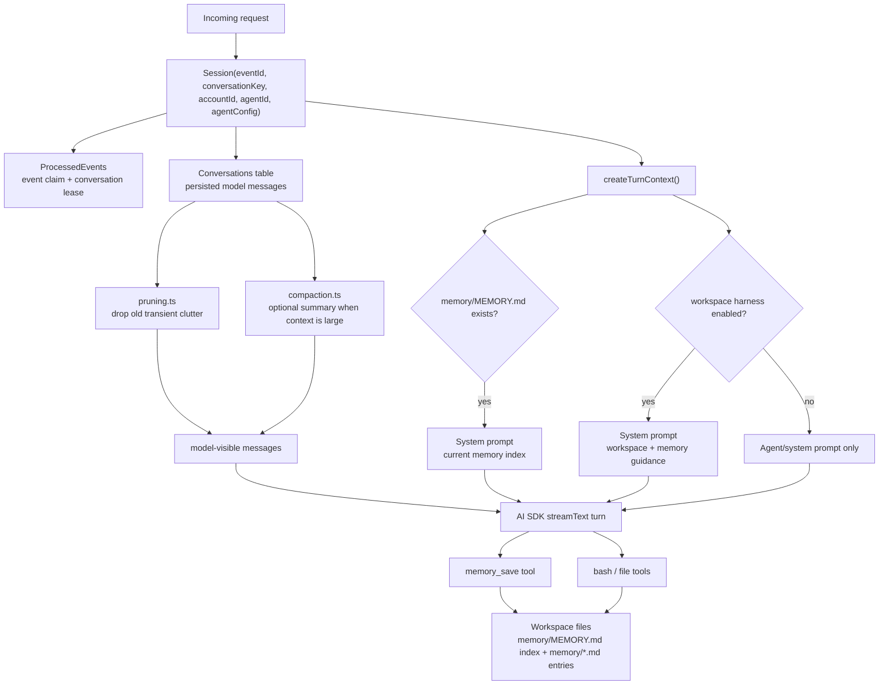
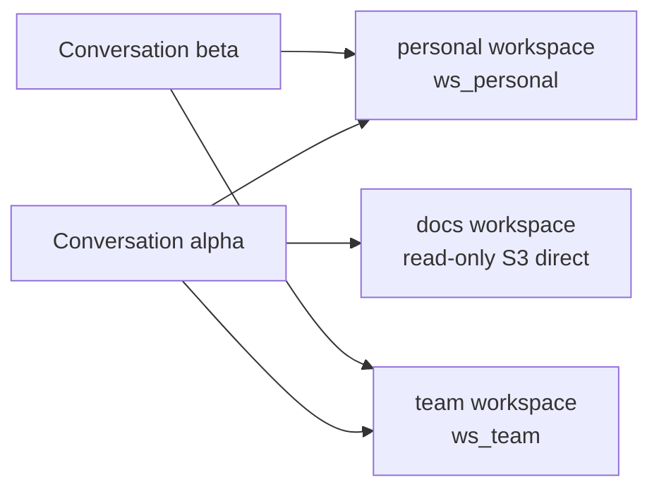

# Memory and Session

Session history and workspace memory are related but separate:

- Session is persisted conversation history and the model-visible context projection for a single conversation.
- Workspace memory is structured: one markdown file per fact in the workspace's `memory/` folder, indexed by `memory/MEMORY.md`.

The harness loads the `memory/MEMORY.md` index into the system prompt when it exists,
and (for sandbox-backed workspaces) exposes a `memory_save` tool that writes one
entry per fact. Each entry carries YAML frontmatter:

```markdown
---
name: owner-prefers-short-replies
description: "The workspace owner prefers short, chat-like replies"
metadata:
  node_type: memory
  type: feedback
  originSessionId: slack:T0A6U9DLZV2:C0BGCKWF3PZ
---

Keep replies to a few sentences unless asked for detail.
```

`originSessionId` is the conversation scope (channel/thread key) the fact was learned
in, so agents that share a workspace across channels can tell where a memory came
from. A `<memory>` system block ships with the workspace harness: it states today's
date (time awareness), the current conversation's scope, and the save/recall rules
(the index holds one-line summaries — read the linked file before relying on it;
current instructions always outrank memory). Set `harness.memory.enabled: false` on
the workspace to keep the plain file tools but drop the memory tool and guidance;
`TASKS.md` and other files remain an ordinary developer convention managed through
the file tools.

## Mental Model



## Workspace Sharing

Workspaces are account-scoped records. Any agent or conversation that references the same
`workspaceId` sees the same files:

```mermaid
flowchart LR
  Define["defineWorkspace({ name: \"notes\" })"] --> A["Agent A config<br/>notes → ws_notes"]
  Define --> B["Agent B config<br/>notes → ws_notes"]
  A --> Files["shared files<br/>MEMORY.md / TASKS.md / project files"]
  B --> Files
```

Create a workspace in `broods/index.ts`, then reference it from the agent:

```ts
import { defineWorkspace, defineAgent, defineSandbox } from "broods";

export const notes = defineWorkspace({
  name: "notes",
  config: {
    storage: { provider: "s3" },
  },
});

export const myAgent = defineAgent({
  name: "my-agent",
  config: {
    sandbox: lambdaSandbox,
    workspaces: [notes],
  },
});
```

Agents can expose multiple named workspaces. The first entry is the default when a tool call
omits the optional `workspace` argument:

```ts
import { defineWorkspace, defineAgent, defineSandbox } from "broods";

export const personal = defineWorkspace({
  name: "personal",
  config: { storage: { provider: "s3" } },
});
export const team = defineWorkspace({
  name: "team",
  config: { storage: { provider: "s3" } },
});
export const docs = defineWorkspace({
  name: "docs",
  config: { storage: { provider: "s3" } },
});
export const lockedDown = defineSandbox({
  name: "locked-down",
  config: {
    provider: "lambda",
    network: { mode: "deny-all" },
    permissionMode: "ask",
  },
});

export const myAgent = defineAgent({
  name: "my-agent",
  config: {
    sandbox: lambdaSandbox,
    workspaces: [
      personal, // inherit agent sandbox
      { workspace: team, sandbox: lockedDown }, // per-workspace override
      { workspace: docs, sandbox: null }, // read-only S3 access
    ],
  },
});
```



## Runtime Behavior

[`Session`](https://github.com/beeblastco/broods/blob/dev/apps/core/src/harness/session.ts) owns the runtime path:

- `claim()` deduplicates an inbound event in `ProcessedEvents`.
- `acquireConversationLease()` serializes work per conversation.
- `enqueuePendingIngress()` / `takePendingIngress()` buffer channel messages that arrive while a turn is already running, so the lease holder drains and answers them **in order after** its current reply instead of dropping them. Applies to every channel (they all route through `handleChannelRequest`).
- `appendIngressEvents()` persists incoming user, assistant, tool, and persisted system messages.
- `createTurnContext()` loads conversation entries, builds system prompt parts, runs compaction when configured, and prunes model-visible messages.
- `resolvedWorkspaces()` (backed by `resolveAgentRuntime()` in
  `src/shared/workspaces.ts`) resolves account-scoped workspace and sandbox records,
  applies per-workspace sandbox overrides, and hashes `accountId:workspaceId` with
  `normalizeFilesystemNamespace()`.
- `filesystemNamespace()` returns the default workspace namespace for existing single-workspace callers.

The namespace helper is in [`src/shared/runtime-keys.ts`](https://github.com/beeblastco/broods/blob/dev/apps/core/src/shared/runtime-keys.ts). The config interface and validation live in [`src/shared/domain/agent-config.ts`](https://github.com/beeblastco/broods/blob/dev/apps/core/src/shared/domain/agent-config.ts).

## Configure It

The harness is a set of named features, each on by default and toggled independently — there is no top-level `enabled` flag:

- `harness.workspace` — the `<workspace>` prompt (file-tool + TASKS guidance).
- `harness.memory` — structured memory: the `memory_save` tool, `memory/MEMORY.md` index loading, and the `<memory>` prompt.

```ts
import { defineWorkspace } from "broods";

// Everything on — the default. There is nothing to set: an explicit
// `enabled: true` is redundant and normalizes away to this same form.
export const notes = defineWorkspace({
  name: "notes",
  config: {
    storage: { provider: "s3" },
  },
});
```

Opt out of memory entirely (no `memory_save`, no `<memory>` guidance, and the index is not loaded into context) while keeping the workspace guidance:

```ts
export const notesNoMemory = defineWorkspace({
  name: "notes",
  config: {
    storage: { provider: "s3" },
    harness: { memory: { enabled: false } },
  },
});
```

Suppress only the workspace guidance prompt while keeping structured memory:

```ts
export const notesBare = defineWorkspace({
  name: "notes",
  config: {
    storage: { provider: "s3" },
    harness: { workspace: { enabled: false } },
  },
});
```

Remove a workspace reference from the agent config to disable that workspace's mounted
tools and prompt-time memory loading. Set `workspaces[].sandbox: null` when the agent
should keep read-only `read`/`glob` access through S3 but must not mount or mutate files.

## Session Context Management

Session history is managed before each model turn:

- Pruning is enabled by default unless `session.pruning.enabled` is false. It removes older reasoning/tool-call clutter from the model-visible context without changing persisted history.
- Compaction is disabled by default unless `session.compaction.enabled` is true. When enabled, it uses the selected agent model to summarize older history once the serialized context exceeds `session.compaction.maxContextLength`.
- Compaction persists a system summary, keeps the latest user message active, and includes prior compaction summaries when compacting again.
