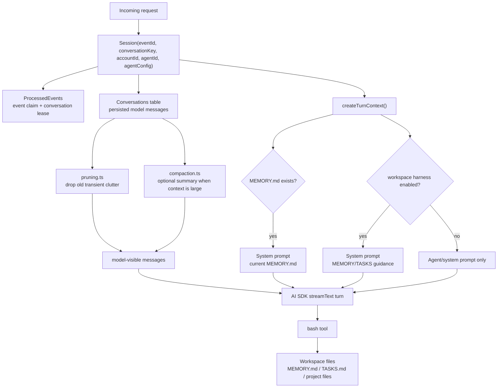
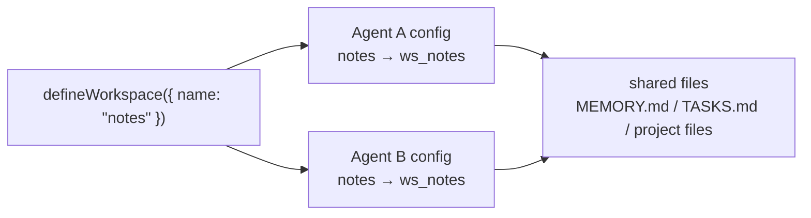
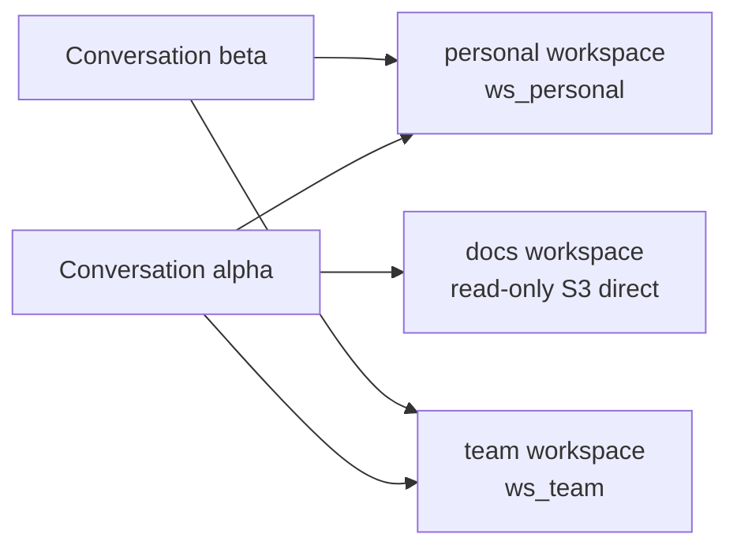

# Memory and Session

Session history and workspace memory are related but separate:

- Session is persisted conversation history and the model-visible context projection for a single conversation.
- Workspace memory is a developer convention: files like `MEMORY.md`, `TASKS.md`, or `notes/*.md` that the agent reads and updates through the `bash` tool.

The harness still loads `MEMORY.md` into the system prompt when the file exists. It no
longer exposes separate memory or task-list tools. When a workspace has
`harness.enabled` unset or true, the harness also adds short MEMORY/TASKS workflow
instructions by default; the agent then manages memory and task files as ordinary
markdown files in the mounted workspace.

## Mental Model



## Workspace Sharing

Workspaces are account-scoped records. Any agent or conversation that references the same
`workspaceId` sees the same files:



Create a workspace in `broods/index.ts`, then reference it from the agent:

```ts
import { defineWorkspace, defineAgent, defineSandbox } from "broods";

export const notes = defineWorkspace({
  name: "notes",
  config: {
    storage: { provider: "s3" },
    harness: { enabled: true },
  },
});

export const myAgent = defineAgent({
  name: "my-agent",
  config: {
    sandbox: lambdaSandbox,
    workspaces: [notes],
  },
});
```

Agents can expose multiple named workspaces. The first entry is the default when a tool call
omits the optional `workspace` argument:

```ts
import { defineWorkspace, defineAgent, defineSandbox } from "broods";

export const personal = defineWorkspace({
  name: "personal",
  config: { storage: { provider: "s3" } },
});
export const team = defineWorkspace({
  name: "team",
  config: { storage: { provider: "s3" } },
});
export const docs = defineWorkspace({
  name: "docs",
  config: { storage: { provider: "s3" } },
});
export const lockedDown = defineSandbox({
  name: "locked-down",
  config: {
    provider: "lambda",
    network: { mode: "deny-all" },
    permissionMode: "ask",
  },
});

export const myAgent = defineAgent({
  name: "my-agent",
  config: {
    sandbox: lambdaSandbox,
    workspaces: [
      personal, // inherit agent sandbox
      { workspace: team, sandbox: lockedDown }, // per-workspace override
      { workspace: docs, sandbox: null }, // read-only S3 access
    ],
  },
});
```



## Runtime Behavior

[`Session`](https://github.com/beeblastco/broods/blob/dev/apps/core/src/harness/session.ts) owns the runtime path:

- `claim()` deduplicates an inbound event in `ProcessedEvents`.
- `acquireConversationLease()` serializes work per conversation.
- `enqueuePendingIngress()` / `takePendingIngress()` buffer channel messages that arrive while a turn is already running, so the lease holder drains and answers them **in order after** its current reply instead of dropping them. Applies to every channel (they all route through `handleChannelRequest`).
- `appendIngressEvents()` persists incoming user, assistant, tool, and persisted system messages.
- `createTurnContext()` loads conversation entries, builds system prompt parts, runs compaction when configured, and prunes model-visible messages.
- `resolvedWorkspaces()` (backed by `resolveAgentRuntime()` in
  `src/shared/workspaces.ts`) resolves account-scoped workspace and sandbox records,
  applies per-workspace sandbox overrides, and hashes `accountId:workspaceId` with
  `normalizeFilesystemNamespace()`.
- `filesystemNamespace()` returns the default workspace namespace for existing single-workspace callers.

The namespace helper is in [`src/shared/runtime-keys.ts`](https://github.com/beeblastco/broods/blob/dev/apps/core/src/shared/runtime-keys.ts). The config interface and validation live in [`src/shared/domain/agent-config.ts`](https://github.com/beeblastco/broods/blob/dev/apps/core/src/shared/domain/agent-config.ts).

## Configure It

Create a workspace with automatic `MEMORY.md` loading and default MEMORY/TASKS harness instructions:

```ts
import { defineWorkspace } from "broods";

export const notes = defineWorkspace({
  name: "notes",
  config: {
    storage: { provider: "s3" },
    harness: { enabled: true },
  },
});
```

Disable only the MEMORY/TASKS harness instructions while still loading an existing `MEMORY.md`:

```ts
export const notesBare = defineWorkspace({
  name: "notes",
  config: {
    storage: { provider: "s3" },
    harness: { enabled: false },
  },
});
```

Remove a workspace reference from the agent config to disable that workspace's mounted
tools and prompt-time memory loading. Set `workspaces[].sandbox: null` when the agent
should keep read-only `read`/`glob` access through S3 but must not mount or mutate files.

## Session Context Management

Session history is managed before each model turn:

- Pruning is enabled by default unless `session.pruning.enabled` is false. It removes older reasoning/tool-call clutter from the model-visible context without changing persisted history.
- Compaction is disabled by default unless `session.compaction.enabled` is true. When enabled, it uses the selected agent model to summarize older history once the serialized context exceeds `session.compaction.maxContextLength`.
- Compaction persists a system summary, keeps the latest user message active, and includes prior compaction summaries when compacting again.
