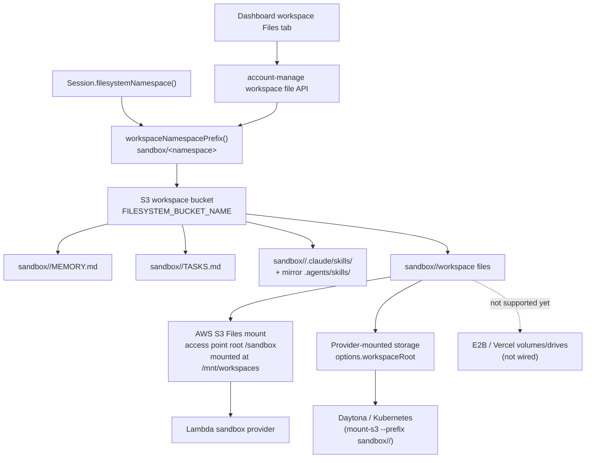

# Storage

Storage is the filesystem backing for Workspace. Workspace config accepts
`{ "storage": { "provider": "s3" } }` (default). Provider-native storage values
such as `vercel` are rejected until they are wired into the same workspace
mount/read contract.

`workspace.storage` declares the shared backing store used by:

- `MEMORY.md`, `TASKS.md`, and other developer-defined markdown files
- files read and written by the `bash` sandbox tool
- staged skill bundles under `.claude/skills/<skill-name>` and `.agents/skills/<skill-name>`
- mounted workspace paths used by the Lambda (S3 Files), Daytona, and Kubernetes (mount-s3) sandbox providers

## Current Architecture

> **!WARNING**
> **The workspace mount key prefix is load-bearing — keep it in sync.**
> The Lambda S3 Files access point is rooted at a non-root sub-path `/sandbox`
> (`SandboxS3FilesAccessPoint.rootDirectories` in `sst.config.ts`). It **must** be a
> sub-path, not `/`: the access point's `creationPermissions` (777, uid/gid 1000) are
> only applied to a directory it *creates*. The bucket root already exists, so a root
> of `/` is **not writable** by the sandbox uid and `bash` writes fail (this was the
> bug fixed by git commit `2bdb34f`). Because of that sub-path, the mount stores every
> file under the `sandbox/` key prefix. Every harness-side S3 read/write of workspace
> files therefore applies the same prefix via `workspaceNamespacePrefix()`
> (`WORKSPACE_MOUNT_PREFIX` in `functions/_shared/sandbox.ts`). **If you change one,
> change the other.** When they drift, the harness and sandbox read/write two separate
> key trees and silently stop seeing each other's files — a freshly loaded skill can show
> an empty mount even though the harness copied the files.

Sandbox paths map to S3 keys through that prefix: the bucket holds `sandbox/<namespace>/...` and the mount exposes it at `/mnt/workspaces/<namespace>/...` by default.



The Lambda sandbox provider uses AWS S3 Files at `/mnt/workspaces`, backed by the same workspace bucket through an access point rooted at `/sandbox`. The uniform Lambda sandbox image writes directly through that mount. Daytona and Kubernetes mount only the selected `sandbox/<namespace>/` prefix at the workspace directory for the run (`mountAwsS3Buckets: true`). E2B and Vercel do not currently support S3 workspaces in this harness; attaching an S3 workspace to those sandboxes fails fast instead of silently using provider-native filesystem state.

The dashboard workspace **Files** tab lists and mutates this same S3 namespace through
the authenticated account-management API. Uploads, renames, and deletes therefore
operate on the files the agent mounts; Convex file storage is used only for editable
skill-node bundles.

The panel uses a reactive, server-reconciled UX:

- the last confirmed file tree is cached in memory and browser `sessionStorage`, so
  reopening the workspace or reloading the page paints cached metadata immediately
- cached metadata is stale-while-revalidate: S3 remains authoritative and refreshes in
  the background; file contents and signed download URLs are never cached
- uploads appear immediately as pending rows, then become authoritative after S3 confirms them
- rename and delete update the tree optimistically, then reload S3; failures show an error and restore the server state
- while the workspace panel is visible, it lists S3 every five seconds
- returning focus to the window, restoring a hidden tab, or pressing **Refresh** triggers another listing
- overlapping list requests are deduplicated and older responses cannot overwrite newer optimistic changes

This polling detects direct S3 changes and files exported by an agent without requiring
the panel or page to be reopened. It cannot display an agent write before S3 Files has
exported that mount change to S3. Dashboard uploads are currently limited to 512 KiB
per file because their base64 payload crosses a Convex action; agents can create larger
files directly through the mounted workspace.
When a workspace panel first loads after this storage path was introduced, any
legacy canvas-node files are copied from Convex storage into S3 and the old records
are removed. Existing S3 paths win, preventing stale legacy content from overwriting
newer agent files or reappearing after deletion.

The `sandbox/` folder is the only active application workspace root in the current
deployment. A top-level `sandbox-workspaces/` folder is legacy data and is not read by
the current runtime. Top-level `fs-<40 hex>/` folders also match this application's
hashed workspace namespace format and are legacy pre-`sandbox/` workspace data, not
AWS-owned internal objects. Inspect or back them up before deletion; the current runtime
only reads the corresponding active keys under `sandbox/fs-<40 hex>/`.

Model-facing tools hide the provider path: `bash` starts in the selected workspace
directory, and file tools use workspace-relative paths. Prefer prompts like
`python3 script.py` or `read analysis.json`, not provider mount paths.

Skills are staged from the account skill bucket into `<namespace>/.claude/skills/<name>` (mirrored to `<namespace>/.agents/skills/<name>` for discovery) when `load_skill` runs. See [`skills.md`](../skills.md).

## Reading workspace files: S3 API vs the sandbox mount

There are two ways to reach the same workspace bytes, and they are **not** interchangeable because the mount syncs to the bucket asymmetrically:

- **bucket → mount** (a file the harness wrote with S3 `PutObject`/`CopyObject`): S3 Files detects and imports the object without remounting; allow for propagation delay.
- **mount → bucket** (a file the agent wrote through `bash`/NFS): visible through the mount immediately, but the S3 API does **not** list/return it for **~1–2 minutes** (AWS S3 Files writes back to the bucket asynchronously — measured: not visible at +0s/+45s, visible at +120s).

So pick the door by **who last wrote the file**, not by how much time has passed. There is no timer or "switch to the mount after writing" — each read site is wired to the correct door:

| Reading… | Last writer | Read via | Rationale |
| --- | --- | --- | --- |
| Agent-written workspace files (agent-created files, agent-edited `MEMORY.md`) | sandbox, through the mount | **Sandbox mount** — `bash`, `read`, `glob`, `grep` | the S3 API is stale for up to ~2 min, so it can miss very recent sandbox writes |
| Harness-written workspace files (`.stage.json` manifest, the staged copy `load_skill` wrote, sandbox artifact write-back) | harness, via S3 | **S3 API** (`functions/_shared/s3.ts`) | already in the bucket and instantly correct through both doors; no sandbox round-trip needed |
| Account skill bucket (the skill "origin") | harness, via S3 | **S3 API** | a separate bucket, never mounted |

The agent always reads through the mount (its `bash` tool *is* the mount), so it always sees its own writes instantly regardless of elapsed time. The S3-API-vs-mount decision only applies to **harness-side reads**.

Concretely, the model-facing workspace tools read sandbox-backed workspaces through the mounted sandbox path. Read-only workspaces read through a service-managed read-only mount by default (same fresh-read semantics); the `sandbox: null` opt-out instead reads directly from S3 under the same `sandbox/<namespace>/` prefix (cheaper, but lagged — see [Lambda](sandbox/lambda.md)).

> **Known exception:** `Session.loadMemoryFile` reads `MEMORY.md` through the **S3 API** at the start of each turn. If the agent edited `MEMORY.md` less than ~2 min earlier in the same session, that read can be stale. This is accepted today because memory converges across turns and a sandbox round-trip on every turn is costly; route prompt-time memory reads through a sandbox-backed `read` call if freshness ever becomes a hard requirement.

## Code-First Configuration

```ts
import { defineWorkspace } from "broods";

export const notes = defineWorkspace({
  name: "notes",
  config: {
    storage: { provider: "s3" },
    harness: { enabled: true },
  },
});
```

If `storage` is omitted, workspace config normalization fills in `{ "provider": "s3" }`.

## Future External Storage

Additional work can add external storage providers such as Google Drive, Google Cloud Storage, Cloudflare R2, or other mounted object stores. Those providers should still connect through the sandbox mount model:

- keep one logical workspace namespace for memory notes, task notes, staged skills, and files
- mount or sync that namespace into `options.workspaceRoot`
- keep files visible to the sandbox runtime
- avoid provider-specific logic inside `session.ts` or the core agent loop

This keeps Workspace behavior consistent while allowing different storage backends underneath the sandbox mount.
