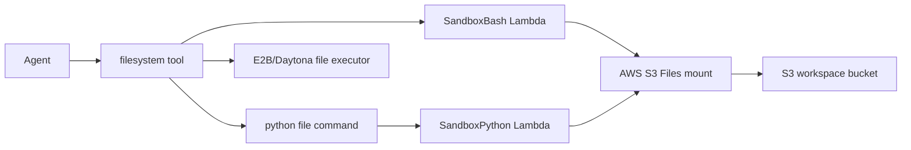

# Sandbox Reference

The workspace sandbox lets an agent execute code that it has already written into the workspace filesystem. It extends the existing `filesystem` tool; there is no separate model-facing sandbox tool.



## Enable It

Sandbox execution is available only when workspace and sandbox are enabled for the agent.

```json
{
  "workspace": {
    "enabled": true,
    "needsApproval": false,
    "storage": {
      "provider": "s3"
    },
    "sandbox": {
      "provider": "lambda",
      "timeout": 30,
      "outputLimitBytes": 65536,
      "options": {
        "networkAccess": "disabled"
      }
    }
  }
}
```

| Provider | Documentation |
| --- | --- |
| `lambda` | [Lambda Details](lambda.md) |
| `e2b` | [E2B Details](e2b.md) |
| `daytona` | [Daytona Details](daytona.md) |

## How Agents Use It

The filesystem tool accepts bash-like shell scripts. For the Lambda provider, shell commands run in `SandboxBash` with the account workspace mounted as the current directory.

```bash
mkdir -p notes
cat <<'EOF' > notes/a.txt
hello
EOF
find notes -type f -maxdepth 2
```

Node and TypeScript execute natively from the same `SandboxBash` Lambda:

```bash
cat <<'EOF' > /main.js
console.log(JSON.stringify({ ok: true, runtime: "node" }));
EOF

node /main.js
```

```bash
cat <<'EOF' > /main.py
print({"ok": True, "runtime": "python"})
EOF

python3 /main.py
```

Sandboxed code can also read and write nearby workspace files with normal file APIs:

```bash
python3 analyze.py sample.wav
```

```py
from pathlib import Path

data = Path("sample.wav").read_bytes()
Path("summary.txt").write_text(str(len(data)))
```

Supported execution commands:

| Runtime | Command | File extension |
| --- | --- | --- |
| Shell | bash-like scripts | interpreted by `just-bash` in `SandboxBash` |
| Node | `node <file>` | `.js` |
| TypeScript | `node <file>` | `.ts` — transpiled before execution in `SandboxBash` |
| Python | `python <file>` or `python3 <file>` | `.py` — routed to `SandboxPython` |

Inline execution is intentionally rejected across all providers. Commands such as `node -e "..."` and `python -c "..."` are not allowed.

## Result Shape

Python runs return structured JSON through the filesystem tool:

```json
{
  "output": {
    "stdout": "hello\n",
    "stderr": "",
    "artifacts": []
  },
  "status": {
    "ok": true,
    "runtime": "node",
    "provider": "lambda",
    "exitCode": 0,
    "durationMs": 42,
    "timedOut": false,
    "truncated": false
  }
}
```

## Mounted Workspace

The Lambda provider uses AWS S3 Files mounted at `/mnt/workspaces`. Shell and Node writes happen directly inside the mounted namespace, so the S3 Files filesystem syncs those changes to the workspace bucket. Third-party providers must make that same namespace visible under `options.workspaceRoot`; otherwise the command can start but the file the agent just wrote will not exist inside the provider sandbox.

## Output Truncation

Sandbox stdout and stderr are truncated at the byte limit configured by `outputLimitBytes` (default 65536). This prevents runaway output from blowing the Lambda invocation payload (6 MB max) or flooding the LLM's tool-result context window.

```json
{
  "workspace": {
    "sandbox": {
      "outputLimitBytes": 65536
    }
  }
}
```

When the limit is exceeded, the output is sliced at the cap and `[output truncated]` is appended.

All sandbox executors apply truncation logic using the same `outputLimitBytes` value.

## Dependency Strategy

Dependencies are not an account config field. Use provider images/templates for packages — see each provider page for details. The Lambda provider enables `curl` only when `options.networkAccess` is `"public"`. Non-production stages already include NAT; production needs explicit egress infrastructure before public network commands can work there.

## Security Boundaries

The sandbox path is designed around mounted, file-based runs:

- only allowlisted runtimes are exposed
- Python execution requires an existing workspace file
- inline code flags are rejected
- stdout/stderr output is capped at `outputLimitBytes` (see [Output Truncation](#output-truncation))
- workspace and skills buckets block public access and deny S3 actions for principals outside the project runtime/deploy roles
- child processes run without AWS credentials in their environment
- `curl` is disabled unless `options.networkAccess` is `"public"` and still blocks private/loopback/internal ranges

Workspace write/read commands still use the normal `filesystem` tool. Use `workspace.needsApproval` if file writes and code runs should require human approval.
