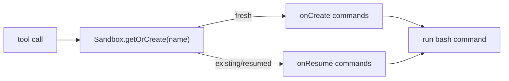

# Vercel

The `vercel` provider runs commands through [`@vercel/sandbox`](https://vercel.com/docs/sandbox).
The SDK is loaded lazily by the harness, and persistent sandboxes are named by the same
reservation key used by the other providers (`reservationKey ?? namespace`).

## Config

```jsonc
{
  "name": "vercel",
  "config": {
    "provider": "vercel",
    "persistent": true,
    "network": {
      "mode": "restricted",
      "allowDomains": ["api.example.com"],
      "allowCidrs": ["10.0.0.0/8"]
    },
    "permissionMode": "bypass",
    "onCreate": ["npm install"],
    "onResume": ["test -d node_modules"],
    "options": {
      "token": "vercel-token",
      "teamId": "team_xxx",
      "projectId": "prj_xxx",
      "runtime": "node24"
    }
  }
}
```

`options.token`, `options.teamId`, and `options.projectId` can be omitted when the harness
environment provides `VERCEL_TOKEN`, `VERCEL_TEAM_ID`, and `VERCEL_PROJECT_ID`. `runtime`
defaults to `node24`.

## Lifecycle

Vercel has native per-call lifecycle hooks, so the executor passes `onCreate` and `onResume`
to `Sandbox.getOrCreate()`/`Sandbox.get()` instead of emulating them with marker files.



## Network

Vercel enforces all three normalized modes natively:

| Mode | Vercel mapping |
| --- | --- |
| `allow-all` | `networkPolicy: "allow-all"` |
| `deny-all` | `networkPolicy: "deny-all"` |
| `restricted` | `networkPolicy.allow` for domains and `networkPolicy.subnets.allow` for CIDRs |

## Workspace Storage Caveat

A `storage.provider: "vercel"` workspace lives on Vercel's persistent filesystem. It is not
mounted from the shared S3 workspace bucket and is not shared with Lambda, Daytona, or
Kubernetes sandboxes. Use it when the agent and workspace are intentionally Vercel-only.

## Background Jobs

Persistent Vercel sandboxes support `bash` background jobs and `async_status` using the same
`.fp-jobs` marker scripts as E2B and Daytona. Auto-delivery still needs egress to the harness
Function URL; with `deny-all` the job runs, but completion must be fetched by polling.
