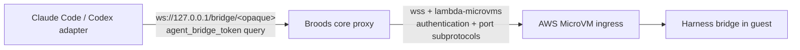

# `@broods/ai-sdk-sandbox`

This package adapts an injected Broods sandbox driver to the experimental
`HarnessV1SandboxProvider` contract in `@ai-sdk/harness@1.0.47`. The bounded
Workdir and Lambda MicroVM drivers in `apps/core/src/harness/sandbox/` import it,
and `apps/core/src/harness/ai-sdk-harness/` constructs Claude Code, Codex, Deep
Agents, OpenCode, and Pi `HarnessAgent` instances with those drivers. The Broods
core run loop selects them from an explicit adapter definition.

## Boundary

The package owns Harness-facing translation for commands, file streams, network
sessions, restricted session views, and lifecycle calls. It does not import core
runtime internals, select a real sandbox provider, access credentials, or manage
Broods persistence. The core-owned Workdir integration implements the small
`BroodsSandboxDriver` port inside `apps/core` by adapting
`createSandboxExecutor()` and reusing the runtime's existing reservation,
persistence, and cleanup paths. It must not add another provider registry or
session-persistence layer:

```ts
import {
  createBroodsSandbox,
  type BroodsSandboxDriver,
} from "@broods/ai-sdk-sandbox";

const driver: BroodsSandboxDriver =
  createCoreHarnessDriver(/* runtime context */);
const sandbox = createBroodsSandbox({ driver });

// Core passes `sandbox` to the selected AI SDK Harness adapter.
```

The driver creates or resumes a `BroodsSandboxDriverSession`. A create result
also reports `isFirstCreate`, which the driver sets at most once per stable
identity so Harness bootstrap is not repeated after restoration. The session
provides binary file I/O, foreground and background commands, optional network
policy/port mutation, port URL resolution, and resource cleanup. Provider-specific
errors pass through unchanged so the future integration remains responsible for
classification and retry policy. If creation rejects before returning a session
handle, the driver cleans up any partially allocated resource.

File writes intentionally collect the full input stream into a `Uint8Array`
because that is the current driver contract. Large artifact writes therefore use
memory proportional to the file size; supporting bounded-memory writes will
require a future streaming driver contract rather than a change to this adapter
alone.

## Ownership and lifecycle

- `createSession` returns an adapter-owned session. `stop` and `destroy` are
  idempotent at the adapter boundary and invoke each driver operation at most once.
- Driver `destroy`, when present, must work for either a running or an already
  stopped resource. Without it, the adapter falls back to `stop`.
- Harness `onFirstCreate` receives a restricted view with command and file access,
  but no lifecycle or network controls.
- If `onFirstCreate` fails, the adapter destroys (or stops) the fresh resource and
  rethrows the setup failure. If cleanup also fails, both errors are retained in an
  `AggregateError`.
- `resumeSession` is exposed only when the driver implements durable resume.
- `setNetworkPolicy` and `setPorts` remain absent when the driver cannot enforce
  them. `getPortUrl` reports a Harness capability error when port exposure is not
  supported.

The live Workdir integration test creates real Firecracker guests, exercises the
driver lifecycle, and bootstraps upstream bridges through Workdir's authenticated
WebSocket proxy. The current Claude Code and Codex adapters append their bridge
token with a literal `?`; Broods carries a narrow patch for the latest adapter
versions so provider URLs that already contain Workdir's authentication query
parameter are merged with `&`.

## Lambda MicroVM bridge

The upstream Harness sandbox contract exposes application ports only as
`getPortUrl({ port, protocol }) => string`. AWS Lambda MicroVM WebSocket ingress
also requires a short-lived authentication token and target port in
`Sec-WebSocket-Protocol`, which a URL-only driver cannot express. Broods therefore
owns a loopback-only WebSocket proxy:



- The Harness-visible URL contains a 256-bit opaque route only. It never contains
  the MicroVM id, AWS endpoint, or AWS authentication token.
- The proxy binds to `127.0.0.1`, accepts only declared ports, validates the
  upstream AWS hostname and `wss:` scheme, bounds pre-connect buffering, and
  returns generic connection errors.
- A fresh port-scoped AWS token is minted inside core when the adapter connects,
  passed only as an upstream WebSocket subprotocol, and never logged.
- The adapter's own `agent_bridge_token` query is forwarded to the guest bridge;
  it is distinct from the AWS ingress credential.

`sandbox-microvm-harness.integration.test.ts` is opt-in because it creates real
synthetic MicroVMs. With isolated AWS test credentials and image configuration,
run:

```bash
MICROVM_HARNESS_TEST=1 bun test apps/core/tests/sandbox-microvm-harness.integration.test.ts
```

The test uses an in-memory reservation store rather than shared Convex state and
terminates each uniquely named MicroVM in `finally`.

This package deliberately does not define queueing, steering, cancellation,
streaming, or the live agent run loop. Those remain owned by Broods core rather
than the sandbox-provider adapter.
